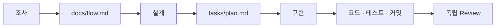

# 19장. Session을 안전하게 넘기는 방법 — 작업 상태를 파일로 남긴다

18장에서 세션을 나누는 리듬을 봤다.

그런데 세션을 끊으면 문제가 하나 생긴다.

다음 세션은 아무것도 모른다.

그래서 이런 일이 벌어진다.

```text
세션 1  (2시간 조사) → /clear
세션 2  "이 프로젝트 구조부터 설명해줘"   ← 처음부터 다시
```

인계 없이 끊으면 끊을수록 손해다.

---

## 원칙 한 줄

4부 전체가 이 문장으로 압축된다.

> 중요한 정보가 Claude와의 대화 안에만  
> 존재하면 안 된다.

대화는 반드시 사라진다.

압축으로 사라지거나, 세션 종료로 사라지거나,  
사라지지 않더라도 12장처럼 무게를 잃는다.

그러니 **사라지기 전에 꺼낸다.**

---

## 언제 꺼내는가

세 시점이다.

| 시점 | 이유 |
|---|---|
| 압축 직전 | 세부사항이 요약에서 탈락하기 전 |
| 세션 종료 전 | 대화가 사라지기 전 |
| 방향 전환 직전 | 검증한 사실과 폐기할 가설을 분리하기 위해 |

세 번째가 실무에서 가장 값지다.

접근이 틀렸다고 판단했을 때  
전부 버리면 조사한 사실까지 함께 버린다.

```text
지금까지 확인한 사실만 tasks/refund-fix.md 에 정리해줘.
시도했던 접근과 그게 왜 안 됐는지도 같이 남겨줘.
```

---

## 작업 문서에 무엇을 적는가

여덟 개 항목이면 충분하다.

```markdown
# 포인트 이중 환급 수정

## 목표
주문 취소 시 포인트 환급이 1건만 발생하게 한다

## 현재 구조
OrderCancelFacade.cancel()
  ├─ PaymentCancelHandler → 이벤트 → PointRefundListener (환급 1)
  └─ PointRefundService.refund()                        (환급 2)

## 확인한 사실
- 이벤트 방식은 3개월 전 도입 (a3f9c21)
- 관리자 강제 취소는 Facade를 거치지 않는다 (AdminOrderService:203)
- 부분 취소는 비례 배분 로직이 별도로 있다

## 확인하지 못한 것
- 배치성 자동 취소 경로가 있는지 (스케줄러 미확인)

## 결정된 사항
- Facade의 직접 호출을 제거한다 (이벤트 방식이 최신)
- 관리자 경로는 이번 범위에서 제외

## 변경된 파일
- OrderCancelFacade.kt (직접 호출 제거)
- OrderCancelTest.kt (재현 테스트 추가)

## 남은 작업
- 부분 취소 케이스 테스트 추가
- 관리자 경로는 별도 티켓으로

## 검증 방법
./gradlew test --tests '*OrderCancel*'
```

이 문서 하나면 새 세션이 30초 만에 따라잡는다.

---

## 확인한 것과 확인하지 못한 것을 나눈다

🔥 위 템플릿에서 가장 중요한 항목은  
`확인하지 못한 것` 이다.

17장에서 추측을 사실처럼 남기면  
Context Rot이 영구화된다고 했다.

이 절이 그 방지 장치다.

```markdown
# ❌ 위험한 인계
결제 취소 경로는 3개다

# ✅ 안전한 인계
## 확인한 사실
- 취소 경로 3개 확인 (Facade, 관리자, 배치)
  근거: grep "cancel(" 결과 + 호출 추적

## 확인하지 못한 것
- 외부 CS 어드민에서 직접 호출하는 경로가 있는지
```

다음 세션의 Agent는  
아래쪽을 "확인해야 할 것" 으로 다룬다.

위쪽처럼 쓰면 "이미 확정된 사실" 로 다룬다.

---

## 어디에 남기는가

문서 하나가 전부는 아니다.

| 남길 것 | 위치 | 수명 |
|---|---|---|
| 동작 규칙 | 테스트 | 코드와 함께 |
| 항상 유효한 규칙 | `CLAUDE.md` | 프로젝트와 함께 |
| 구조 이해 | `docs/` | 구조가 바뀔 때까지 |
| 이번 작업 상태 | `tasks/` | 작업이 끝날 때까지 |
| 변경의 이유 | 커밋 메시지 | 코드와 함께 |
| 큰 기술 결정 | ADR | 영구 |

디렉터리 구조는 이 정도면 된다.

```text
order-service/
  CLAUDE.md
  docs/
    order-cancel-flow.md      ← 구조 이해
  tasks/
    refund-fix.md             ← 진행 중인 작업
  .claude/
    settings.json
```

⚠️ `tasks/` 를 Git에 커밋할지는 팀이 정한다.

커밋하면 팀이 공유하고,  
커밋하지 않으면 개인 작업 공간이 된다.

둘 다 유효하다.  
정하지 않는 것이 문제다.

---

## 새 세션을 시작하는 문장

인계 문서가 있으면 시작이 짧아진다.

```text
@tasks/refund-fix.md 를 읽고 이어서 작업하자.

"남은 작업" 의 첫 항목인 부분 취소 케이스 테스트부터 시작해줘.
"확인하지 못한 것" 은 아직 확인되지 않았으니 전제로 삼지 마.
```

세 번째 문장이 인계를 완성한다.

---

## 인계를 Agent에게 시킨다

매번 손으로 쓸 필요는 없다.

```text
이번 세션에서 확인한 것을 tasks/refund-fix.md 에 정리해줘.

- 코드로 직접 확인한 것과 추론한 것을 구분해줘
- 추론한 것에는 어떻게 확인할 수 있는지 방법을 적어줘
- 시도했다가 버린 접근도 이유와 함께 남겨줘
```

두 번째 항목이 핵심이다.

이 요청을 그대로 쓰는 일이 반복되면  
45장에서 Skill로 만든다.

---

## 긴 작업은 이렇게 이어진다

며칠짜리 작업의 실제 모습이다.



세션은 서로를 모른다.  
파일만 안다.

이 구조에는 부수 효과가 하나 있다.

사람이 중간에 빠졌다 들어와도 똑같이 작동한다.  
휴가 뒤에 돌아온 동료에게도 같은 문서를 준다.

> Agent를 위해 만든 인계 문서가  
> 사람에게도 그대로 쓸모 있다.

64장의 최종 실전에서 이 구조를 그대로 쓴다.

---

## 이 장의 핵심

* 중요한 정보가 대화 안에만 존재하면 안 된다
* 꺼내는 시점은 압축 직전 · 세션 종료 전 · 방향 전환 직전이다
* 방향을 바꿀 때 전부 버리면 조사한 사실까지 버린다
* 작업 문서에는 목표 · 구조 · 확인한 사실 · 결정 · 남은 작업 · 검증 방법을 적는다
* `확인하지 못한 것` 절이 추측의 영구화를 막는다
* 확인한 사실에는 근거를 함께 적는다
* 동작은 테스트로, 규칙은 `CLAUDE.md` 로, 이유는 커밋 메시지로 나눠 남긴다
* 인계 문서 작성도 Agent에게 맡기되, 사실과 추론을 구분하게 한다
* 세션은 서로를 모르고 파일만 안다 — 사람이 끼어들어도 같은 구조가 작동한다
