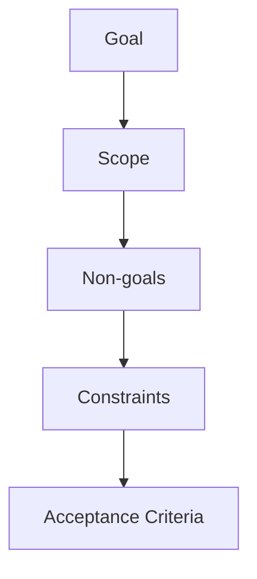

# 20장. 요구사항을 Agent Task로 — Goal · Scope · Constraints · Acceptance Criteria

10장에서 작업 지시 한 문장을 쓰는 법을 봤다.

실무에서는 그렇게 시작하지 않는다.

티켓이 통째로 온다.

```text
[PAY-2841] 결제 실패 시 재시도 지원

고객사에서 PG 일시 오류로 결제가 실패하는 건이
하루 30건 정도 발생. 자동 재시도가 필요합니다.
```

이 세 줄로 Agent에게 작업을 시킬 수는 없다.

---

## 요구사항과 Task는 다르다

| 요구사항 | Task |
|---|---|
| 원하는 결과 | 실행 가능한 단위 |
| 사람의 언어 | 검증 가능한 조건 |
| 범위가 열려 있다 | 범위가 닫혀 있다 |
| 이해관계자가 쓴다 | 개발자가 쓴다 |

이 변환은 원래 우리가 하던 일이다.

티켓을 받으면 머릿속에서  
"그러면 이거랑 저건 어떻게 하지" 를 정리한다.

에이전틱 코딩에서는 그 정리를 **밖으로 꺼내야** 한다.

머릿속에 있으면 Agent는 모른다.

---

## 다섯 요소

10장의 네 요소에 하나가 추가된다.



새로 들어온 것이 **Non-goals** 다.

### Goal — 무엇을 달성하는가

한 문장으로 쓴다.

```markdown
## Goal
PG 일시 오류로 실패한 결제를 자동 재시도해
수동 처리 건수를 줄인다
```

### Scope — 어디까지 건드리는가

파일이나 모듈 수준으로 적는다.

```markdown
## Scope
- `payment/` 결제 요청·응답 처리
- 재시도 대상은 PG 타임아웃과 5xx 응답만
```

### Non-goals — 무엇을 하지 않는가

🔥 이 항목이 다섯 중 가장 값지다.

```markdown
## Non-goals
- 카드사 한도 초과·잔액 부족은 재시도하지 않는다
- 결제 수단 변경 UX는 이번 범위가 아니다
- 재시도 이력 조회 화면은 만들지 않는다
- PG 연동 라이브러리를 교체하지 않는다
```

Agent는 도움이 될 것 같은 일을 추가한다.

재시도를 붙이면서 이력 테이블을 만들고,  
관리자 조회 API를 하나 더 만든다.

⚠️ 이것을 나중에 Diff에서 발견하면  
전부 되돌려야 한다.

앞에서 한 줄로 막는 편이 훨씬 싸다.

> Scope는 갈 곳을 정하고,  
> Non-goals는 가지 않을 곳을 정한다.

### Constraints — 지켜야 할 조건

```markdown
## Constraints
- 재시도 중 중복 결제가 발생하면 안 된다 (멱등키 필수)
- 최대 3회, 지수 백오프
- 기존 Spring Retry를 쓴다. 새 라이브러리 추가 금지
- 결제 응답 스펙 변경 불가 (앱 배포 주기)
```

### Acceptance Criteria — 어떻게 확인하는가

10장의 완료 조건이다.  
Agent가 실행해서 판정할 수 있어야 한다.

```markdown
## Acceptance Criteria
- PG 타임아웃 시 3회까지 재시도하는 테스트 통과
- 동일 멱등키로 재시도해도 결제가 1건만 생성되는 테스트 통과
- 잔액 부족 응답은 재시도하지 않는 테스트 통과
- `./gradlew test` 전체 통과
- `./gradlew ktlintCheck` 통과
```

---

## 티켓에 없지만 항상 물어야 하는 것

백엔드 요구사항에는 늘 빠지는 항목이 있다.

기획자는 이것을 쓰지 않는다.  
우리가 아는 것이기 때문이다.

| 물어볼 것 | 이번 티켓의 답 |
|---|---|
| 동시에 들어오면? | 같은 결제 건에 재시도가 겹칠 수 있는가 |
| 두 번 실행되면? | 멱등키로 방어 |
| 데이터 변경이 있는가? | 재시도 횟수 컬럼 추가 → 마이그레이션 |
| 기존 데이터는? | 기존 결제 건의 기본값은 0 |
| 실패하면 어떻게 되는가? | 3회 후 실패 상태로 확정, 알림 발송 |
| 권한이 필요한가? | 내부 스케줄러만 호출 |

⚠️ 이 여섯 개를 Task에 답해두지 않으면  
Agent가 **알아서 정한다.**

그리고 그 결정은 대개 그럴듯하고, 때때로 틀리다.

---

## 변환 전과 후

앞의 티켓이 이렇게 바뀐다.

```markdown
# PAY-2841 결제 재시도

## Goal
PG 일시 오류로 실패한 결제를 자동 재시도한다

## Scope
- `payment/` 요청·응답 처리
- 재시도 대상: PG 타임아웃, 5xx

## Non-goals
- 카드 한도·잔액 부족 재시도
- 이력 조회 화면, 관리자 API
- PG 라이브러리 교체

## Constraints
- 멱등키 필수, 중복 결제 0건
- 최대 3회 지수 백오프
- Spring Retry 사용, 신규 의존성 금지
- 응답 스펙 변경 불가

## 결정 필요 (사람이 답함)
- 재시도 이력을 별도 테이블로 둘 것인가 → 아니오. payment 테이블 컬럼 추가
- 3회 실패 후 알림 → 기존 슬랙 알림 채널 재사용

## Acceptance Criteria
- (위 5개 항목)
```

`결정 필요` 절이 하나 늘었다.

이 절이 있으면 Agent가 추측하지 않는다.

---

## 변환도 위임할 수 있다

단, 결정은 사람이 한다.

```text
@tickets/PAY-2841.md 를 읽고 작업 Task로 변환해줘.

- 코드를 확인해서 영향받을 파일을 Scope에 넣어줘
- 티켓에 명시되지 않아서 내가 결정해야 하는 항목을
  "결정 필요" 로 따로 모아줘
- 아직 구현은 하지 마
```

두 번째 지시가 핵심이다.

Agent가 잘하는 일은 **빠진 것을 찾아내는 것**이고,  
사람이 해야 하는 일은 **그것을 정하는 것**이다.

이 요청을 반복하게 되면 45장에서 Skill로 만든다.

---

## 이 장의 핵심

* 요구사항은 원하는 결과이고, Task는 실행 가능한 단위다
* 머릿속에서 하던 정리를 밖으로 꺼내야 Agent가 안다
* Goal · Scope · Non-goals · Constraints · Acceptance Criteria 다섯이다
* Non-goals가 가장 값지다 — Agent는 도움이 될 것 같은 일을 추가한다
* Scope는 갈 곳을, Non-goals는 가지 않을 곳을 정한다
* 동시성 · 멱등성 · 마이그레이션 · 기존 데이터 · 실패 처리 · 권한은 티켓에 없다
* 답해두지 않으면 Agent가 알아서 정한다 — 그럴듯하고 때때로 틀리다
* `결정 필요` 절을 만들면 추측이 사라진다
* 변환은 위임하고 결정은 사람이 한다
