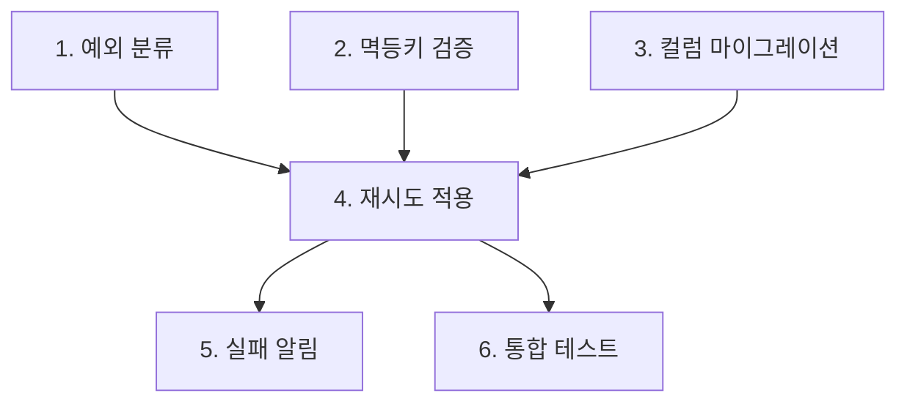

# 22장. 큰 작업 분해하기 — 병렬 가능한 것과 순차적인 것

계획까지 세웠다.

그런데 계획서를 보니 파일 12개가 바뀐다.  
마이그레이션도 있고 새 클래스도 넷이다.

이것을 한 세션에서 시키면 어떻게 되는가.

---

## 큰 작업이 실패하는 세 가지 이유

### 1️⃣ Context가 감당하지 못한다

12개 파일을 읽고 고치는 동안  
초반에 읽은 파일의 내용이 흐려진다.

12장의 Rot이 한 작업 안에서 일어난다.

### 2️⃣ Diff를 검토할 수 없다

800줄짜리 Diff를 끝까지 읽는 사람은 없다.

⚠️ 읽지 않은 Diff를 승인하는 순간  
에이전틱 코딩이 아니라 그냥 위임이 된다.

### 3️⃣ 되돌릴 단위가 없다

12개 중 3개가 잘못됐을 때  
전부 버리거나 전부 안고 가야 한다.

---

## 분해의 기준은 되돌리기다

여러 기준이 있지만 실무에서 통하는 것은 하나다.

> 커밋 하나 = 되돌릴 수 있는 단위

이 기준으로 쪼개면 나머지가 따라온다.

각 단위가 갖춰야 할 조건은 셋이다.

| 조건 | 이유 |
|---|---|
| 단독으로 머지 가능하다 | 다음 단위가 늦어도 배포에 지장 없다 |
| 자체 검증이 가능하다 | 테스트로 끝났는지 판정된다 |
| 30분~2시간 분량이다 | 한 세션에 들어간다 |

---

## Epic → Task → Step

세 층으로 본다.

```text
Epic   결제 재시도 지원              (티켓 하나)
 ├ Task  1. 재시도 예외 분류 도입      (커밋 하나)
 ├ Task  2. 멱등키 검증 강화          (커밋 하나)
 ├ Task  3. retryCount 컬럼 마이그레이션
 ├ Task  4. PgClient 재시도 적용
 ├ Task  5. 3회 실패 시 알림
 └ Task  6. 통합 테스트 보강
```

Step은 Task 안의 순서다.  
문서로 쓰지 않고 Agent에게 맡긴다.

🔥 Task 층이 사람이 관리하는 층이다.

여기가 커밋 단위이고, Review 단위이고,  
세션 단위다.

---

## 의존성을 그린다

쪼갠 다음 순서를 정한다.



여기서 병렬 가능성이 보인다.

* 1, 2, 3은 서로 독립이다
* 4는 셋 다 필요하다
* 5, 6은 4 이후 독립이다

---

## 병렬 가능한가를 판단하는 법

두 질문이면 충분하다.

| 질문 | 예 → |
|---|---|
| 같은 파일을 고치는가 | 순차 |
| 앞의 결과가 있어야 시작할 수 있는가 | 순차 |

둘 다 아니면 병렬이다.

⚠️ 첫 번째 질문을 자주 놓친다.

논리적으로 독립인 두 작업이  
같은 `PaymentService.kt` 를 고치면 충돌한다.

Agent 두 개를 동시에 돌리면 그대로 덮어쓴다.

파일이 겹치면 순차로 돌리거나,  
53장의 Git Worktree로 격리한다.

---

## 실제로는 이렇게 진행한다

병렬이 가능해도 첫 시도는 순차를 권한다.

```text
세션 1  Task 1 → 커밋
세션 2  Task 2 → 커밋
세션 3  Task 3 → 커밋 (마이그레이션이라 별도 확인)
세션 4  Task 4 → 커밋
...
```

이유는 두 가지다.

* 앞 Task에서 배운 것이 뒤에 반영된다
* 어디서 어긋났는지 즉시 안다

병렬은 작업이 확실히 독립이고  
검증 수단이 갖춰졌을 때 쓴다. 53장에서 다룬다.

---

## 각 Task를 어떻게 넘기는가

Task마다 20장의 다섯 요소를 다시 쓰지 않는다.

상위 문서를 참조하고 이번 범위만 좁힌다.

```text
@tasks/PAY-2841.md 를 읽고 Task 4만 진행하자.

이번 범위:
- PgClient.request() 에 재시도 적용
- Task 1의 예외 분류를 사용한다

이번 범위 아님:
- 알림 (Task 5)
- 통합 테스트 (Task 6)

완료 조건:
- 재시도 단위 테스트 3건 통과
- 기존 결제 테스트 24건 통과
```

`이번 범위 아님` 이 20장의 Non-goals다.

Task를 쪼갤수록 이 항목이 중요해진다.  
Agent는 인접 Task를 같이 해버리려 한다.

---

## 과잉 분해의 비용

⚠️ 반대 방향으로도 실패할 수 있다.

한 줄짜리 Task 20개는 관리 비용만 늘린다.

| 신호 | 뜻 |
|---|---|
| Task 설명이 코드보다 길다 | 너무 잘게 쪼갰다 |
| 매번 같은 파일을 다시 읽힌다 | 합치는 편이 낫다 |
| 커밋이 단독으로 의미 없다 | 앞뒤와 합친다 |

기준은 아까와 같다.

되돌릴 필요가 없는 것은 따로 되돌릴 수 있게  
만들 필요도 없다.

---

## 분해도 위임할 수 있다

```text
@tasks/PAY-2841.md 의 계획을 커밋 단위로 쪼개줘.

- 각 단위는 단독으로 머지 가능해야 해
- 각 단위의 완료 조건을 테스트로 쓸 수 있게 적어줘
- 순서와 의존 관계를 표시해줘
- 같은 파일을 건드리는 단위끼리 표시해줘

쪼개기만 하고 구현은 하지 마.
```

마지막 요구가 유용하다.

파일 충돌 정보는 Agent가 코드를 보고 판단하는 편이  
사람의 기억보다 정확하다.

---

## 이 장의 핵심

* 큰 작업은 Context가 감당 못 하고, Diff를 검토할 수 없고, 되돌릴 단위가 없다
* 읽지 않은 Diff를 승인하면 에이전틱 코딩이 아니라 그냥 위임이다
* 분해 기준은 하나다 — 커밋 하나가 되돌릴 수 있는 단위
* 각 단위는 단독 머지 가능하고, 자체 검증되고, 한 세션에 들어가야 한다
* Task 층이 커밋 단위이자 Review 단위이자 세션 단위다
* 같은 파일을 고치거나 앞 결과가 필요하면 순차, 아니면 병렬이다
* 논리적으로 독립이어도 파일이 겹치면 충돌한다
* 병렬은 나중에 — 첫 시도는 순차로 하면서 배운 것을 뒤에 반영한다
* 잘게 쪼갠 Task일수록 "이번 범위 아님" 을 명시해야 한다
