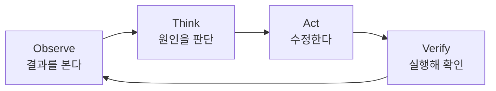

# 24장. Feedback Loop 설계 — Observe · Think · Act · Verify

2장에서 Agent의 다섯 요소 중 마지막이 Feedback Loop였다.

Agent가 스스로 수렴하는 이유는  
반성 능력이 아니라 **틀렸다는 신호가 텍스트로 돌아오기 때문**이라고 했다.

이 장은 그 신호를 설계 대상으로 다룬다.

---

## 루프의 모양



Agent가 잘 도는 프로젝트와 그렇지 않은 프로젝트의 차이는  
`Verify` 에서 무엇이 돌아오느냐에 있다.

돌아오는 것이 없으면  
루프가 아니라 직선이 된다.

```text
Think → Act → (끝)
```

이것이 5장에서 말한 "눈이 없는 상태" 다.

---

## 좋은 피드백의 네 조건

| 조건 | 나쁜 예 | 좋은 예 |
|---|---|---|
| 빠르다 | 통합 테스트 4분 | 단위 테스트 12초 |
| 구체적이다 | `Test failed` | `expected 1 but was 2` |
| 자동이다 | 사람이 확인해줘야 함 | 명령 하나로 판정 |
| 위치를 지목한다 | `NullPointerException` | `PgClient.kt:44` |

네 조건을 모두 만족하는 것이 컴파일 에러다.

그래서 정적 타입 언어를 쓰는 우리는  
에이전틱 코딩에서 유리한 출발선에 있다.

Kotlin 컴파일러가 이미 훌륭한 피드백 장치다.

---

## 피드백에는 계층이 있다

백엔드 작업에서 실제로 쓰는 층들이다.

| 층 | 속도 | 잡아내는 것 |
|---|---|---|
| 컴파일 | 초 | 타입, 시그니처, 오탈자 |
| 린트 | 초 | 스타일, 명백한 실수 |
| 단위 테스트 | 십 초 | 로직 |
| 의존성 규칙 검사 | 십 초 | 계층 위반 (41장) |
| 통합 테스트 | 분 | 연동, 트랜잭션 |
| 실제 API 호출 | 분 | 실환경 동작 |
| 로그 확인 | 분 | 런타임 문제 |

🔥 순서가 중요하다.

싼 것부터 태워야 한다.

```text
컴파일 실패 → 여기서 멈춘다 (12초 낭비)
```

컴파일도 안 되는 코드로 통합 테스트를 돌리면  
4분을 버린다.

Agent에게 이 순서를 알려주는 것은 한 줄이면 된다.

```markdown
# CLAUDE.md
- 수정 후 순서: ktlintCheck → 관련 단위 테스트 → 필요 시 전체 테스트
```

---

## 로그를 피드백으로 만들기

테스트로 못 잡는 것이 있다.

실제로 돌려봐야 아는 문제다.

이때 로그가 피드백이 되려면 조건이 있다.

```text
# ❌ 피드백이 안 되는 로그
2026-08-14 10:23:44 ERROR 결제 처리 실패

# ✅ 피드백이 되는 로그
2026-08-14 10:23:44 ERROR PgClient - 결제 실패
  paymentId=P20260814-0031 pgCode=TIMEOUT retryCount=3
  traceId=8f3a91c2
```

두 번째는 Agent가 다음 행동을 정할 수 있다.

`traceId` 로 관련 로그만 골라낼 수 있고,  
13장에서 말한 로그 잘라내기가 가능해진다.

```bash
docker logs order-service | grep 8f3a91c2
```

⚠️ 구조화되지 않은 로그는  
Context만 먹고 판단은 못 준다.

관측 가능성 개선이 에이전틱 코딩 투자와 겹치는 지점이다.

---

## 수렴하지 않을 때

루프가 항상 답으로 수렴하지는 않는다.

발산하는 신호는 셋이다.

| 신호 | 뜻 |
|---|---|
| 같은 수정을 반복한다 | 원인을 못 찾고 있다 |
| 고칠 때마다 다른 곳이 깨진다 | 문제 정의가 틀렸다 |
| 검증을 약화시키기 시작한다 | 목표를 잘못 이해했다 |

세 번째가 나오면 즉시 멈춘다.  
3장에서 본 그 경로다.

멈추는 조건을 미리 지시에 넣어두면 좋다.

```text
같은 테스트를 세 번 고쳐도 통과하지 못하면
멈추고 지금까지 확인한 것과 막힌 지점을 정리해줘.
```

🔥 이 한 줄이 없으면 Agent는 계속 시도한다.

Agent에게는 "포기" 라는 기본값이 없다.  
비용과 오염이 함께 쌓인다.

59장에서 이것을 중단 조건 설계로 다룬다.

---

## 사람이 개입하는 지점

루프 전체를 사람이 지켜볼 필요는 없다.

| 개입 | 시점 |
|---|---|
| 방향 승인 | 루프 시작 전 (21장) |
| 중단 판단 | 루프가 발산할 때 |
| 결과 검토 | 루프가 수렴한 뒤 (25장) |

가운데를 지켜보고 있으면  
위임의 이점이 사라진다.

3장에서 본 그림 그대로다.

---

## 루프를 갖추는 최소 투자

지금 프로젝트에서 오늘 할 수 있는 것들이다.

```text
1. 빠른 단위 테스트 명령을 분리한다      (12초짜리)
2. 그 명령을 CLAUDE.md에 적는다
3. 검증 순서를 한 줄로 적는다
4. 중단 조건을 작업 지시에 넣는다
```

넷 다 30분이면 된다.

그리고 이 넷이 있으면  
Agent의 결과물 품질이 눈에 띄게 달라진다.

> 모델을 바꾸는 것보다  
> 루프를 만드는 편이 효과가 크다.

4장의 결론이 여기서 실행 가능한 형태가 된다.

---

## 이 장의 핵심

* Agent가 수렴하는 이유는 틀렸다는 신호가 텍스트로 돌아오기 때문이다
* Verify에서 돌아오는 것이 없으면 루프가 아니라 직선이다
* 좋은 피드백은 빠르고, 구체적이고, 자동이고, 위치를 지목한다
* 컴파일 에러가 네 조건을 모두 만족한다 — 정적 타입 언어는 유리한 출발선이다
* 피드백에는 계층이 있고, 싼 것부터 태워야 한다
* 검증 순서를 `CLAUDE.md` 에 한 줄로 적어둔다
* 구조화되지 않은 로그는 Context만 먹고 판단은 주지 않는다
* 검증을 약화시키기 시작하면 즉시 멈춘다
* Agent에게는 포기라는 기본값이 없다 — 중단 조건을 지시에 넣는다
* 루프의 중간을 지켜보면 위임의 이점이 사라진다
