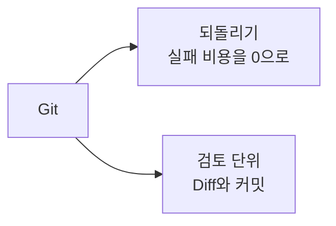
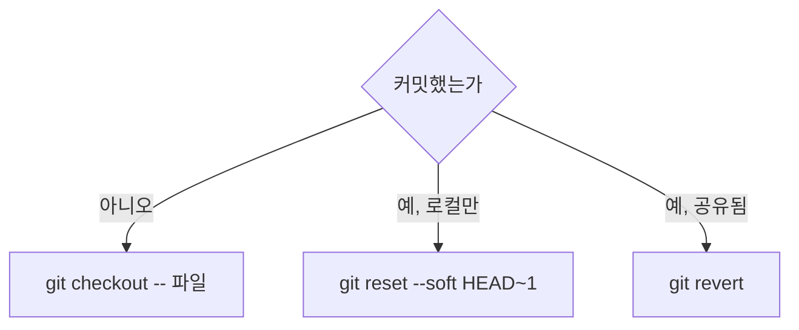
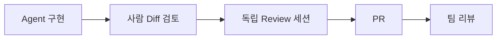

# 25장. Git을 Agent의 안전장치로 — 작은 커밋과 되돌리기

5부의 마지막 장이다.

지금까지 작업을 정의하고, 계획하고, 쪼개고,  
검증 수단을 만들고, 루프를 돌렸다.

마지막으로 필요한 것은 **틀렸을 때 돌아갈 곳**이다.

우리에겐 이미 있다.

---

## Git은 하네스의 일부다

Git이 에이전틱 코딩에서 하는 일은 둘이다.



5장의 부품 목록에는 Git이 없었다.

Tools와 Tests 사이에 조용히 끼어 있다.  
그리고 실무에서는 가장 자주 우리를 구한다.

---

## 작업 전 조건

6장에서 강조한 그 조건이다.

```bash
git status        # clean이어야 한다
git switch -c feat/payment-retry
```

이 두 줄이 안전망 전체의 전제다.

⚠️ 커밋하지 않은 변경 위에서 Agent를 돌리면  
내 변경과 Agent의 변경이 섞인다.

그러면 되돌리기가 불가능해진다.  
어디까지가 내 것인지 구별할 수 없기 때문이다.

`CLAUDE.md` 에 이렇게 적어두는 팀도 있다.

```markdown
- 작업 시작 전 `git status` 가 clean인지 확인한다
  clean이 아니면 작업을 시작하지 말고 알려준다
```

---

## 커밋은 되돌릴 수 있는 단위로

22장의 분해 기준과 같은 문장이다.

```text
❌ "결제 재시도 기능 구현"          (12 파일, 800줄)
✅ "feat: PG 재시도 대상 예외 분류"   (3 파일, 60줄)
   "feat: PgClient 재시도 적용"      (2 파일, 40줄)
   "chore: retryCount 컬럼 추가"     (1 파일, 12줄)
```

작은 커밋의 이점은 되돌리기만이 아니다.

| 이점 | 설명 |
|---|---|
| 되돌리기 | 잘못된 하나만 `revert` |
| 검토 가능 | 60줄은 끝까지 읽힌다 |
| 원인 추적 | `git bisect` 가 의미를 갖는다 |
| 리뷰 부담 | 리뷰어가 실제로 읽는다 |

🔥 두 번째가 에이전틱 코딩에서 가장 중요하다.

22장에서 말한 그대로다.  
읽지 않은 Diff를 승인하면 위임이 아니라 방치다.

---

## Diff를 읽는 순서

9장에서 세 가지를 확인했다.  
실무에서는 순서를 정해두면 빨라진다.

```bash
# 1. 규모부터
git diff --stat

# 2. 테스트가 약해지지 않았는지
git diff src/test/

# 3. 위험한 곳부터
git diff src/main/resources/db/migration/
git diff --  '*Config.kt' '*Properties.kt'

# 4. 나머지
git diff src/main/
```

순서의 이유는 이렇다.

| 순서 | 왜 먼저 |
|---|---|
| `--stat` | 예상보다 크면 여기서 멈춘다 |
| 테스트 | 23장의 네 가지 패턴 |
| 마이그레이션·설정 | 되돌리기 어려운 변경 |
| 나머지 | 앞의 셋이 깨끗하면 마음 편히 읽는다 |

⚠️ `--stat` 에서 예상과 크게 다르면  
그 자리에서 되돌리는 편이 낫다.

```text
계획에 없던 파일이 6개 바뀌었어.
계획 범위(PgClient, PaymentEntity)만 남기고 되돌려줘.
```

---

## Agent에게 커밋을 맡길 때

맡겨도 된다. 규칙이 필요할 뿐이다.

```markdown
# CLAUDE.md
## Git

- 커밋은 논리적 단위로 나눈다. 여러 목적을 한 커밋에 담지 않는다
- 커밋 메시지: `type: 요약` + 빈 줄 + 이유
- 사람이 Diff를 확인하기 전에는 커밋하지 않는다
- 브랜치 생성·전환은 사람이 한다
- `git push` 는 하지 않는다
```

마지막 두 줄이 경계선이다.

로컬에 기록을 쌓는 것과  
원격에 내보내는 것은 성격이 다르다.

17장에서 커밋 메시지를 무료 Memory라고 했다.  
그 이점은 메시지를 잘 쓸 때만 생긴다.

```bash
# ❌
git commit -m "fix bug"

# ✅
git commit -m "fix: 주문 취소 시 포인트 이중 환급 수정

이벤트 기반 환급(a3f9c21) 도입 시 제거되지 않은
Facade의 직접 호출을 제거."
```

---

## 위험한 Git 명령

7장의 `deny` 목록에 반드시 들어가야 하는 것들이다.

| 명령 | 왜 위험한가 |
|---|---|
| `git push --force` | 남의 커밋이 사라진다 |
| `git reset --hard` | 커밋 안 한 작업이 사라진다 |
| `git clean -fd` | 추적 안 되는 파일이 사라진다 |
| `git checkout .` | 전체 변경이 사라진다 |
| `git rebase` (공유 브랜치) | 이력이 갈라진다 |

```json
{
  "permissions": {
    "deny": [
      "Bash(git push --force:*)",
      "Bash(git reset --hard:*)",
      "Bash(git clean:*)"
    ]
  }
}
```

⚠️ 세 번째를 자주 빠뜨린다.

`git clean -fd` 는 `.env.local` 처럼  
추적하지 않는 로컬 설정 파일을 지운다.

Git에 없으니 되돌릴 수도 없다.

---

## 되돌리기 3단계

상황별로 방법이 다르다.



세 번째가 Agent와 함께 일할 때 기본값이다.

이력을 지우지 않고 되돌린다.  
무엇이 왜 되돌려졌는지가 기록에 남는다.

---

## 격리가 필요할 때

병렬 작업에서는 브랜치만으로 부족하다.

Agent 두 개가 같은 작업 디렉터리를 쓰면  
서로의 파일을 덮어쓴다.

```bash
git worktree add ../order-service-retry feat/payment-retry
```

작업 디렉터리 자체를 분리한다.

22장에서 파일이 겹치면 순차로 하라고 했는데,  
Worktree는 그 제약을 푸는 방법이다.

51장에서 다룬다.

---

## PR을 Review 경계로

마지막 안전장치는 사람과 사람 사이에 있다.



세 층의 검토가 겹친다.

18장에서 구현 세션과 Review 세션을 나눈 이유,  
50장의 구현·Review 분리가 이 그림 위에 있다.

> Agent가 빨라질수록  
> 검토 단위는 작아져야 한다.

---

## 이 장의 핵심

* Git은 하네스의 부품이다 — 되돌리기와 검토 단위를 제공한다
* 작업 전 `git status` 가 clean이어야 안전망이 작동한다
* 커밋하지 않은 변경 위에서 작업하면 내 것과 Agent 것이 섞인다
* 커밋은 되돌릴 수 있는 단위로 나눈다 — 22장의 분해 기준과 같다
* Diff는 규모 → 테스트 → 마이그레이션·설정 → 나머지 순으로 읽는다
* `--stat` 에서 예상과 다르면 그 자리에서 되돌린다
* 커밋은 맡기되 push와 브랜치 조작은 사람이 한다
* `git clean` 은 추적하지 않는 파일을 지워서 되돌릴 수 없다
* 공유된 이력은 `revert` 로 되돌린다 — 이유가 기록에 남는다
* Agent가 빨라질수록 검토 단위는 작아져야 한다
