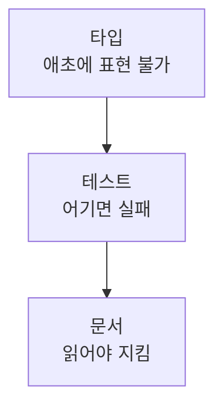

# 29장. 도메인 규칙을 깨뜨리지 않게 — Invariant와 Edge Case

28장의 문제는 코드에 안 보이는 것이었다.

이 장의 문제는 더 나아간다.

**어디에도 안 적혀 있다.**

우리 팀 사람들의 머릿속에만 있다.

---

## 도메인 규칙이 숨어 있는 곳

```text
"부분 취소는 최대 3번까지만 돼요"
"포인트로 결제한 건은 포인트로만 환급해요"
"배송 시작 후에는 취소가 아니라 반품이에요"
"쿠폰은 취소해도 복구 안 해줘요. 정책이 그래요"
```

이 네 줄이 코드 어디에 있는가.

* 첫 번째는 `if (cancelCount >= 3)` 로 흩어져 있다
* 두 번째는 Service 중간에 조건문으로 들어 있다
* 세 번째는 상태 전이 로직 안에 있다
* 네 번째는 **아예 없다.** 그냥 구현하지 않았다

Agent가 이것을 알 방법은 없다.

⚠️ 그리고 모르면 **일반 상식으로 대체한다.**

"취소하면 쿠폰도 복구해주는 게 맞겠지" 라고 판단하고  
친절하게 복구 로직을 추가한다.

---

## Agent가 도메인 규칙을 어기는 세 가지 방식

| 방식 | 예 |
|---|---|
| 몰라서 빠뜨린다 | 부분 취소 3회 제한을 새 경로에 적용 안 함 |
| 상식으로 대체한다 | 없던 쿠폰 복구를 추가 |
| 예외 케이스를 놓친다 | 전액 포인트 결제 건에서 0원 환불 처리 |

세 번째가 가장 자주 일어난다.

Agent는 대표 케이스를 정확히 구현하고  
경계값에서 무너진다.

```text
정상: 10,000원 중 3,000원 포인트 사용 → 비례 배분
경계: 10,000원 전액 포인트 사용     → 카드 환불 0원 요청 발생
```

---

## Invariant를 문장으로 꺼낸다

이 장의 핵심 작업이다.

불변식은 "항상 참이어야 하는 것" 이다.

```markdown
## 주문 도메인 불변식

- 주문 금액 = 상품 금액 합 - 할인 - 포인트 사용액
- 취소된 금액의 합은 결제 금액을 초과할 수 없다
- 포인트 환급액은 사용액을 초과할 수 없다
- 배송 시작된 주문은 취소 상태로 갈 수 없다
- 취소 이력은 삭제되지 않는다 (감사 대상)
```

이 다섯 줄을 어디에 두는가.

16장의 계층화가 여기서 쓰인다.

```text
src/main/kotlin/order/CLAUDE.md
```

도메인 옆에 둔다.  
그 도메인을 건드릴 때만 실려 간다.

---

## Agent에게 꺼내게 시킨다

머릿속에서 다 꺼내기는 어렵다.  
Agent가 코드에서 후보를 뽑아줄 수 있다.

```text
주문 취소 로직에서 도메인 규칙으로 보이는 조건들을 찾아줘.

- 매직넘버, if 조건, 예외 발생 지점을 근거로
- 각 조건이 어떤 규칙을 표현하는지 추정해줘
- 파일과 줄 번호를 함께 적어줘
- 규칙끼리 서로 모순되는 곳이 있으면 표시해줘

수정은 하지 마.
```

마지막 요구가 흥미로운 결과를 준다.

레거시에서는 같은 규칙이  
세 곳에서 서로 다르게 구현되어 있는 경우가 많다.

```text
OrderCancelFacade:88     cancelCount >= 3
AdminOrderService:203    cancelCount > 3      ← 다르다
BatchCancelJob:41        제한 없음            ← 아예 없다
```

🔥 이 목록이 나오면 그 자체로 가치가 있다.

Agent를 도입하지 않았어도 필요했던 정리다.

---

## 규칙을 고정하는 세 가지 수단

강한 순서대로다.



### 타입으로 막기

Kotlin의 강점이 여기서 나온다.

```kotlin
@JvmInline
value class Money(val amount: Long) {
    init { require(amount >= 0) { "금액은 음수일 수 없다" } }
}

sealed interface OrderStatus {
    data object Created : OrderStatus
    data object Paid : OrderStatus
    data object Shipped : OrderStatus
    data object Cancelled : OrderStatus
}
```

`Money` 를 쓰면 음수 금액이 애초에 만들어지지 않는다.  
Agent가 실수할 여지 자체가 사라진다.

> 문서로 지키게 하는 것보다  
> 타입으로 못 하게 하는 편이 강하다.

### 상태 전이를 코드로

```kotlin
fun OrderStatus.canTransitTo(next: OrderStatus): Boolean = when (this) {
    Created -> next in setOf(Paid, Cancelled)
    Paid -> next in setOf(Shipped, Cancelled)
    Shipped -> next == Returned          // 취소 불가
    Cancelled, Returned -> false
}
```

이 함수가 있으면  
"배송 후에는 취소가 아니라 반품" 이 코드가 된다.

Agent가 새 경로를 만들어도 이 함수를 거치면 막힌다.

### 테스트로 고정

타입으로 표현 못 하는 규칙은 테스트로 간다.

```kotlin
@Test
fun `취소 금액 합계는 결제 금액을 초과할 수 없다`() { ... }

@Test
fun `전액 포인트 결제 건은 카드 환불을 요청하지 않는다`() { ... }
```

두 번째가 아까의 경계값이다.

---

## Edge Case를 먼저 요구한다

구현 전에 목록을 받아두면 사고가 줄어든다.

```text
주문 취소 로직을 수정하기 전에,
경계 케이스 목록부터 만들어줘.

- 금액이 0인 경우
- 전액 포인트 결제
- 이미 취소된 주문
- 부분 취소가 여러 번 누적된 경우
- 결제와 취소가 동시에 들어온 경우

이 외에 놓치기 쉬운 것도 추가해줘.
각각 현재 코드가 어떻게 동작하는지도 확인해줘.
```

⚠️ 마지막 문장이 중요하다.

목록만 받으면 "이론적으로 있을 수 있는 케이스" 가 나온다.  
현재 동작까지 확인시키면 실제 문제가 드러난다.

---

## 규칙과 요구사항의 충돌

가끔 이런 일이 생긴다.

```text
요구사항: 배송 시작된 주문도 취소 가능하게 해주세요
불변식:   배송 시작된 주문은 취소 상태로 갈 수 없다
```

Agent는 요구사항을 따른다.  
불변식을 조용히 수정한다.

이것을 막는 규칙이 필요하다.

```markdown
- 불변식과 충돌하는 요구사항이 오면
  구현하지 말고 충돌 내용을 보고한다
```

이 한 줄이 도메인 지식을 지킨다.

---

## 이 장의 핵심

* 도메인 규칙은 코드에 안 보일 뿐 아니라 어디에도 안 적혀 있다
* 모르면 Agent는 일반 상식으로 대체한다 — 없던 로직을 친절하게 추가한다
* Agent는 대표 케이스를 정확히 구현하고 경계값에서 무너진다
* 불변식을 문장으로 꺼내 도메인 디렉터리의 `CLAUDE.md` 에 둔다
* 코드에서 규칙 후보를 뽑는 일은 Agent가 잘한다 — 모순도 함께 찾아준다
* 같은 규칙이 세 곳에서 다르게 구현된 목록은 그 자체로 가치가 있다
* 고정 수단은 타입 > 테스트 > 문서 순으로 강하다
* `value class` 와 `sealed` 상태 전이 함수가 실수 여지를 없앤다
* 경계 케이스는 현재 동작 확인까지 함께 요구해야 실제 문제가 드러난다
* 불변식과 충돌하는 요구사항은 구현이 아니라 보고 대상이다
