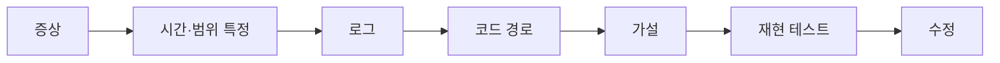

# 33장. 장애와 성능 분석 — 로그에서 Root Cause까지, Slow Query와 N+1

6부의 마지막 장이다.

앞의 일곱 장은 Agent가 실수하는 지점을 다뤘다.

이 장은 반대다.

**Agent가 사람보다 확실히 잘하는 영역**이 있다.

---

## 왜 이 영역에서 강한가

장애 분석은 두 가지 일의 반복이다.

```text
넓게 훑기 → 가설 세우기 → 확인 → 다시 훑기
```

이 중 첫 번째가 사람에게는 지루하고 느리다.

호출 경로를 열 단계 따라가고,  
로그 형식이 다른 파일 세 개를 대조하고,  
비슷한 이름의 메서드 여섯 개를 구별하는 일.

Agent는 이것을 지치지 않고 한다.

🔥 그리고 가설을 여러 개 동시에 세운다.

사람은 하나를 붙잡고 파는데,  
Agent는 다섯 개를 나열하고 각각의 확인 방법을 제시한다.

---

## 장애 분석의 순서



`F` 가 종착점이다.  
재현 테스트 없이 수정하면 고쳤는지 알 수 없다.

23장의 원칙이 장애 대응에서도 그대로다.

---

## 증상부터 정확히 준다

가장 흔한 실수는 결론을 먼저 주는 것이다.

```text
# ❌ 결론을 준 지시
포인트 환급 로직에 버그가 있는 것 같아. 찾아줘.

# ✅ 증상을 준 지시
어제 14시경 일부 사용자의 포인트 잔액이 음수가 됐어.

- 발생 건수: 12건
- 공통점: 전부 부분 취소를 2회 이상 한 주문
- 로그: PointHistory 에 REFUND 가 3건씩 있음
- 정상 케이스와의 차이는 아직 모름

원인 가설을 세워줘. 코드는 아직 고치지 마.
```

⚠️ 결론을 주면 Agent는 그 결론을 뒷받침한다.

12장에서 본 오염이 시작부터 들어가는 것이다.

증상만 주면 우리가 생각 못 한 경로를 찾아온다.

---

## 로그는 잘라서 준다

13장의 원칙이다.

```bash
# ❌
docker logs order-service > all.log        # 200MB

# ✅
docker logs order-service --since 14:00 --until 14:30 \
  | grep "8f3a91c2" | head -100
```

24장에서 `traceId` 를 강조한 이유가 여기서 회수된다.

추적 ID가 있으면 한 요청의 전체 흐름을  
100줄 안으로 뽑을 수 있다.

없으면 시간 범위로 자르고, 그래도 크면  
Agent에게 먼저 필터 조건을 만들게 한다.

```text
이 장애와 관련된 로그를 찾으려고 해.
어떤 키워드로 grep 하면 좋을지 먼저 알려줘.
```

---

## 가설을 여러 개 받는다

Agent의 강점을 쓰는 방법이다.

```text
가능한 원인을 3개 이상 제시해줘.

각각에 대해:
- 근거가 되는 코드 위치 (파일:줄)
- 이 가설이 맞다면 로그에 무엇이 남아 있어야 하는가
- 어떻게 확인할 수 있는가

가장 유력한 것부터 정렬해줘.
```

두 번째 항목이 특히 유용하다.

가설을 **반증 가능한 형태**로 만들면  
확인이 빨라진다.

```text
가설 2: 부분 취소 시 이전 취소분을 차감하지 않는다
  → 맞다면 3번째 취소의 refundAmount 가
     남은 금액보다 클 것
  → 확인: PointHistory 의 금액 합 vs 원 결제 금액
```

---

## 재현이 종착점

원인을 찾았으면 테스트로 만든다.

```text
이 원인이 맞다면 재현되는 테스트를 만들어줘.
부분 취소를 3회 하는 시나리오로.

지금은 실패해야 정상이야.
```

실패를 확인한 다음에 수정한다.

9장과 같은 흐름이고,  
장애 대응에서 이 순서를 지키기가 더 어렵다.

⚠️ 급하기 때문이다.

그래서 규칙으로 적어둘 가치가 있다.

```markdown
- 장애 수정은 재현 테스트를 먼저 만든 뒤에 한다
  (핫픽스가 급하면 수정을 먼저 하되, 테스트 추가 없이 종료하지 않는다)
```

괄호 안이 현실적인 타협이다.

---

## 성능 — 측정 없이 최적화하지 않는다

여기서 Agent의 성향이 함정이 된다.

"이 API가 느려" 라고 하면  
Agent는 즉시 개선안을 낸다.

캐시를 붙이고, 쿼리를 합치고, 인덱스를 제안한다.

⚠️ 전부 그럴듯하고, 대개 원인이 아니다.

```text
# ❌
주문 목록 API가 느려. 개선해줘.

# ✅
주문 목록 API가 느려 (p95 1.8초).

먼저 원인을 특정하자.
- 실행되는 쿼리를 전부 찾아줘 (JPA 로그 기준)
- 쿼리 개수와 각각의 실행 계획을 확인해줘
- 애플리케이션 로직에서 느릴 만한 곳도 확인해줘

개선안은 원인이 확인된 다음에.
```

---

## N+1은 Agent가 잘 찾는다

가장 흔한 성능 문제이자  
정적 분석으로 잡히는 문제다.

```text
주문 목록 조회에서 N+1이 발생하는 지점을 찾아줘.

- 엔티티 연관관계의 fetch 전략을 확인해줘
- 루프 안에서 lazy 필드에 접근하는 곳을 찾아줘
- 실제 실행되는 쿼리 개수를 로그로 확인해줘
```

세 번째가 확인 단계다.

```properties
logging.level.org.hibernate.SQL=debug
```

쿼리 개수가 1 + N이면 확정이다.

해결 방법은 여러 개다.

| 방법 | 주의 |
|---|---|
| `fetch join` | 페이징과 함께 쓰면 메모리에서 자름 |
| `@EntityGraph` | 조인이 많아지면 카티션 곱 |
| `@BatchSize` | 쿼리 수는 줄지만 여전히 여러 번 |
| DTO 직접 조회 | 가장 빠르지만 코드가 늘어남 |

Agent는 대개 `fetch join` 을 제안한다.  
페이징이 있으면 그게 함정이다.

---

## 개선은 숫자로 확인한다

완료 조건에 측정을 넣는다.

```markdown
## Acceptance Criteria
- 주문 목록 조회 시 실행 쿼리 3개 이하 (기존 41개)
- 로컬 1,000건 데이터에서 응답 200ms 이하
- 실행 계획에 풀스캔 없음
- 기존 주문 테스트 32건 통과
```

⚠️ 로컬 측정은 참고값이다.

27장에서 말한 대로 데이터 분포가 다르다.  
쿼리 **개수**는 신뢰할 수 있고, 시간은 아니다.

그래서 첫 번째 항목이 가장 확실한 기준이다.

---

## 6부를 마치며

여덟 장을 관통하는 패턴이 있다.

| Agent가 잘하는 것 | 사람이 해야 하는 것 |
|---|---|
| 전수 조사 (누락·패턴 찾기) | 정책 결정 |
| 가설 세우기 | 가설 선택 |
| 규칙대로 구현하기 | 규칙 정하기 |
| 반복 작업 | 되돌릴 수 없는 실행 |

왼쪽에 맡기고 오른쪽을 지킨다.

이 구분이 7부와 8부에서  
레거시를 다룰 때 그대로 이어진다.

---

## 이 장의 핵심

* 장애 분석은 Agent가 사람보다 확실히 잘하는 영역이다
* 지치지 않고 훑고, 가설을 여러 개 동시에 세운다
* 결론을 주면 Agent는 그 결론을 뒷받침한다 — 증상만 준다
* `traceId` 가 있으면 한 요청 흐름을 100줄로 뽑을 수 있다
* 가설은 반증 가능한 형태로 받는다 — "맞다면 무엇이 남아 있어야 하는가"
* 재현 테스트가 장애 분석의 종착점이다
* 급할수록 이 순서를 어기게 되므로 규칙으로 적어둔다
* "느려" 라고만 하면 그럴듯하고 대개 틀린 개선안이 나온다
* N+1은 쿼리 개수로 확정하고, `fetch join` 은 페이징과 함께 쓸 때 함정이 있다
* 로컬에서 쿼리 개수는 신뢰할 수 있고 응답 시간은 참고값이다
