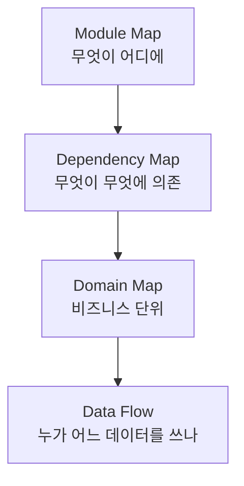
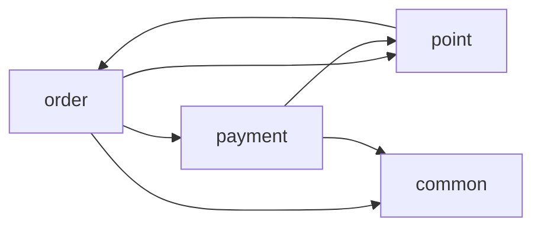

# 35장. 코드베이스 지도 만들기 — Module · Dependency · Domain · Data Flow

34장에서 흐름 하나를 끝까지 따라갔다.

그런 흐름이 마흔 개 있다.

전부 따라가면 3주가 걸리고,  
따라가는 동안 앞의 것을 잊는다.

필요한 것은 지도다.

---

## 지도를 만드는 이유

한 번 만들면 이후 모든 작업이 싸진다.

```text
지도가 없을 때        지도가 있을 때
────────────────     ────────────────
매 세션 탐색부터      @docs/dependency-map.md 로 시작
파일 40개 읽힘        문서 한 장
30분 소요             1분
```

12장의 Context 예산이 근본적으로 달라진다.

그리고 지도는 사람도 쓴다.  
신규 입사자 온보딩 문서가 동시에 만들어진다.

---

## 네 종류를 만든다



뒤로 갈수록 만들기 어렵고,  
8부에 더 중요하다.

---

## 1️⃣ Module Map

가장 쉽다. 8장에서 만든 구조 설명의 확장이다.

```text
패키지별로 정리해줘.

- 각 패키지의 역할 한 줄
- 클래스 수, 총 라인 수
- 주요 진입점
- 최근 1년 변경 커밋 수

표로 만들고 docs/module-map.md 에 저장해줘.
```

| 패키지 | 역할 | 클래스 | 라인 | 최근 1년 커밋 |
|---|---|---|---|---|
| `order` | 주문 생성·조회·취소 | 84 | 12,400 | 217 |
| `payment` | 결제·PG 연동 | 61 | 9,800 | 143 |
| `point` | 적립·환급 | 22 | 3,100 | 38 |
| `common` | 공통 유틸 | 47 | 5,200 | 91 |
| `legacy` | 사용 중단 | 130 | 21,000 | 4 |

🔥 마지막 두 열이 판단 재료다.

`legacy` 가 전체의 3분의 1인데 커밋은 4건.  
`common` 이 91건이면 공통 모듈이 계속 자라고 있다는 뜻이다.

---

## 2️⃣ Dependency Map

여기서부터 가치가 커진다.

```text
패키지 간 의존 관계를 분석해줘.

- 어느 패키지가 어느 패키지를 참조하는가
- 참조 횟수(import 기준)도 함께
- 순환 의존이 있으면 별도로 표시해줘

Mermaid 다이어그램과 표 둘 다 만들어줘.
```



⚠️ `point → order` 화살표가 보인다.

`order` 가 `point` 를 쓰는 것은 자연스러운데  
`point` 가 `order` 를 다시 참조하고 있다.

순환이다.

```text
point → order 참조를 전부 찾아줘.
각각 무엇 때문에 필요한지 확인해줘.
```

대개 이유는 셋 중 하나다.

| 이유 | 해결 방향 |
|---|---|
| 주문 정보 조회가 필요 | 필요한 값만 파라미터로 받기 |
| 이벤트를 못 쓰고 직접 호출 | 이벤트로 전환 |
| 공통 타입이 order에 있음 | common으로 이동 |

🔥 순환 의존은 경계가 없다는 증거다.

이 목록이 8부에서 가장 먼저 손댈 작업이 된다.

---

## 3️⃣ Domain Map

패키지 구조와 비즈니스 도메인이  
일치하지 않는 것이 레거시의 특징이다.

```text
비즈니스 도메인 기준으로 코드를 묶어줘.

패키지 구조가 아니라 실제 하는 일 기준으로.
한 도메인의 코드가 여러 패키지에 흩어져 있으면
전부 찾아서 목록으로 만들어줘.
```

결과가 이렇게 나오면 문제가 보인다.

```markdown
## 포인트 도메인
- point/                         (본체)
- order/OrderPointCalculator.kt  ← 흩어짐
- payment/PointPaymentHandler.kt ← 흩어짐
- legacy/PointMigrationJob.kt    ← 흩어짐
- common/PointFormatter.kt       ← 흩어짐
```

포인트 로직이 네 곳에 있다.

⚠️ 이 상태에서 "포인트를 떼어내자" 는 불가능하다.

39장에서 무엇부터 정리할지 정할 때  
이 흩어짐 정도가 우선순위 기준이 된다.

---

## 4️⃣ Data Flow와 데이터 소유권

8부에 가장 직접적으로 쓰이는 지도다.

```text
각 테이블에 누가 쓰기를 하는지 조사해줘.

- 테이블별로 INSERT/UPDATE/DELETE 하는 클래스 목록
- 어느 패키지에서 하는지
- 읽기만 하는 곳도 별도로

Repository, JPQL, 네이티브 쿼리, 마이그레이션 전부 확인해줘.
```

| 테이블 | 쓰는 곳 | 읽는 곳 |
|---|---|---|
| `orders` | order | order, payment, point, legacy |
| `payments` | payment, **legacy** ⚠️ | payment, order |
| `point_histories` | point, **order** ⚠️ | point, order, admin |
| `users` | user | 거의 전부 |

⚠️ 표시된 두 곳이 문제다.

`order` 가 `point_histories` 에 직접 쓰고 있다.

이러면 포인트 도메인은 자기 데이터의 주인이 아니다.  
나중에 떼어낼 때 이 지점이 그대로 걸린다.

> 코드 경계보다 데이터 경계가 더 완고하다.

43장에서 이 표를 다시 꺼낸다.

---

## 지도는 낡는다

⚠️ 지도의 가장 큰 위험은 틀린 지도다.

없는 것보다 나쁘다.  
Agent가 그것을 사실로 읽기 때문이다.

```markdown
<!-- docs/dependency-map.md -->
> 작성: 2026-08-14
> 기준 커밋: a3f9c21
```

기준 커밋을 적어두면 얼마나 낡았는지 즉시 안다.

42장에서 의존성 규칙을 테스트로 만들면  
지도의 일부는 자동으로 검증된다.

---

## 지도를 Agent가 쓰게 만든다

만들어놓고 안 쓰면 의미가 없다.

`CLAUDE.md` 에서 가리킨다.

```markdown
## 코드베이스 지도

작업 전에 관련 지도를 먼저 읽는다.

- `docs/module-map.md` 패키지 구조와 규모
- `docs/dependency-map.md` 패키지 간 의존 (순환 포함)
- `docs/domain-map.md` 도메인별 코드 위치
- `docs/data-ownership.md` 테이블 쓰기 주체

지도와 코드가 다르면 코드를 따르고, 차이를 보고한다.
```

마지막 줄이 안전장치다.

지도가 낡았을 때  
Agent가 조용히 틀린 정보를 쓰는 것을 막는다.

---

## 한 번에 다 만들지 않는다

작업하면서 필요한 것부터 만든다.

| 지금 하려는 일 | 먼저 만들 지도 |
|---|---|
| 기능 추가 | Module Map |
| 리팩터링 | Dependency Map |
| 도메인 정리 | Domain Map |
| 분리 준비 | Data Flow |

목적지로 가려면 결국 넷 다 필요하지만,  
순서는 지금 하는 일이 정한다.

---

## 이 장의 핵심

* 지도를 한 번 만들면 이후 모든 세션의 Context 비용이 달라진다
* Module → Dependency → Domain → Data Flow 순으로 어렵고, 뒤로 갈수록 8부에 중요하다
* 패키지 규모와 최근 커밋 수를 함께 보면 판단 재료가 된다
* 순환 의존은 경계가 없다는 증거다 — 8부에서 가장 먼저 손댈 목록이 된다
* 레거시에서는 패키지 구조와 비즈니스 도메인이 일치하지 않는다
* 한 도메인의 코드가 흩어진 정도가 정리 우선순위의 기준이 된다
* 데이터 소유권 표에서 남의 테이블에 쓰는 곳이 분리의 걸림돌이다
* 코드 경계보다 데이터 경계가 더 완고하다
* 틀린 지도는 없는 지도보다 나쁘다 — 기준 커밋을 함께 적는다
* "지도와 코드가 다르면 코드를 따르고 보고한다" 를 규칙으로 둔다
