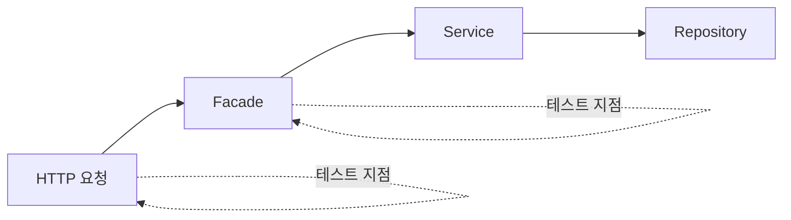

# 36장. Characterization Test — 리팩터링 전에 현재 동작을 고정한다

지도가 생겼다.

의존이 어떻게 얽혀 있는지,  
어느 도메인이 어디에 흩어져 있는지 안다.

이제 손을 대고 싶어진다.

⚠️ 아직 하나가 남았다.

**무엇이 깨졌는지 알 방법**이다.

---

## 테스트가 없는 상태에서의 리팩터링

레거시의 현실은 대개 이렇다.

```text
order 패키지    테스트 커버리지 34%
payment 패키지  22%
legacy 패키지   0%
```

이 상태에서 Agent에게 리팩터링을 시키면  
빠르고 조용하게 망가진다.

23장의 문장이 여기서 가장 무겁다.

> 테스트가 없으면  
> Agent의 "수정 완료" 는 의견에 불과하다.

그래서 8부로 넘어가기 전에  
이 장의 작업이 반드시 선행된다.

---

## 일반 테스트와 무엇이 다른가

Characterization Test는 **옳은지 묻지 않는다.**

| 일반 테스트 | Characterization Test |
|---|---|
| 이렇게 동작해야 한다 | 지금 이렇게 동작한다 |
| 명세에서 나온다 | 실행 결과에서 나온다 |
| 버그를 잡는다 | 버그도 함께 고정한다 |
| 영구히 유지 | 리팩터링이 끝나면 정리 |

🔥 세 번째 줄이 이 기법의 핵심이자  
사람들이 가장 거부감을 느끼는 부분이다.

버그를 테스트로 박제한다.

의도적이다.

리팩터링의 목표는 **동작을 바꾸지 않는 것**이다.  
버그도 동작의 일부다.

버그 수정과 구조 변경을 동시에 하면  
무엇 때문에 깨졌는지 알 수 없다.

```text
1단계  현재 동작 고정 (버그 포함)
2단계  구조 변경 — 테스트가 계속 통과해야 함
3단계  버그 수정 — 이때 테스트를 의도적으로 수정
```

25장의 작은 커밋 원칙과 같은 이유다.  
한 번에 한 가지만 바꾼다.

---

## 어디에 씌우는가

경계에 씌운다. 안쪽이 아니다.



`Service` 나 `Repository` 에 씌우면  
리팩터링할 때 테스트도 함께 깨진다.

그러면 테스트가 안전망이 아니라 짐이 된다.

| 레벨 | 언제 |
|---|---|
| HTTP API | 가장 안전. 내부를 마음껏 바꿀 수 있다 |
| Facade | 계층 재배치가 목표일 때 |
| Service | 권장하지 않음 |

> 바꿀 것의 바깥에 테스트를 둔다.

---

## Agent와 함께 만드는 절차

여섯 단계다.

### 1️⃣ 대상 경로를 고른다

35장의 지도에서 고른다.

```text
docs/domain-map.md 를 읽고,
포인트 도메인이 관여하는 API 엔드포인트를 전부 찾아줘.
```

### 2️⃣ 입력 조합을 뽑는다

여기서 Agent가 강하다.

```text
POST /orders/{id}/cancel 의 입력 조합을 나열해줘.

코드의 분기를 근거로:
- 주문 상태별 (생성/결제완료/배송중/배송완료)
- 결제 수단별 (카드/포인트/혼합)
- 취소 이력별 (없음/부분취소 1회/2회/3회)
- 경계값 (금액 0, 전액 포인트, 최소 단위)

각 조합에서 어느 분기로 가는지도 표시해줘.
```

29장에서 경계 케이스를 요구한 것과 같은 방법이다.

### 3️⃣ 현재 결과를 수집한다

```text
각 조합에 대해 현재 코드가 무엇을 반환하고
어떤 Side Effect를 만드는지 확인해줘.

- 응답 상태 코드와 본문
- DB 변경 (어느 테이블에 무엇이)
- 발행되는 이벤트
- 외부 호출 여부

실행해서 확인하고, 결과를 표로 정리해줘.
```

⚠️ 여기서 "이건 버그 같은데요" 가 나온다.

```text
경계 케이스 (전액 포인트 결제 + 부분 취소 3회):
현재 동작은 4번째 취소를 허용합니다.
제한이 3회인데 조건이 `> 3` 으로 되어 있습니다.
```

29장에서 본 그 불일치다.

**고치지 않는다.** 기록만 한다.

### 4️⃣ 테스트로 옮긴다

```text
위 표를 그대로 테스트로 만들어줘.

- 현재 동작을 그대로 검증해 (옳은지 판단하지 마)
- 버그로 의심되는 것은 테스트 이름에 표시해줘
  예: `현재 동작_부분취소_4회까지_허용됨_BUG의심`
- 기존 IntegrationTestBase 를 상속해
```

테스트 이름에 남기면  
나중에 정리할 목록이 자동으로 생긴다.

### 5️⃣ 전부 통과하는지 확인한다

```bash
./gradlew test --tests '*OrderCancelCharacterization*'
```

여기서 실패하면 테스트가 틀린 것이다.  
현재 동작을 잘못 기록했다는 뜻이니 고친다.

### 6️⃣ 커밋한다

```bash
git commit -m "test: 주문 취소 현재 동작 고정 (characterization)

리팩터링 전 안전망. 버그 의심 3건은 테스트 이름에 표시."
```

---

## 골든 마스터

응답이 크면 하나씩 단정하기 어렵다.  
이때는 결과 전체를 파일로 저장해 비교한다.

```kotlin
@Test
fun `주문 상세 응답 - 골든 마스터`() {
    val response = api.get("/orders/1001")
    approvals.verifyJson(response)   // 저장된 스냅샷과 비교
}
```

⚠️ 23장의 "기댓값을 실제값으로 수정" 이  
스냅샷에서는 훨씬 쉽게 일어난다. 파일 하나 덮어쓰면 끝이다.

```markdown
- 골든 마스터 스냅샷을 임의로 갱신하지 않는다
  차이가 나면 갱신하지 말고 보고한다
```

---

## 커버리지가 아니라 경로

전부 덮으려 하면 시작도 못 한다.

```text
❌ order 패키지 커버리지 80% 달성
✅ 취소 흐름의 주요 경로 12개 고정
```

기준은 이렇다.

| 우선순위 | 대상 |
|---|---|
| 1 | 돈이 움직이는 경로 |
| 2 | 이번에 바꿀 코드가 지나는 경로 |
| 3 | 자주 바뀌는 경로 (35장의 커밋 통계) |
| 4 | 나머지 |

🔥 2번이 실용적인 기준이다.

바꾸지 않을 코드에 테스트를 씌우는 것은  
지금 필요한 일이 아니다.

---

## 리팩터링이 끝난 뒤

Characterization Test는 한시적이다.

작업이 끝나면 셋 중 하나를 고른다.

| 판단 | 처리 |
|---|---|
| 명세로서 옳다 | 이름을 정리하고 정식 테스트로 승격 |
| 버그를 고정한 것이다 | 버그 수정과 함께 기댓값 변경 |
| 중간 구조에만 의미 있다 | 삭제 |

17장에서 작업 문서를 승격하거나 삭제하라고 한 것과 같다.

방치하면 "왜 이런 이상한 동작을 검증하지" 하는  
테스트가 몇 년 남는다.

---

## 이제 8부가 가능해진다

```text
34장  무엇이 어떻게 동작하는지 안다
35장  무엇이 무엇에 의존하는지 안다
36장  바꿔도 깨졌는지 알 수 있다
```

세 번째가 없으면 앞의 둘은 지식일 뿐이다.

경계를 긋는 작업은 코드를 대규모로 옮기는 일이고,  
안전망 없이는 시작하지 않는다.

---

## 이 장의 핵심

* Characterization Test는 옳은지 묻지 않고 지금 동작을 기록한다
* 버그도 함께 고정한다 — 리팩터링의 목표는 동작을 바꾸지 않는 것이다
* 구조 변경과 버그 수정을 동시에 하면 무엇 때문에 깨졌는지 알 수 없다
* 바꿀 것의 바깥에 테스트를 둔다 — API 레벨이 가장 안전하다
* 입력 조합을 코드 분기 근거로 뽑는 일은 Agent가 강하다
* 수집 중 발견한 버그는 고치지 말고 테스트 이름에 표시한다
* 골든 마스터 스냅샷은 파일 하나 덮어쓰면 되므로 갱신을 금지한다
* 목표는 커버리지가 아니라 이번에 바꿀 코드가 지나는 경로다
* 작업이 끝나면 승격하거나 삭제한다 — 방치하면 이상한 테스트가 남는다
* 안전망 없이 경계 작업을 시작하지 않는다
