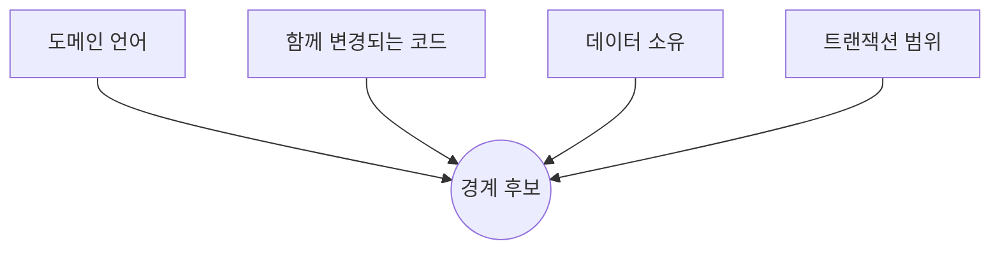

# 38장. 코드에서 경계를 찾기 — 도메인 · 책임 · 데이터 소유권

7부에서 준비를 마쳤다.

지도가 있고, 안전망이 있다.

이제 선을 긋는다.

그런데 어디에 긋는가.

---

## 경계는 발명이 아니라 발견이다

가장 흔한 실수는 경계를 **설계하려는** 것이다.

화이트보드에 이상적인 도메인 구조를 그리고  
코드를 거기에 맞추려 한다.

레거시에서 이 방식은 거의 실패한다.

이미 5년간 만들어진 결합이 있고,  
그 결합에는 대부분 이유가 있다.

> 경계는 코드가 이미 알려주고 있다.  
> 우리가 할 일은 읽어내는 것이다.

Agent가 특히 잘하는 일이 바로 이 읽어내기다.

---

## 네 가지 신호

경계 후보는 네 방향에서 드러난다.



각각을 Agent에게 수집시킬 수 있다.

### 1️⃣ 도메인 언어

같은 단어를 쓰는 코드는 대개 같은 편이다.

```text
코드에 등장하는 도메인 용어를 추출해줘.

- 클래스명, 메서드명, 필드명, DB 컬럼명 기준
- 어떤 용어가 어느 패키지에 몰려 있는지 표로
- 같은 개념을 다른 이름으로 부르는 곳이 있으면 표시해줘
```

마지막 요구가 유용하다.

```text
"결제 금액" 을 부르는 이름
  payment.amount        (payment 패키지)
  paidAmount            (order 패키지)
  settlement_price      (legacy 패키지)
```

⚠️ 이름이 갈리는 지점이 경계일 때가 많다.

29장에서 도메인 용어를 정리한 것이 여기서 회수된다.

### 2️⃣ 함께 변경되는 코드

34장에서 뽑은 신호다.

```text
최근 1년간 한 커밋에서 함께 변경된 파일 쌍을
빈도순으로 20개 뽑아줘. 패키지가 다른 쌍만.
```

패키지는 다른데 늘 함께 바뀐다면  
그 둘은 사실 하나다.

🔥 이 신호는 코드를 읽어서는 절대 안 보인다.  
이력에만 있다.

### 3️⃣ 데이터 소유

35장의 데이터 소유권 표다.

```text
docs/data-ownership.md 를 읽고,
한 테이블에 두 개 이상의 패키지가 쓰기를 하는 경우를 찾아줘.
```

쓰기 주체가 여럿인 테이블은  
경계가 성립하지 않은 곳이다.

### 4️⃣ 트랜잭션 범위

가장 완고한 신호다.

```text
하나의 트랜잭션 안에서 함께 수정되는 테이블 조합을 찾아줘.
@Transactional 메서드 기준으로.
```

같은 트랜잭션에 묶인 테이블은  
나중에 서비스를 나눌 때 가장 큰 장애물이 된다.

44장에서 이 문제를 다룬다.

---

## 신호가 엇갈릴 때

네 신호가 항상 같은 답을 주지는 않는다.

| 상황 | 해석 |
|---|---|
| 언어는 다른데 함께 변경 | 결합이 잘못됐다 — 끊을 후보 |
| 언어는 같은데 흩어져 있다 | 모을 후보 |
| 데이터는 나뉘는데 트랜잭션이 묶임 | 경계는 있으나 정합성 설계 필요 |
| 넷 다 붙어 있다 | 하나의 도메인. 나누지 않는다 |

마지막 줄이 중요하다.

**나누지 않는다는 결론도 결론이다.**

⚠️ 경계를 찾는 작업이 곧 나누는 작업은 아니다.

---

## Agent에게 경계를 정하게 하지 않는다

이 장에서 가장 조심할 부분이다.

```text
# ❌ 이렇게 물으면
이 코드베이스를 어떤 도메인으로 나누면 좋을까?
```

Agent는 답한다.  
아주 그럴듯하게.

주문, 결제, 배송, 회원, 상품, 정산.  
전자상거래 교과서에 나오는 그 구분이다.

⚠️ 우리 코드와 무관하게 나온 답이다.

우리 회사에서 "정산" 이 실제로 무엇을 뜻하는지,  
왜 배송과 주문이 한 몸인지 반영되지 않았다.

```text
# ✅ 이렇게 묻는다
docs/dependency-map.md 와 docs/data-ownership.md 를 읽고,
결합이 약해서 떼어낼 수 있어 보이는 후보를 찾아줘.

- 근거가 되는 데이터를 함께 제시해줘
- 각 후보의 외부 의존 개수를 세어줘
- 판단은 하지 말고 후보와 근거만 보여줘
```

33장의 결론을 미리 주지 않는 원칙과 같다.

> Agent에게 정답을 묻지 말고  
> 근거를 모으게 한다.

---

## 경계 카드로 정리한다

후보가 나오면 하나씩 카드로 만든다.

```markdown
# 경계 후보: 포인트

## 범위
- point/ 전체 (22 클래스)
- order/OrderPointCalculator.kt        ← 이동 필요
- payment/PointPaymentHandler.kt       ← 이동 필요
- common/PointFormatter.kt             ← 이동 필요

## 소유 데이터
- point_histories (쓰기: point, order ⚠️)
- point_balances  (쓰기: point 단독 ✅)

## 외부에서 들어오는 의존
- order → point.refund()      (12곳)
- payment → point.use()       (5곳)

## 밖으로 나가는 의존
- point → order.getOrder()    (3곳) ⚠️ 순환

## 트랜잭션 결합
- 주문 취소 트랜잭션이 orders + point_histories 동시 수정

## 떼어내기 전 해결할 것
1. point → order 역참조 3곳 제거
2. order 가 point_histories 에 직접 쓰는 경로 정리
3. 흩어진 3개 파일 이동
```

이 카드가 39장의 우선순위 판단 재료가 되고,  
41~43장의 작업 목록이 된다.

---

## 문서로 먼저 검증한다

16장에서 예고한 방법이다.

코드를 옮기기 전에  
경계가 성립하는지 문서로 확인할 수 있다.

```text
경계 카드의 범위를 전제로,
포인트 도메인의 규칙만 담은 CLAUDE.md 초안을 써줘.

- 이 도메인의 불변식
- 이 도메인이 소유한 데이터
- 다른 도메인과 주고받는 것

쓰다가 "이건 어느 쪽 규칙인지 모르겠다" 싶은 게 나오면
그것도 적어줘.
```

🔥 마지막 요구가 검증 장치다.

애매한 항목이 많이 나오면  
경계가 아직 명확하지 않다는 뜻이다.

파일 하나 옮기지 않고 가설을 검증했다.

---

## 이 장의 핵심

* 경계는 설계하는 것이 아니라 코드에서 발견하는 것이다
* 신호는 넷이다 — 도메인 언어, 함께 변경, 데이터 소유, 트랜잭션 범위
* 같은 개념을 다른 이름으로 부르는 지점이 경계일 때가 많다
* 함께 변경되는 파일 쌍은 코드가 아니라 이력에만 있는 신호다
* 쓰기 주체가 여럿인 테이블은 경계가 성립하지 않은 곳이다
* 신호가 엇갈리면 해석이 달라지고, "나누지 않는다" 도 결론이다
* Agent에게 도메인 구분을 물으면 교과서적 답이 나온다
* 정답을 묻지 말고 근거를 모으게 한다
* 경계 카드가 이후 작업의 목록이 된다
* 도메인 규칙 문서를 써보면 코드를 옮기기 전에 경계를 검증할 수 있다
