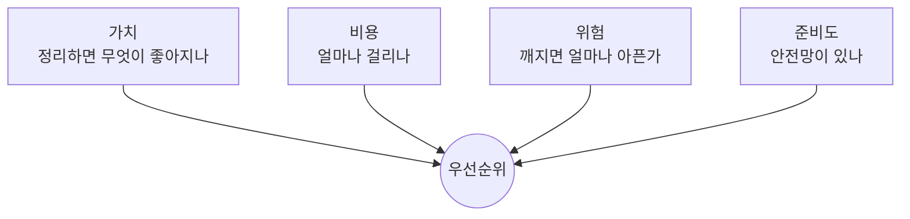

# 39장. 무엇부터 정리할 것인가 — 경계 후보의 우선순위

경계 카드가 다섯 장 나왔다.

포인트, 알림, 정산, 배송, 회원.

전부 정리할 수는 없다.

우리에겐 기능 개발도 있고,  
이 작업에 쓸 수 있는 시간은 한 달에 며칠이다.

---

## 네 축으로 본다



각 축을 Agent가 측정할 수 있다.

### 가치 — 변경 빈도

정리 효과는 앞으로 얼마나 자주 만지느냐에 비례한다.

```text
경계 후보별로 최근 1년 커밋 수를 세어줘.
해당 도메인 파일이 포함된 커밋 기준으로.
```

| 후보 | 커밋 수 |
|---|---|
| 주문 | 217 |
| 결제 | 143 |
| 포인트 | 38 |
| 알림 | 12 |
| 정산 | 9 |

1년에 9번 만지는 코드를 정리하는 것은  
지금 할 일이 아니다.

### 비용 — 결합도와 흩어짐

```text
경계 카드별로 다음을 세어줘.

- 밖에서 들어오는 의존 개수
- 밖으로 나가는 의존 개수 (순환 포함)
- 도메인 코드가 흩어진 패키지 수
- 공유 테이블 수
```

| 후보 | 들어옴 | 나감 | 흩어짐 | 공유 테이블 |
|---|---|---|---|---|
| 포인트 | 17 | 3 | 4 | 1 |
| 알림 | 31 | 0 | 2 | 0 |
| 정산 | 4 | 9 | 6 | 3 |

🔥 `나감` 이 비용의 핵심 지표다.

들어오는 의존은 인터페이스로 정리하면 되지만,  
나가는 의존은 그 도메인이 남에게 매달려 있다는 뜻이다.

알림은 나가는 의존이 0이다.  
떼어내기 가장 쉽다.

### 위험 — 깨지면 얼마나 아픈가

측정이 아니라 판단이다.

| 등급 | 예 |
|---|---|
| 최상 | 결제, 정산 — 돈이 틀리면 되돌리기 어렵다 |
| 상 | 주문, 재고 — 서비스가 멈춘다 |
| 중 | 포인트 — 보정 가능 |
| 하 | 알림 — 재발송하면 된다 |

⚠️ 첫 대상으로 최상 등급을 고르지 않는다.

방법이 익숙해지기 전에 가장 위험한 곳을 건드린다.

### 준비도 — 안전망

36장의 결과다.

```text
경계 후보별 테스트 커버리지와
Characterization Test 존재 여부를 정리해줘.
```

준비도가 낮으면 우선순위와 무관하게  
36장으로 돌아가야 한다.

---

## 매트릭스에 놓는다

가치와 비용 두 축이면 대개 결정된다.

```text
             비용 낮음        비용 높음
          ┌──────────────┬──────────────┐
가치 높음 │  ① 먼저 한다  │ ③ 쪼개서 한다 │
          ├──────────────┼──────────────┤
가치 낮음 │ ② 연습용      │  ④ 안 한다   │
          └──────────────┴──────────────┘
```

앞의 표를 놓아보면 이렇다.

* 포인트 — 가치 중, 비용 중 → ①에 가깝다
* 알림 — 가치 낮음, 비용 낮음 → ②
* 정산 — 가치 낮음, 비용 높음 → ④
* 주문 — 가치 최상, 비용 최상 → ③

---

## 첫 대상은 ②에서 고른다

의외의 결론이지만 실무에서 맞다.

**첫 번째 작업의 목적은 성과가 아니라 방법 습득이다.**

41장의 대규모 이동,  
42장의 규칙 강제,  
43장의 데이터 정리.

이 셋을 처음 해보는 자리로  
가장 위험한 도메인을 고르면 안 된다.

알림 도메인이 좋은 첫 대상인 이유는 이렇다.

| 조건 | 알림 |
|---|---|
| 나가는 의존 | 0 |
| 공유 테이블 | 없음 |
| 실패 시 영향 | 재발송 가능 |
| 트랜잭션 결합 | 없음 (이미 비동기) |

🔥 여기서 배운 절차로 포인트를 하고,  
포인트에서 배운 것으로 결제를 한다.

> 첫 경계는 가장 중요한 곳이 아니라  
> 가장 안전한 곳에 긋는다.

---

## 순서를 로드맵으로

결정을 문서로 남긴다. 19장의 원칙이다.

```markdown
# 경계 정리 로드맵

## 1차 (연습) — 알림
목표: 절차 확립. 의존성 테스트 도입.
예상: 2주

## 2차 — 포인트
목표: 순환 의존 제거, 데이터 소유권 회복
선행: point → order 역참조 3곳 제거
예상: 6주

## 3차 — 정산 배치
목표: 계층 정리만. 분리는 하지 않음

## 보류 — 주문·결제
이유: 변경이 잦아 리팩터링과 기능 개발이 충돌
재검토: 2차 완료 후

## 하지 않음 — legacy
이유: 신규 개발 없음. 제거 대상
```

⚠️ `하지 않음` 절이 중요하다.

적어두지 않으면 6개월 뒤에  
"이건 왜 안 했지" 를 다시 논의한다.

20장의 Non-goals와 같은 역할이다.

---

## Agent에게 우선순위를 묻지 않는다

38장과 같은 이유다.

```text
# ❌
어느 도메인부터 정리하면 좋을까?

# ✅
docs/boundaries/ 의 경계 카드들을 읽고
각 후보의 지표를 표로 정리해줘.

- 최근 1년 커밋 수
- 들어오는/나가는 의존 개수
- 흩어진 패키지 수
- 공유 테이블 수
- 테스트 커버리지

순위는 내가 정할게.
```

위험 판단과 조직 사정은 코드에 없다.

* 다음 분기에 이 도메인을 크게 개편할 예정이다
* 이 영역 담당자가 다음 달에 퇴사한다
* 규제 감사가 있어서 정산은 건드릴 수 없다

세 가지 모두 우선순위를 뒤집는 정보이고,  
Agent는 알 수 없다.

---

## 이 장의 핵심

* 전부 정리할 수 없으므로 순서를 정해야 한다
* 축은 넷이다 — 가치(변경 빈도), 비용(결합도), 위험, 준비도
* 나가는 의존이 비용의 핵심 지표다 — 그 도메인이 남에게 매달려 있다는 뜻이다
* 들어오는 의존은 인터페이스로 정리할 수 있다
* 첫 대상으로 가장 위험한 도메인을 고르지 않는다
* 첫 작업의 목적은 성과가 아니라 방법 습득이다
* 첫 경계는 가장 중요한 곳이 아니라 가장 안전한 곳에 긋는다
* 로드맵에 "하지 않음" 과 그 이유를 함께 적는다
* 위험 판단과 조직 사정은 코드에 없다 — 순위는 사람이 정한다
