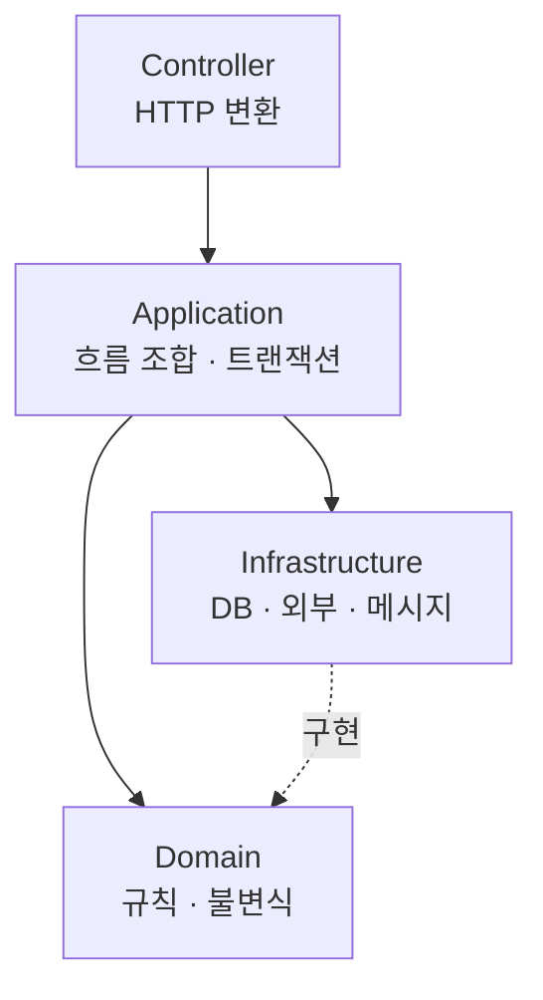

# 40장. 모놀리스 내부 구조 개선 — Controller · Application · Domain · Infrastructure

첫 대상을 정했다.

바로 도메인을 떼어내고 싶지만  
그 전에 할 일이 하나 있다.

**계층 정리다.**

---

## 왜 계층이 먼저인가

도메인 경계는 세로선이고,  
계층 경계는 가로선이다.

```text
              order    payment    point
Controller      │         │         │
Application     │         │         │
Domain          │         │         │
Infrastructure  │         │         │
```

세로선을 그으려면  
가로선이 먼저 정리되어 있어야 한다.

이유는 실용적이다.

⚠️ 도메인 로직이 Controller와 Repository에 섞여 있으면  
그 도메인을 통째로 옮길 수 없다.

```kotlin
// Controller에 도메인 로직이 있는 경우
@PostMapping("/orders/{id}/cancel")
fun cancel(@PathVariable id: Long) {
    val order = orderRepository.findById(id)
    if (order.status == SHIPPED) throw ...        // 도메인 규칙
    val refund = order.paidAmount * 0.9           // 도메인 규칙
    ...
}
```

이 코드는 어느 도메인의 것인가.

옮길 수도, 남길 수도 없다.

---

## 목표 구조



각 층의 책임은 한 줄로 정의된다.

| 층 | 하는 일 | 하지 않는 일 |
|---|---|---|
| Controller | 요청·응답 변환, 인증 | 도메인 판단 |
| Application | 흐름 조합, 트랜잭션 경계 | 도메인 규칙 |
| Domain | 규칙, 불변식, 상태 전이 | 기술 의존 |
| Infrastructure | DB, 외부 API, 메시지 | 도메인 판단 |

🔥 화살표 방향이 핵심이다.

`Infrastructure → Domain` 이 아니라  
`Domain` 이 인터페이스를 정의하고 `Infrastructure` 가 구현한다.

이 방향이 지켜지면  
Domain 코드는 Spring도 JPA도 모른다.

그리고 통째로 옮길 수 있다.

---

## 현재와의 갭 측정

Agent에게 시킨다.

```text
포인트 도메인의 코드를 목표 계층에 매핑해줘.

각 클래스가 실제로 하는 일을 기준으로:
- Controller / Application / Domain / Infrastructure 중 어디에 속하는지
- 현재 위치와 다르면 표시해줘
- 한 클래스가 여러 층의 일을 하고 있으면 별도로 표시해줘
```

세 번째가 진짜 문제를 드러낸다.

```text
PointService.kt (412줄)
  - 잔액 계산 로직        → Domain
  - 트랜잭션 관리         → Application
  - Redis 캐시 접근       → Infrastructure
  - 응답 DTO 변환         → Controller
  ⚠️ 네 층의 일을 한 클래스에서 함
```

이런 클래스가 계층 정리의 실제 대상이다.

---

## 순수한 도메인 모델

Kotlin + JPA에서 자주 부딪히는 문제다.

```kotlin
@Entity
@Table(name = "point_balances")
class PointBalance(
    @Id val userId: Long,
    var balance: Long
) {
    fun use(amount: Long) {
        require(balance >= amount)
        balance -= amount
    }
}
```

도메인 규칙과 JPA 매핑이 한 클래스에 있다.

⚠️ 이 상태로는 Domain 층이 Infrastructure에 의존한다.

완전히 분리하면 이렇게 된다.

```kotlin
// Domain — 기술 의존 없음
class PointBalance(val userId: Long, val balance: Money) {
    fun use(amount: Money): PointBalance { ... }
}

// Infrastructure — 매핑 전용
@Entity
@Table(name = "point_balances")
class PointBalanceEntity(...) {
    fun toDomain(): PointBalance = ...
}
```

깨끗하다.  
그리고 코드가 두 배가 된다.

이 선택은 팀이 한다.

| 선택 | 적합한 경우 |
|---|---|
| 완전 분리 | 도메인 규칙이 복잡, 실제 분리 계획 있음 |
| 엔티티에 규칙 | 규칙이 단순, 분리 계획 없음 |
| 절충 | 핵심 도메인만 분리 |

🔥 Agent에게 물으면 대개 완전 분리를 권한다.

교과서적으로 옳기 때문이다.  
비용은 우리가 낸다.

```text
완전 분리 방식과 엔티티에 규칙을 두는 방식의
코드량 차이가 어느 정도인지 샘플로 보여줘.
포인트 잔액 하나만 두 방식으로 만들어봐.
```

숫자를 보고 결정한다.

---

## 한 번에 다 하지 않는다

전체를 목표 구조로 옮기는 것은 몇 달짜리다.

그 사이 기능 개발이 멈춘다.  
현실적이지 않다.

```markdown
# CLAUDE.md
## 계층 규칙

- 신규 코드는 목표 구조를 따른다
- 기존 코드는 그 파일을 수정할 때 함께 정리한다
- 정리를 위한 정리는 하지 않는다
```

세 번째 줄이 브레이크다.

Agent에게 파일 하나 수정을 시켰는데  
주변 열 개를 함께 정리해 오는 일을 막는다.

20장의 Non-goals가 규칙 형태로 들어간 것이다.

---

## 두 세대가 공존하는 기간

이 방식의 대가는 공존이다.

```text
point/
  domain/          ← 새 구조
  application/
  infrastructure/
  PointService.kt  ← 옛 구조 (아직)
```

⚠️ 12장의 Context Pollution이 여기서 다시 나온다.

Agent가 옛 구조를 보고 그것을 따라 쓴다.

방어는 문서로 한다.

```markdown
# point/CLAUDE.md
- `domain/`, `application/`, `infrastructure/` 가 현재 구조다
- 루트에 있는 `PointService.kt`, `PointFacade.kt` 는 마이그레이션 대상
  참고하되 새 코드의 본보기로 삼지 않는다
```

16장의 계층화가 여기서 실제로 쓰인다.

---

## 계층 이동 자체는 41장에서

계층을 정리하려면 파일을 옮겨야 하고,  
파일을 옮기는 것이 생각보다 큰 작업이다.

41장에서 그 방법을 다룬다.

---

## 완료 조건

```markdown
## Acceptance Criteria
- PointService 가 네 층으로 분리됨
- Domain 패키지에 Spring/JPA import 가 없음
- Characterization Test 24건 그대로 통과
- 외부에서 point 를 호출하는 17곳의 시그니처 변경 없음
- 의존성 테스트 추가 (42장)
```

🔥 두 번째와 네 번째가 이 작업의 진짜 기준이다.

Domain이 기술을 모르는가.  
그리고 밖에서 볼 때 아무것도 안 바뀌었는가.

---

## 이 장의 핵심

* 도메인 경계는 세로선이고 계층 경계는 가로선이다 — 가로선이 먼저다
* 도메인 로직이 Controller와 Repository에 섞여 있으면 옮길 수 없다
* Domain이 인터페이스를 정의하고 Infrastructure가 구현한다
* 한 클래스가 여러 층의 일을 하는 곳이 계층 정리의 실제 대상이다
* JPA 엔티티에서 도메인 모델을 분리하면 깨끗해지고 코드가 두 배가 된다
* Agent는 교과서적으로 옳은 완전 분리를 권한다 — 비용은 우리가 낸다
* 신규 코드부터 적용하고, 기존 코드는 만질 때 함께 정리한다
* "정리를 위한 정리는 하지 않는다" 를 규칙으로 둔다
* 두 구조가 공존하는 동안 옛 구조를 본보기로 삼지 않게 문서로 막는다
* 완료 기준은 Domain이 기술을 모르는지, 밖에서 볼 때 안 바뀌었는지다
