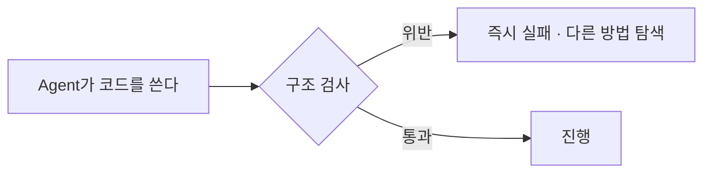

# 41장. 경계를 규칙으로 강제하기 — 의존성 테스트와 Hook

포인트 도메인을 정리했다.

계층이 나뉘었고, 순환이 사라졌고,  
Domain 패키지에 JPA import가 없다.

그리고 3주 뒤 다시 보면 이렇게 되어 있다.

```kotlin
// point/domain/PointPolicy.kt
import org.springframework.stereotype.Component
import com.company.order.OrderRepository        // ⚠️
```

---

## 문서로 그은 경계는 무너진다

이유는 악의가 아니다.

급한 기능이 있었고,  
그 자리에서 그게 가장 빠른 방법이었다.

사람도 그렇고 Agent는 더하다.

15장에서 본 그대로다.

> `CLAUDE.md` 에 대문자로 세 번 써도  
> import 한 줄을 막지는 못한다.

16장의 에스컬레이션이 여기서 필요해진다.

```text
문장 → Skill → Hook → 권한
```

경계는 **테스트**로 올라간다.

---

## 의존성 테스트

JVM 진영에는 ArchUnit이 있고,  
Kotlin에는 Konsist가 있다.

둘 다 "코드 구조를 검증하는 테스트" 다.

```kotlin
@Test
fun `domain 패키지는 Spring에 의존하지 않는다`() {
    Konsist.scopeFromPackage("..point.domain..")
        .files
        .assertFalse { it.hasImport { imp ->
            imp.name.startsWith("org.springframework")
        }}
}

@Test
fun `point 도메인은 order 를 참조하지 않는다`() {
    Konsist.scopeFromPackage("..point..")
        .files
        .assertFalse { it.hasImport { imp ->
            imp.name.startsWith("com.company.order")
        }}
}
```

이 테스트가 있으면  
앞의 import는 CI에서 빨간불이 된다.

🔥 그리고 Agent에게는 즉각적인 피드백이 된다.

```text
> ./gradlew test --tests '*ArchitectureTest'

  point 도메인은 order 를 참조하지 않는다  FAILED
    Import 'com.company.order.OrderRepository' found in
    point/domain/PointPolicy.kt
```

24장의 좋은 피드백 네 조건을 모두 만족한다.  
빠르고, 구체적이고, 자동이고, 위치를 지목한다.

Agent는 이 메시지를 받으면 다른 방법을 찾는다.

---

## 무엇을 규칙으로 만드는가

경계 카드에서 그대로 나온다.

| 규칙 | 근거 |
|---|---|
| Domain은 프레임워크에 의존하지 않는다 | 39장의 계층 방향 |
| 도메인 간 직접 참조 금지 | 37장의 경계 |
| Repository는 자기 도메인 테이블만 | 35장의 데이터 소유권 |
| Controller는 Repository를 직접 호출하지 않는다 | 계층 건너뛰기 방지 |
| `@Transactional` 은 Application 층에만 | 28장 |
| 외부 API 호출은 Infrastructure 에서만 | 30장 |

⚠️ 마지막 두 개가 특히 값지다.

28장과 30장에서 문장으로 적었던 규칙이  
여기서 실행 가능한 검사로 승격된다.

---

## 기존 위반은 baseline으로

현실적인 문제가 하나 있다.

```text
> ./gradlew test --tests '*ArchitectureTest'
  FAILED — 위반 147건
```

레거시에 규칙을 걸면 처음엔 전부 실패한다.

두 가지 방법이 있다.

### 예외 목록을 명시한다

```kotlin
private val KNOWN_VIOLATIONS = setOf(
    "point/PointService.kt",          // 마이그레이션 대상
    "legacy/PointMigrationJob.kt",    // 제거 예정
)

@Test
fun `point 도메인은 order 를 참조하지 않는다`() {
    Konsist.scopeFromPackage("..point..")
        .files
        .filterNot { it.path in KNOWN_VIOLATIONS }
        .assertFalse { ... }
}
```

🔥 목록이 있으면 두 가지가 생긴다.

* 새로운 위반은 즉시 막힌다
* 남은 부채가 눈에 보인다

목록이 줄어드는 것이 진척도다.

### 새 코드에만 적용한다

```kotlin
@Test
fun `새 구조의 domain 패키지는 프레임워크에 의존하지 않는다`() {
    Konsist.scopeFromPackage("..point.domain..")   // 새 구조만
        .files.assertFalse { ... }
}
```

39장에서 "신규 코드부터" 라고 한 것과 같은 전략이다.

---

## Hook으로 앞당긴다

CI에서 잡는 것보다 커밋 전에 잡는 편이 낫다.

```json
{
  "hooks": {
    "PostToolUse": [
      {
        "matcher": "Edit|Write",
        "hooks": [
          {
            "type": "command",
            "command": "./gradlew test --tests '*ArchitectureTest' -q"
          }
        ]
      }
    ]
  }
}
```

파일을 수정할 때마다 구조 검사가 돈다.

⚠️ 이 검사가 느리면 작업이 답답해진다.

Konsist/ArchUnit 검사는 대개 수 초 안에 끝나지만,  
느리면 커밋 전 훅으로 옮긴다.

46장에서 Hook 설계를 자세히 다룬다.

---

## 규칙이 개발을 막을 때

⚠️ 여기서 판단이 필요한 순간이 온다.

```text
급한 장애 수정인데 아키텍처 테스트가 막습니다.
KNOWN_VIOLATIONS 에 추가할까요?
```

Agent가 이렇게 물어오면 사람이 답한다.

세 가지 선택지가 있다.

| 선택 | 언제 |
|---|---|
| 규칙대로 우회 구현 | 시간이 있다 |
| 예외 목록 추가 + 티켓 | 급하다 (기한 명시) |
| 규칙 자체를 수정 | 규칙이 틀렸다 |

세 번째가 실제로 있다.

규칙을 만들 때 몰랐던 사정이 나중에 드러나면  
규칙이 현실과 안 맞는 것이다.

16장의 "규칙에는 수명이 있다" 가 여기에도 적용된다.

```markdown
- 아키텍처 규칙을 우회해야 하면
  임의로 예외를 추가하지 말고 먼저 물어본다
```

이 한 줄이 없으면 Agent가 조용히 예외를 늘린다.

---

## 규칙이 만드는 진짜 변화

이 장의 작업이 끝나면  
Agent와 일하는 방식이 달라진다.



경계가 문서가 아니라 **조건**이 됐다.

4장에서 말한 그 차이다.

> 프롬프트는 지시를 전달하고  
> 하네스는 조건을 만든다.

이제 새 팀원이 와도, Agent가 바뀌어도  
경계는 유지된다.

🔥 이것이 8부에서 가장 오래 남는 산출물이다.

옮긴 파일은 다시 흩어질 수 있지만  
테스트는 흩어지는 것을 막는다.

---

## 이 장의 핵심

* 문서로 그은 경계는 급한 기능 하나에 무너진다
* `CLAUDE.md` 는 import 한 줄을 막지 못한다
* 경계는 의존성 테스트로 승격시킨다 (ArchUnit / Konsist)
* 구조 검사 실패 메시지는 좋은 피드백의 네 조건을 모두 만족한다
* 문장으로 적었던 트랜잭션·외부호출 규칙이 실행 가능한 검사가 된다
* 레거시에 규칙을 걸면 처음엔 전부 실패한다 — 기존 위반은 예외 목록으로 명시한다
* 예외 목록이 줄어드는 것이 진척도다
* Hook으로 앞당기면 CI보다 빨리 잡는다
* 규칙이 개발을 막으면 우회·예외·규칙 수정 중 사람이 고른다
* Agent가 임의로 예외를 추가하지 못하게 규칙을 하나 더 둔다
* 옮긴 파일은 다시 흩어질 수 있지만 테스트는 흩어지는 것을 막는다
