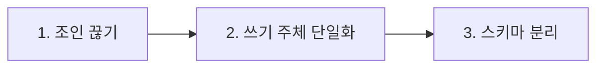

# 42장. 데이터 경계 준비 — 공유 테이블과 조인부터 끊기

코드는 나뉘었다.

패키지가 정리됐고, 의존성 테스트가 지키고 있다.

그런데 DB를 열어보면 아무것도 안 바뀌었다.

```sql
SELECT o.id, o.amount, p.balance
FROM orders o
JOIN point_balances p ON o.user_id = p.user_id
WHERE ...
```

주문 쿼리가 포인트 테이블을 조인한다.

> 코드 경계보다 데이터 경계가 더 완고하다.

35장의 그 문장이 여기서 실제 작업이 된다.

---

## 왜 데이터가 마지막 장벽인가

코드는 옮기면 끝이다.

데이터는 그렇지 않다.

| 코드 | 데이터 |
|---|---|
| 이동 후 컴파일로 검증 | 이동 후 정합성을 확인할 방법이 애매 |
| 되돌리기 쉽다 | 되돌리기 어렵다 |
| 성능 영향 적음 | 조인 제거 = 성능 저하 |
| 하루면 옮긴다 | 몇 달짜리 |

그래서 이 작업은 **분리하기 위해서** 하는 것이 아니다.

당장 분리하지 않아도  
데이터 경계를 정리하면 얻는 것이 있다.

* 어느 도메인이 무엇을 소유하는지 명확해진다
* 스키마 변경의 영향 범위가 좁아진다
* 나중에 떼어낼 수 있는 상태가 된다

---

## 세 단계



3단계까지 갈지는 나중에 정해도 된다.  
1, 2단계만으로도 충분한 가치가 있다.

---

## 1️⃣ 조인을 전수 조사한다

```text
도메인 경계를 넘는 조인을 전부 찾아줘.

- JPQL, QueryDSL, 네이티브 쿼리, @Query 전부
- 엔티티 연관관계(@ManyToOne 등)도 포함
- 어느 도메인 테이블과 어느 도메인 테이블을 조인하는지
- 각 조인이 어떤 화면·API에서 쓰이는지

표로 정리하고 docs/cross-domain-joins.md 에 저장해줘.
```

| 위치 | 조인 | 용도 |
|---|---|---|
| `OrderListQuery` | orders ↔ point_balances | 주문 목록에 잔액 표시 |
| `OrderDetailQuery` | orders ↔ point_histories | 사용 포인트 표시 |
| `SettlementJob` | payments ↔ point_histories | 정산 집계 |

⚠️ 엔티티 연관관계를 빠뜨리기 쉽다.

```kotlin
@Entity
class Order(
    @ManyToOne val pointBalance: PointBalance   // 조인이다
)
```

이것도 조인이고, 33장의 N+1 원인이기도 하다.

---

## 조인을 무엇으로 대체하는가

세 가지 방법이 있고, 각각 대가가 다르다.

| 방법 | 방식 | 대가 |
|---|---|---|
| 애플리케이션 조합 | 각각 조회 후 코드에서 합침 | 쿼리 수 증가 |
| 데이터 복제 | 필요한 값을 자기 테이블에 저장 | 정합성 관리 |
| 조회 전용 뷰 | 읽기 전용 모델 별도 유지 | 구조 복잡 |

첫 번째부터 시작한다.

```kotlin
// 전
val orders = orderRepository.findWithPointBalance(userId)

// 후
val orders = orderRepository.findByUserId(userId)
val balance = pointQueryService.getBalance(userId)   // 도메인 API
return OrderListResponse.of(orders, balance)
```

🔥 여기서 `pointQueryService` 가 핵심이다.

지금은 같은 프로세스 안의 클래스지만,  
나중에 HTTP 호출로 바꿀 수 있는 지점이 된다.

43장에서 이 인터페이스를 다시 다룬다.

---

## 성능은 실제로 나빠진다

⚠️ 이 사실을 숨기지 않는 편이 낫다.

조인 하나가 쿼리 두 개가 되고,  
목록 조회에서는 N+1이 될 수도 있다.

```text
이 조인을 제거하면 쿼리가 어떻게 바뀌는지 보여줘.

- 현재: 쿼리 1개
- 변경 후: 쿼리 몇 개
- 100건 조회 시 각각 몇 번 실행되는지
```

33장의 원칙이 여기서도 적용된다.  
측정하고 판단한다.

대개 이렇게 해결한다.

| 문제 | 대처 |
|---|---|
| 목록에서 N+1 | ID 목록으로 한 번에 조회 (배치 조회) |
| 조회가 잦음 | 조회 전용 캐시 (31장) |
| 집계가 무거움 | 조회 전용 테이블 또는 뷰 |

---

## 2️⃣ 쓰기 주체를 하나로

조인보다 중요한 작업이다.

35장의 데이터 소유권 표에서  
쓰기 주체가 여럿인 테이블을 찾았다.

```text
point_histories 에 INSERT/UPDATE 하는 코드를 전부 찾아줘.
point 패키지 밖에 있는 것을 별도로 표시해줘.
```

```text
point/PointHistoryRepository.save()          ✅
order/OrderCancelFacade:112  직접 INSERT     ⚠️
admin/AdminPointService:88   직접 UPDATE     ⚠️
legacy/PointMigrationJob:41  벌크 INSERT     ⚠️
```

세 곳을 정리한다.

```kotlin
// 전 — order 가 직접 쓴다
pointHistoryRepository.save(PointHistory(...))

// 후 — point 도메인에 요청한다
pointCommandService.refund(orderId, amount, reason)
```

쓰기가 한 곳으로 모이면  
그 도메인이 자기 규칙을 강제할 수 있게 된다.

29장의 불변식이 실제로 지켜지는 지점이다.

```markdown
- `point_histories` 쓰기는 `point` 패키지에서만 한다
- 다른 도메인은 `PointCommandService` 를 통한다
```

41장의 의존성 테스트로 이 규칙도 검사할 수 있다.

```kotlin
@Test
fun `point 테이블은 point 패키지에서만 수정한다`() {
    // Repository 클래스명, 네이티브 쿼리 문자열 검사
}
```

---

## 외래키를 어떻게 할 것인가

여기서 판단이 갈린다.

```sql
ALTER TABLE point_histories
  ADD CONSTRAINT fk_order FOREIGN KEY (order_id) REFERENCES orders(id);
```

이 제약이 있으면 DB를 나눌 수 없다.

| 유지 | 제거 |
|---|---|
| 정합성을 DB가 보장 | 애플리케이션이 보장해야 함 |
| 실수로 깨진 데이터 방지 | 정합성 배치 필요 |
| 분리 불가 | 분리 가능 |

⚠️ 실제로 분리할 계획이 없다면  
FK를 제거하지 않는 편이 낫다.

DB가 공짜로 해주던 검증을 잃는다.

38장의 로드맵에서 그 도메인이  
어디까지 가기로 했는지에 따라 결정한다.

---

## 3️⃣ 스키마 분리는 마지막에

같은 DB 안에서 스키마만 나누는 단계다.

```sql
CREATE SCHEMA point;
ALTER TABLE point_histories SET SCHEMA point;
```

이 단계까지 오면  
DB 인스턴스를 나누는 일만 남는다.

⚠️ 그리고 그것은 이 책의 범위 밖이다.

여기서부터는 데이터 마이그레이션,  
이중 쓰기, 최종 일관성의 영역이다.

---

## 검증

```markdown
## Acceptance Criteria
- 도메인 경계를 넘는 조인 0건 (문서화된 예외 제외)
- `point_histories` 쓰기 주체가 point 패키지 단독
- 위 두 항목을 검사하는 아키텍처 테스트 추가
- 주문 목록 API 쿼리 수 5개 이하 (기존 3개 → 허용 범위)
- Characterization Test 전체 통과
```

🔥 마지막 줄이 이 작업의 안전망이다.

36장에서 고정한 동작이  
데이터 접근 방식을 바꿔도 그대로여야 한다.

---

## 이 장의 핵심

* 코드를 나눠도 DB가 하나면 떼어낼 수 없다
* 데이터 작업은 되돌리기 어렵고 성능에 직접 영향을 준다
* 당장 분리하지 않아도 소유권이 명확해지는 이득이 있다
* 엔티티 연관관계도 조인이다 — 전수 조사에서 빠뜨리기 쉽다
* 조인을 애플리케이션 조합으로 바꾸면 쿼리 수가 늘어난다 — 숨기지 않고 측정한다
* 도메인 조회 서비스가 나중에 HTTP 호출로 바뀔 지점이 된다
* 쓰기 주체를 하나로 모으는 것이 조인 제거보다 중요하다
* 쓰기가 모이면 그 도메인이 자기 불변식을 강제할 수 있다
* 분리 계획이 없다면 외래키를 제거하지 않는 편이 낫다
* Characterization Test가 데이터 접근 변경의 안전망이다
