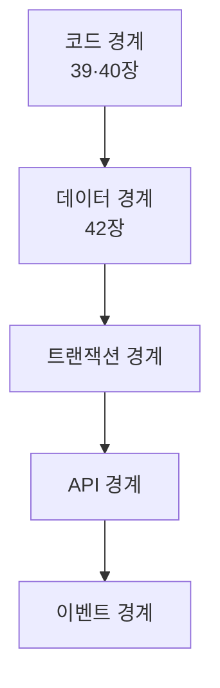

# 43장. 나중에 떼어내기 쉬운 구조 — 코드 · 데이터 · 트랜잭션 · API · 이벤트

8부의 마지막 장이다.

여기까지 오면 세 가지가 정리됐다.

계층, 코드 경계, 데이터 소유권.

남은 것은 둘이다.

그리고 그 둘이 진짜 어렵다.

---

## 다섯 경계



앞의 둘은 했다.  
뒤의 셋을 이 장에서 다룬다.

---

## 트랜잭션 경계가 진짜 벽이다

```kotlin
@Transactional
fun cancel(orderId: Long) {
    orderService.cancel(orderId)        // orders 수정
    paymentService.cancel(orderId)      // payments 수정
    pointService.refund(orderId)        // point_histories 수정
}
```

같은 트랜잭션에서 세 도메인의 데이터가 바뀐다.

전부 성공하거나 전부 실패한다.  
DB가 보장해준다.

⚠️ 서비스를 나누는 순간 이 보장이 사라진다.

분산 트랜잭션은 실무에서 답이 아니다.  
그래서 다른 방식이 필요하다.

```text
포인트 환급은 실패했는데 결제 취소는 됐다.
이 상태를 어떻게 처리할 것인가.
```

---

## 보상 로직을 미리 만든다

당장 나누지 않아도 이 준비는 할 수 있다.

```text
주문 취소 트랜잭션의 각 단계에 대해
실패 시 되돌리는 방법을 정리해줘.

- 어떤 순서로 실행되는가
- 각 단계가 실패하면 앞 단계를 어떻게 되돌리는가
- 되돌릴 수 없는 단계가 있는가 (외부 호출 등)
- 되돌리는 대신 보정해야 하는 것은 무엇인가
```

세 번째 질문에서 대개 이런 답이 나온다.

```text
PG 취소는 되돌릴 수 없습니다.
취소를 취소하는 API가 없습니다.
```

🔥 그래서 순서가 중요해진다.

되돌릴 수 없는 것을 마지막에 둔다.

```text
1. 주문 상태 변경        (되돌리기 가능)
2. 포인트 환급           (되돌리기 가능)
3. PG 결제 취소          (되돌리기 불가) ← 마지막
```

이 순서 조정은 지금 당장 할 수 있고,  
분리 여부와 무관하게 안전성이 올라간다.

---

## 트랜잭션을 좁힌다

두 번째 준비다.

```kotlin
// 후 — 도메인별 트랜잭션 + 이벤트
fun cancel(orderId: Long) {
    orderService.cancel(orderId)              // TX 1
    eventPublisher.publish(OrderCancelled(orderId))
}
// PaymentCancelListener  → TX 2
// PointRefundListener    → TX 3
```

⚠️ 31장의 문제가 전부 따라온다.

중복 수신, 순서 역전, 유실.  
그래서 이 전환은 멱등성과 DLQ가 준비된 다음에 한다.

1장부터 따라온 이중 환급 버그가  
바로 이 전환에서 생긴 종류의 문제였다.

---

## API 경계 — 인터페이스 뒤로 숨긴다

42장에서 만든 `pointQueryService` 를 다듬는다.

```kotlin
// point 도메인이 공개하는 계약
interface PointApi {
    fun getBalance(userId: Long): PointBalance
    fun use(command: UsePointCommand): PointUseResult
    fun refund(command: RefundPointCommand): PointRefundResult
}
```

지금은 같은 프로세스의 구현체가 붙는다.

```kotlin
@Component
class LocalPointApi(...) : PointApi { ... }
```

나중에 이렇게 바뀔 수 있다.

```kotlin
@Component
class HttpPointApi(...) : PointApi { ... }
```

🔥 호출하는 쪽 코드는 한 줄도 바뀌지 않는다.

이 인터페이스를 설계할 때 지킬 것이 셋이다.

| 원칙 | 이유 |
|---|---|
| 엔티티를 노출하지 않는다 | 나중에 직렬화 불가 |
| 컬렉션 반환은 페이징 | 네트워크 경계에서 위험 |
| 실패를 반환값으로 표현 | 예외는 경계를 넘기 어렵다 |

세 번째가 특히 중요하다.

```kotlin
// ❌ 나중에 HTTP로 바꾸기 어렵다
fun use(...): PointBalance   // 실패 시 예외

// ✅
fun use(...): PointUseResult // Success | InsufficientBalance | ...
```

29장의 `sealed` 가 여기서 다시 쓰인다.

---

## 이벤트 경계

마지막이다.

도메인 간 통신을 이벤트로 바꾸면  
결합이 가장 약해진다.

```kotlin
// order 도메인이 발행
data class OrderCancelled(
    val orderId: Long,
    val userId: Long,
    val usedPoint: Long,        // point 가 필요한 값을 포함
    val occurredAt: Instant,
    val eventId: String
)
```

⚠️ 이벤트 설계에서 자주 하는 실수가 있다.

```kotlin
// ❌ ID만 보낸다
data class OrderCancelled(val orderId: Long)
```

받는 쪽이 다시 조회해야 한다.  
조회하려면 order 를 참조해야 하고, 결합이 남는다.

필요한 값을 이벤트에 담는 편이 낫다.

그리고 31장의 규칙이 그대로 적용된다.

```markdown
- 모든 이벤트에 `eventId` 를 포함한다
- Consumer 는 `eventId` 로 중복 처리를 방어한다
- 이벤트는 발행 시점의 사실을 담는다 (나중에 조회하지 않아도 되게)
```

---

## 준비도 체크리스트

떼어낼 수 있는 상태인지 판단하는 기준이다.

```markdown
## 포인트 도메인 분리 준비도

### 코드
- [x] 계층 분리 (39장)
- [x] 순환 의존 제거 (40장)
- [x] 의존성 테스트 (41장)

### 데이터
- [x] 경계 넘는 조인 제거 (42장)
- [x] 쓰기 주체 단일화 (42장)
- [ ] 외래키 제거
- [ ] 스키마 분리

### 트랜잭션
- [x] 보상 로직 정의
- [ ] 도메인별 트랜잭션 분리
- [ ] 정합성 배치

### API
- [x] 인터페이스 추출
- [x] 엔티티 비노출
- [ ] 실패의 반환값 표현

### 이벤트
- [ ] 이벤트 스키마 정의
- [x] Consumer 멱등성
- [ ] DLQ 및 재처리
```

이 체크리스트가 8부 전체의 요약이다.

---

## 떼어내지 않아도 이득이다

마지막으로 짚을 것이 있다.

이 책의 목적지는 마이크로서비스가 아니다.

체크리스트를 절반만 채워도 얻는 것이 있다.

| 얻는 것 | 어디서 |
|---|---|
| 변경 영향 범위가 좁아진다 | 코드·데이터 경계 |
| 실패가 전파되지 않는다 | 트랜잭션 경계 |
| 새 팀원이 빨리 이해한다 | 도메인 지도와 규칙 |
| Agent가 더 정확해진다 | 좁은 Context, 강한 검증 |

🔥 마지막 줄이 이 책의 논지다.

경계가 명확한 코드베이스는  
사람에게도 Agent에게도 다루기 쉽다.

> 나누기 위해 정리하는 것이 아니라  
> 정리했더니 나눌 수 있게 되는 것이다.

실제로 나눌지는 그때 가서 정한다.  
나누지 않기로 해도 손해는 없다.

---

## 8부를 마치며

일곱 장에서 한 일을 되짚으면 이렇다.

```text
37장  경계를 찾았다
38장  순서를 정했다
39장  계층을 정리했다
40장  코드를 옮겼다
41장  경계를 테스트로 고정했다
42장  데이터 소유권을 회복했다
43장  나머지 세 경계를 준비했다
```

이 과정 전체를 Agent와 함께했다.

그리고 매 단계에서 사람이 한 일은 같았다.

**결정.**

---

## 이 장의 핵심

* 다섯 경계 중 트랜잭션·API·이벤트가 마지막 세 개다
* 서비스를 나누는 순간 DB의 원자성 보장이 사라진다
* 보상 로직 정의는 당장 나누지 않아도 할 수 있다
* 되돌릴 수 없는 단계를 마지막에 둔다 — 순서 조정만으로 안전해진다
* 트랜잭션을 도메인별로 좁히면 31장의 문제가 전부 따라온다
* 도메인 API를 인터페이스로 두면 나중에 HTTP 구현으로 교체된다
* 실패는 예외가 아니라 반환값으로 표현해야 경계를 넘을 수 있다
* 이벤트에 ID만 담으면 받는 쪽이 다시 조회해야 하고 결합이 남는다
* 준비도 체크리스트를 절반만 채워도 이득이 있다
* 나누기 위해 정리하는 것이 아니라, 정리했더니 나눌 수 있게 되는 것이다
