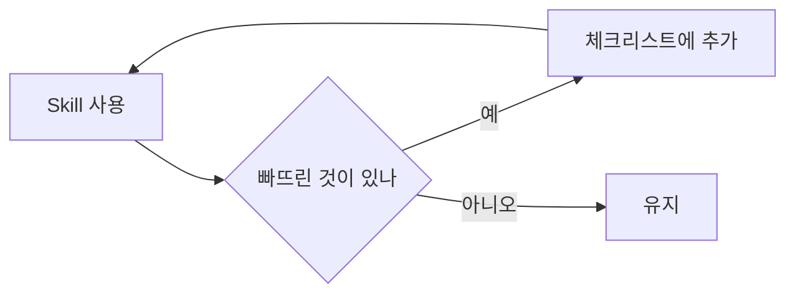

# 44장. Skill이란 무엇인가 — 반복되는 절차를 자산으로

8부까지 오면서 같은 문장을 여러 번 썼다.

```text
@tasks/... 를 읽고 확인한 것과 추론한 것을 구분해서 정리해줘
```

```text
경계 카드별로 들어오는/나가는 의존 개수를 세어줘
```

```text
마이그레이션을 검토해줘. 확장-수축 순서를 지켰는지,
NOT NULL 을 백필 전에 걸지 않았는지...
```

세 번째 쓸 때쯤 이런 생각이 든다.

> 이걸 매번 다시 쓰고 있네.

---

## Prompt와 Skill의 차이

```text
Prompt   이번 한 번을 위한 문장
Skill    반복되는 절차를 파일로 고정한 것
```

차이는 수명이다.

| | Prompt | Skill |
|---|---|---|
| 수명 | 이번 세션 | 레포와 함께 |
| 공유 | 안 됨 | 팀 전체 |
| 개선 | 매번 다시 씀 | 고치면 계속 반영 |
| 길이 | 짧게 쓰게 됨 | 길어도 됨 |

🔥 네 번째가 의외로 중요하다.

매번 타이핑해야 하면 우리는 짧게 쓴다.  
그래서 중요한 조건을 빠뜨린다.

파일에 적어두면 열다섯 줄짜리 체크리스트를  
매번 정확히 적용할 수 있다.

---

## SKILL.md의 구조

`.claude/skills/` 아래에 디렉터리 하나가 Skill 하나다.

```text
.claude/
  skills/
    migration-review/
      SKILL.md
    incident-analysis/
      SKILL.md
      references/
        log-patterns.md
```

`SKILL.md` 는 앞머리와 본문으로 되어 있다.

```markdown
---
name: migration-review
description: DB 마이그레이션 파일을 검토한다. 마이그레이션을
  작성했거나 리뷰할 때, 스키마 변경을 확인할 때 사용한다.
---

# 마이그레이션 검토

## 절차

1. 변경된 마이그레이션 파일을 읽는다
2. 아래 체크리스트를 항목별로 확인한다
3. 각 항목에 대해 "확인함 / 문제있음 / 해당없음" 을 명시한다

## 체크리스트

- [ ] NOT NULL 을 기존 데이터 백필 전에 걸지 않았는가
- [ ] 컬럼 rename 대신 추가-이행-제거 순서를 따랐는가
- [ ] 100만 건 이상 테이블에 온라인 인덱스 생성을 썼는가
- [ ] 롤백 방법이 문서화되어 있는가
- [ ] 배포 중간 상태(구버전 앱 + 신버전 스키마)에서 동작하는가

## 하지 말 것

- 마이그레이션을 실행하지 않는다
- 파일을 수정하지 않는다. 문제만 보고한다
```

27장에서 문장으로 흩어져 있던 규칙이  
실행 가능한 절차가 됐다.

---

## description이 곧 트리거다

앞머리에서 실제로 중요한 것은 `description` 이다.

Claude Code는 이 문장을 읽고  
지금 상황에 이 Skill이 필요한지 판단한다.

```markdown
# ❌ 나쁜 description
description: 마이그레이션 관련 작업

# ✅ 좋은 description
description: DB 마이그레이션 파일을 검토한다. 마이그레이션을
  작성했거나 리뷰할 때, 스키마 변경을 확인할 때 사용한다.
```

⚠️ 나쁜 쪽은 언제 써야 할지 알 수 없다.

`description` 은 Skill의 요약이 아니라  
**언제 발동하는지에 대한 설명**이다.

`/migration-review` 처럼 이름으로 직접 부를 수도 있다.  
자동 발동이 애매하면 직접 부르면 된다.

---

## 무엇을 Skill로 만드는가

기준은 15장의 두 번 규칙과 같다.

```text
같은 절차를 세 번째 설명하고 있다면 Skill이다.
```

| Skill로 만든다 | 만들지 않는다 |
|---|---|
| 여러 단계로 된 절차 | 한 줄짜리 지시 |
| 체크리스트가 있는 검토 | 매번 내용이 다른 작업 |
| 순서가 중요한 작업 | 항상 지켜야 하는 규칙 |
| 자주 빠뜨리는 항목이 있는 일 | 한 번만 할 일 |

세 번째 줄의 오른쪽이 `CLAUDE.md` 다.

5장에서 정한 구분이 여기서 실제로 갈린다.

```text
항상 알아야 하는 것        → CLAUDE.md
필요할 때 수행하는 절차     → Skill
무조건 실행되어야 하는 것   → Hook (46장)
```

⚠️ 이 구분을 어기면 두 가지가 생긴다.

절차를 `CLAUDE.md` 에 넣으면 문서가 비대해지고,  
항상 지킬 규칙을 Skill에 넣으면 발동 안 될 때 무시된다.

---

## 첫 Skill 만들기

19장의 인계 문서 작성이 좋은 첫 대상이다.

매번 비슷하게 쓰고 있었고,  
빠뜨리면 다음 세션이 고생한다.

````markdown
---
name: handoff
description: 세션을 정리하고 다음 세션에 인계한다. 작업을
  마무리할 때, /clear 하기 전에, 방향을 바꾸기 전에 사용한다.
---

# 세션 인계

현재 세션에서 확인한 것을 `tasks/` 아래 문서로 정리한다.

## 형식

```markdown
# {작업 제목}

## 목표
## 현재 구조
## 확인한 사실     ← 근거(파일:줄, 명령 결과)를 함께
## 확인하지 못한 것 ← 추측은 전부 여기로
## 결정된 사항
## 변경된 파일
## 남은 작업
## 검증 방법
```

## 규칙

- 코드로 직접 확인한 것과 추론한 것을 반드시 구분한다
- 추론에는 확인 방법을 함께 적는다
- 시도했다가 버린 접근도 이유와 함께 남긴다
- 기존 문서가 있으면 새로 만들지 말고 갱신한다
````

이제 `/handoff` 한 줄이면 된다.

---

## 참조 파일을 함께 둔다

Skill이 길어지면 나눈다.

```text
.claude/skills/incident-analysis/
  SKILL.md              ← 절차
  references/
    log-patterns.md     ← 자주 나오는 로그 패턴
    runbook.md          ← 시스템별 확인 명령
```

`SKILL.md` 에서 필요할 때만 읽게 한다.

```markdown
로그 패턴 해석이 필요하면 `references/log-patterns.md` 를 읽는다.
```

12장의 Context 예산 원칙이다.  
항상 싣지 않고 필요할 때 싣는다.

---

## Skill도 개선 루프를 돈다

16장의 루프가 그대로 적용된다.



마이그레이션 검토에서 사고가 한 번 나면  
그 항목을 체크리스트에 넣는다.

> 사고가 날 때마다 Skill이 똑똑해진다.

이것이 Skill의 가장 큰 가치다.  
팀의 경험이 파일로 축적된다.

---

## 팀 공유

`.claude/` 를 Git에 커밋하면 팀 전체가 쓴다.

신규 입사자가 첫날부터  
우리 팀의 마이그레이션 체크리스트를 적용받는다.

60장에서 팀 도입을 다룬다.

---

## 이 장의 핵심

* 같은 절차를 세 번째 설명하고 있다면 Skill로 만든다
* Prompt는 이번 한 번, Skill은 레포와 함께 산다
* 매번 타이핑하면 짧게 쓰게 되고 중요한 조건을 빠뜨린다
* `description` 은 요약이 아니라 언제 발동하는지에 대한 설명이다
* 절차는 Skill, 항상 지킬 규칙은 `CLAUDE.md`, 무조건 실행은 Hook이다
* 절차를 `CLAUDE.md` 에 넣으면 문서가 비대해진다
* 인계 문서 작성이 첫 Skill로 좋다
* 긴 Skill은 참조 파일로 나눠 필요할 때만 읽게 한다
* 사고가 날 때마다 체크리스트에 항목이 추가된다 — 팀의 경험이 축적된다
