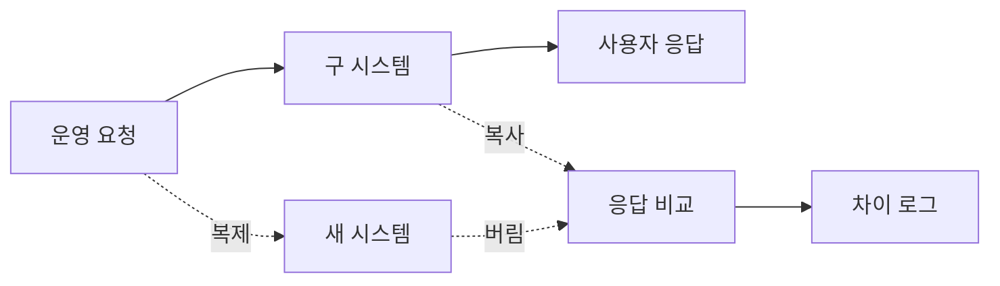
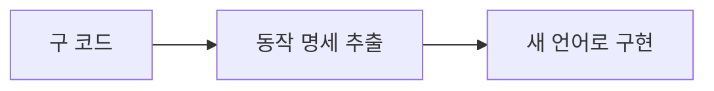

# 45장. 다른 언어로 옮기기 — 무엇부터, 어떻게 같음을 증명하는가

44장에서 준비도 체크리스트를 채웠다.

거기까지가 **한 언어 안에서** 할 수 있는 일이다.

그런데 많은 팀의 실제 목표는 그다음이다.

```text
구 시스템   자체 프레임워크 · 자체 쿼리 빌더 · 계층 미분리 (37장의 상황)
새 시스템   Kotlin + Spring · 표준 ORM
이유        유지보수, 채용, 생태계
```

9부는 그 이관을 다룬다.

⚠️ 순서가 중요하다.

38~44장의 경계 정리가 **먼저** 끝나야 한다.  
정리되지 않은 덩어리를 그대로 옮기면  
새 언어로 쓴 같은 진흙이 된다.

---

## AI가 바꾼 것은 번역이 아니다

전통적으로 이관의 병목은  
사람이 구 코드를 읽고 새 언어로 다시 쓰는 시간이었다.

🔥 그 병목이 사라졌다.  
번역은 Agent가 가장 잘하는 작업 중 하나다.

대신 병목이 옮겨갔다.

> 번역은 싸졌고  
> **"정말 같게 동작하는가" 를 증명하는 일이 비싸졌다.**

이 책이 계속 말해온 구조와 같다.  
Agent가 빨라질수록 검증 수단이 병목이 된다.

그래서 이 장의 절반은 검증 이야기다.

---

## 무엇부터 옮기는가

39장의 축을 쓰되, 이관용 축이 추가된다.

| 축 | 이관에서의 의미 |
|---|---|
| 조인 의존도 | 다른 도메인 테이블과 조인이 남아 있으면 못 옮긴다 |
| 쓰기 주체 | 그 테이블에 구 시스템이 계속 쓰면 정합성이 깨진다 |
| 트래픽 | 낮을수록 문제가 늦게 드러나 안전하다 |
| 실패 허용도 | 되돌릴 수 있는 도메인부터 |
| 호출 방향 | 밖에서 들어오기만 하는 것이 쉽다 |

첫 대상의 조건은 이렇게 정리된다.

```text
✅ 쓰기 주체가 이미 단독 (43장 완료)
✅ 경계 넘는 조인 0 (43장 완료)
✅ 나가는 의존이 없거나 적다
✅ 실패해도 되돌릴 수 있다
```

⚠️ 43장을 건너뛴 도메인은 후보가 아니다.

39장에서 "첫 경계는 가장 안전한 곳에" 라고 했는데,  
이관에서는 그 원칙이 더 강해진다.

경계 정리는 되돌릴 수 있지만  
두 언어에 걸친 실수는 되돌리기 어렵다.

---

## 같음을 어떻게 증명하는가

이 장의 핵심이다.

36장의 특성화 테스트가 여기서 **언어를 건너뛴다.**

### 1️⃣ 계약 테스트를 언어 밖에 둔다

36장에서 "바꿀 것의 바깥에 테스트를 둔다" 고 했다.

이관에서는 그 바깥이 **HTTP 레벨**이다.

```yaml
# tests/contract/point-balance.yaml
- name: 잔액 조회 - 정상
  request:  { method: GET, path: /api/points/1001 }
  expect:
    status: 200
    body:   { userId: 1001, balance: 5000, expiringSoon: 300 }

- name: 잔액 조회 - 없는 사용자
  request:  { method: GET, path: /api/points/99999 }
  expect:
    status: 404
    body:   { code: "USER_NOT_FOUND" }
```

🔥 이 파일은 어느 언어에도 속하지 않는다.

구 시스템에 돌려서 통과시키고,  
새 시스템에 그대로 돌린다.

같은 파일이 양쪽에서 통과하면  
계약이 유지된 것이다.

### 2️⃣ 응답을 실제로 대조한다

계약 테스트는 우리가 예상한 것만 검사한다.  
예상하지 못한 차이는 **섀도 트래픽으로 잡는다.**



새 시스템 응답은 **버린다.**  
사용자에게는 구 시스템 응답만 나간다.

며칠 돌리면 차이가 쌓이고, 분류는 Agent에게 맡긴다.

```text
shadow-diff.log 의 차이를 유형별로 분류해줘.

- 직렬화·포맷 차이 (값은 같음)
- 정렬·순서 차이
- ⚠️ 값 자체가 다른 것

세 번째는 어느 코드 경로에서 갈렸는지 추적해줘.
```

⚠️ 대부분은 직렬화와 정렬이다.  
값이 다른 것만 진짜 문제다.

### 3️⃣ 차이가 나면 어느 쪽이 옳은가

여기서 판단이 필요하다.

| 상황 | 판단 |
|---|---|
| 새 시스템이 명세대로다 | 🔥 구 시스템이 버그였다 — 그래도 일단 맞춘다 |
| 구 시스템이 의도된 예외 처리 | 새 시스템이 틀렸다. 고친다 |
| 둘 다 이상하다 | 별도 티켓. 이관 후에 |

첫 줄이 이관의 함정이다.

36장에서 "버그도 함께 고정한다" 고 한 이유가 여기서도 같다.  
**이관 중에는 버그도 이관한다.**

고치는 것은 이관이 끝난 뒤다.  
동시에 하면 차이가 났을 때 원인을 알 수 없다.

---

## Agent에게 번역을 시키는 법

가장 나쁜 지시는 이것이다.

```text
❌ 이 PHP 코드를 Kotlin으로 바꿔줘
```

⚠️ 결과는 **PHP처럼 생긴 Kotlin**이다.

```kotlin
fun getPoint(userId: Int): HashMap<String, Any>? {   // 구 코드의 관용구
    val rows = query("SELECT * FROM points WHERE user_id = $userId")
    ...
}
```

컴파일은 된다.  
그리고 새 언어로 옮긴 의미가 사라진다.

### 두 단계로 나눈다



**1단계 — 명세를 뽑는다**

```text
@legacy/point/PointService.php 를 읽고
동작 명세를 추출해줘. 코드가 아니라 명세로.

- 입력과 출력 (타입과 형식)
- 분기 조건 전부 (경계값 포함)
- DB 접근 (어떤 테이블에 무엇을)
- Side Effect (로그·알림·캐시)
- 예외 상황과 그때의 응답

구현 방식은 적지 마. 무엇을 하는지만.
```

**2단계 — 새 언어로 구현한다**

```text
@docs/point-spec.md 의 명세대로 Kotlin/Spring 으로 구현해줘.

- 구 코드는 보지 마. 명세만 보고 구현해
- 우리 프로젝트의 기준 구현(@order/) 구조를 따라
- JPA 엔티티와 Repository 를 쓴다
```

🔥 2단계에서 **구 코드를 안 보게 하는 것**이 핵심이다.

보면 따라 쓴다.  
안 보면 새 언어의 관용구로 쓴다.

그리고 명세가 중간에 있으므로  
사람이 검토할 지점이 하나 생긴다.

명세 단계에서 이런 것이 드러난다.

```text
⚠️ 명세 추출 중 발견

- 만료 포인트 처리에 분기가 4개인데
  그중 하나(status=3)는 어느 조건에서 도달하는지 불명확
- 금액 계산에서 반올림 위치가 두 곳에서 다름
```

이관 전에 물어볼 것 목록이 된다.

---

## 쿼리 빌더에서 ORM으로

37장에서 커스텀 쿼리 빌더의 함정을 봤다.  
이관에서는 그것을 **표준 ORM으로 번역**해야 한다.

⚠️ 한 줄씩 대응시키면 안 된다.

```php
Query::from('orders')
    ->join('users', 'orders.user_id', 'users.id')   // ⚠️
    ->where('status', '=', 'PAID')->limit(10)->list();
```

그대로 JPA로 옮기면  
43장에서 애써 끊은 조인이 되살아난다.

순서가 있다.

```text
1. 이 쿼리가 무엇을 얻으려 하는지 (명세)
2. 43장에서 정한 경계에 맞는가
3. 맞으면 ORM으로, 안 맞으면 API 호출로
```

그리고 매핑표를 먼저 만든다.

```markdown
## 쿼리 빌더 → JPA 매핑

| 구 쿼리 빌더 | JPA | 주의 |
|---|---|---|
| `->limit(10)` | `Pageable(0, 10)` | 구 빌더는 페이지당 개수 |
| `->list()` | `findAll()` | |
| `->first()` | `findFirst()` | 구 빌더는 없으면 null |
| `->join(...)` | ⚠️ 금지 | 도메인 경계 확인 후 결정 |
| `->raw(...)` | 케이스별 검토 | |
```

37장에서 만든 쿼리 빌더 레퍼런스가  
여기서 두 번째로 값을 한다.

---

## 트랜잭션 경계는 다시 설계한다

이관에서 가장 조용히 틀리는 부분이다.

| 구 시스템 | 새 시스템 |
|---|---|
| 요청 하나 = 트랜잭션 하나 (암묵적) | `@Transactional` 로 명시 |
| 커밋 시점이 요청 끝 | 메서드 끝 |
| 중첩 개념이 없거나 다름 | 전파 속성이 있음 |

```text
구 코드의 트랜잭션 경계를 확인해줘.

- 명시적으로 시작·커밋하는 곳
- 프레임워크가 암묵적으로 처리하는 범위
- 한 요청에서 여러 번 커밋되는 경로가 있는지

새 시스템에서 어디에 @Transactional 을 붙일지
근거와 함께 제안해줘.
```

⚠️ "한 요청에서 여러 번 커밋" 이 나오면 주의한다.

새 시스템에서 하나로 묶으면  
실패 시 롤백 범위가 달라진다.

28장의 문제가 이관 과정에서 새로 생기는 셈이다.

---

## 완료 조건

```markdown
## Acceptance Criteria
- 계약 테스트 34건이 양쪽에서 통과
- 섀도 트래픽 3일, 값 차이 0건 (포맷 차이는 문서화)
- 새 시스템 단독 부하 테스트 통과 (p95 기존 대비 ±20%)
- 롤백 절차 문서화 및 리허설 완료
- 구 코드 삭제하지 않음 (46장의 공존 기간)
```

🔥 마지막 두 줄이 중요하다.

이관은 배포가 아니라 **전환**이다.  
되돌릴 수 있는 상태로 끝나야 한다.

다음 장이 그 공존 기간의 이야기다.

---

## 이 장의 핵심

* 43장의 경계 정리가 끝난 도메인만 이관 후보다
* 정리되지 않은 덩어리를 옮기면 새 언어로 쓴 같은 진흙이 된다
* AI가 번역을 싸게 만들었고, 병목은 "같음을 증명하는 일" 로 옮겨갔다
* 계약 테스트는 어느 언어에도 속하지 않는 형식으로 둔다
* 예상하지 못한 차이는 섀도 트래픽으로 잡는다 — 새 응답은 버린다
* 차이의 대부분은 직렬화·정렬이고, 값이 다른 것만 진짜다
* 이관 중에는 버그도 이관한다 — 고치는 것은 끝난 뒤다
* "이 코드를 저 언어로 바꿔줘" 는 그 언어처럼 생긴 다른 언어를 만든다
* 명세를 뽑고, 구 코드를 안 보고 구현하게 한다
* 명세 추출 단계에서 이관 전에 물어볼 것이 드러난다
* 쿼리를 한 줄씩 옮기면 애써 끊은 조인이 되살아난다
* 트랜잭션 경계는 옮기는 것이 아니라 다시 설계하는 것이다
