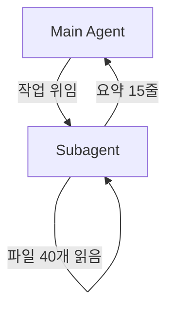

# 47장. Subagent — 독립 Context와 역할 분리

13장에서 한 번 언급하고 지나갔다.

```text
Subagent로 이 모놀리스의 주문 관련 모듈 구조를 조사하고
요약만 가져와줘.
```

이제 그 도구를 제대로 본다.

---

## 무엇인가

Agent가 별도의 Agent를 띄운다.



핵심은 화살표가 아니라 **경계**다.

Subagent는 자기만의 Context를 갖는다.  
그리고 작업이 끝나면 그 Context는 사라진다.

Main Agent에게 돌아오는 것은 결과뿐이다.

---

## 왜 강력한가

12장의 Context 예산이 근본적으로 달라진다.

```text
직접 조사할 때
  Main Context = 파일 40개 + 요약
  → 이후 모든 턴에서 재전송

Subagent에게 위임할 때
  Main Context = 요약 15줄
  → 파일 40개는 Subagent와 함께 사라짐
```

🔥 이것이 Subagent의 본질적 가치다.

병렬 처리가 아니라 **Context 격리**다.

읽는 양이 많고 결과가 짧은 작업일수록  
효과가 크다.

| 작업 | 읽는 양 | 결과 |
|---|---|---|
| 코드베이스 조사 | 매우 많음 | 요약 문서 |
| 의존성 전수 조사 | 많음 | 표 하나 |
| 특정 패턴 검색 | 많음 | 목록 |
| 독립 Review | 중간 | 지적 사항 |

넷 다 위임에 적합하다.

---

## 언제 쓰지 않는가

⚠️ Subagent가 항상 이득은 아니다.

| 쓰지 않는다 | 이유 |
|---|---|
| 짧은 작업 | 위임 비용이 더 크다 |
| 맥락이 많이 필요한 작업 | 설명하는 데 더 든다 |
| 여러 번 주고받아야 하는 작업 | 한 번에 결과를 받는 구조다 |
| 결과가 긴 작업 | 격리 이점이 사라진다 |

세 번째가 중요하다.

Subagent는 대화 상대가 아니다.  
작업을 주고 결과를 받는 구조다.

중간에 "아니 그거 말고" 를 할 수 없다.

> 잘 정의된 작업만 위임한다.

20장의 Task 정의가 여기서 다시 필요해진다.

---

## 정의하는 방법

`.claude/agents/` 아래에 파일 하나가 Agent 하나다.

```markdown
---
name: explorer
description: 코드베이스를 조사한다. 구조 파악, 호출 흐름 추적,
  패턴 검색이 필요할 때 사용한다. 코드를 수정하지 않는다.
tools: Read, Grep, Glob, Bash
model: sonnet
---

너는 코드베이스 조사 전문가다.

## 원칙

- 코드를 수정하지 않는다
- 추측과 확인한 사실을 구분해서 보고한다
- 파일 경로와 줄 번호를 항상 함께 적는다
- 전체를 읽지 말고 검색으로 좁힌 뒤 필요한 부분만 읽는다

## 보고 형식

## 확인한 사실
- (근거: 파일:줄 또는 명령 결과)

## 확인하지 못한 것
- (확인 방법 포함)

## 발견한 이상한 점
```

앞머리의 세 항목이 설계 포인트다.

---

## 도구 제한이 핵심이다

`tools` 에 무엇을 넣느냐가  
그 Agent의 성격을 결정한다.

```markdown
tools: Read, Grep, Glob, Bash
```

⚠️ `Edit` 과 `Write` 가 없다.

이 Agent는 **구조적으로** 코드를 고칠 수 없다.

7장에서 말한 차이다.

> 문장으로 적은 것은 지침이고,  
> 설정으로 막은 것은 조건이다.

"수정하지 마" 라고 쓰는 것보다  
도구를 주지 않는 편이 확실하다.

`Bash` 를 넣은 이유는 `git log` 와 `grep` 때문이다.  
필요 없으면 빼는 편이 더 안전하다.

---

## 모델도 함께 정한다

11장의 배치를 Agent 정의에 넣는다.

```markdown
model: sonnet    # 조사는 읽는 양이 많고 판단은 단순
```

| Agent | 모델 | 이유 |
|---|---|---|
| Explorer | Sonnet | 대량 읽기, 단순 판단 |
| Planner | Opus | 설계 판단 |
| Implementer | Sonnet | 정해진 대로 구현 |
| Reviewer | Opus | 놓치면 의미가 없다 |

🔥 조사를 싼 모델에 맡기는 것이  
비용 절감 효과가 가장 크다.

읽는 양이 압도적으로 많은 작업이기 때문이다.

---

## 위임하는 법

Main 세션에서 이렇게 부른다.

```text
explorer 를 써서 결제 도메인의 외부 의존을 전부 조사해줘.

조사 범위:
- payment 패키지에서 다른 패키지를 참조하는 곳
- 외부 API를 호출하는 곳
- 다른 도메인 테이블에 접근하는 곳

결과는 표로 정리해서 가져와줘.
```

⚠️ 범위를 명확히 주지 않으면  
Subagent가 헤맨다.

그리고 헤맨 과정은 우리에게 보이지 않는다.  
결과만 돌아온다.

---

## 결과만 돌아온다 — 장점이자 한계

이 성질의 양면을 알아야 한다.

| 장점 | 한계 |
|---|---|
| Context가 깨끗하다 | 근거를 다시 물어봐야 한다 |
| 토큰이 재전송되지 않는다 | 과정에서 발견한 것이 유실될 수 있다 |
| 역할이 격리된다 | 중간 개입이 안 된다 |

두 번째 한계를 보완하는 방법이 있다.

```text
조사 결과를 docs/payment-dependencies.md 에 저장하고,
요약만 나에게 보고해줘.
```

🔥 Subagent에게 **파일로 남기게** 한다.

19장의 외부화 원칙이  
Subagent에서 특히 중요해진다.

Context는 사라지지만 파일은 남는다.

---

## 여러 개를 동시에

독립적인 조사는 병렬로 던질 수 있다.

```text
세 가지를 동시에 조사해줘.

1. explorer: 결제 도메인의 외부 의존
2. explorer: 포인트 도메인의 외부 의존
3. explorer: 두 도메인이 공유하는 테이블
```

각각 독립 Context에서 돌고 결과가 모인다.

⚠️ 조사는 병렬로 해도 안전하지만  
수정은 다르다.

50장에서 다룬다.

---

## 이 장의 핵심

* Subagent의 본질적 가치는 병렬 처리가 아니라 Context 격리다
* 읽는 양이 많고 결과가 짧은 작업일수록 효과가 크다
* 짧은 작업은 위임 비용이 더 크다
* Subagent는 대화 상대가 아니다 — 중간에 방향을 바꿀 수 없다
* 잘 정의된 작업만 위임한다
* `tools` 에서 `Edit`·`Write` 를 빼면 구조적으로 수정할 수 없게 된다
* "수정하지 마" 라고 쓰는 것보다 도구를 주지 않는 편이 확실하다
* 조사를 싼 모델에 맡기는 것이 비용 절감 효과가 가장 크다
* 결과만 돌아오므로 과정에서 발견한 것은 파일로 남기게 한다
