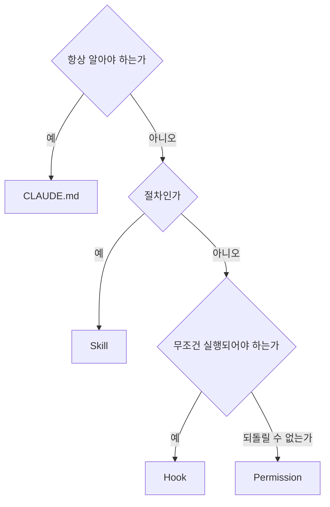

# 49장. Hooks — 무조건 실행되어야 하는 것, 그리고 셋의 구분

Skill에는 한 가지 한계가 있다.

발동해야 쓰인다.

```text
"마이그레이션 검토 Skill이 있는데 안 썼네요"
```

그리고 `CLAUDE.md` 의 규칙도 마찬가지다.

15장에서 본 그대로다.  
지시는 잊힐 수 있다.

Hook은 잊히지 않는다.

---

## Hook은 시스템이 실행한다

이것이 결정적인 차이다.

| | 실행 주체 | 잊힐 수 있는가 |
|---|---|---|
| `CLAUDE.md` | Agent가 읽고 따름 | 예 |
| Skill | Agent가 발동 판단 | 예 |
| Hook | 🔥 Claude Code가 실행 | 아니오 |

Hook은 Agent의 판단을 거치지 않는다.  
설정된 시점에 무조건 돈다.

그래서 16장의 에스컬레이션에서  
Skill보다 위에 있다.

---

## 언제 실행되는가

주요 시점들이다.

| 시점 | 언제 | 백엔드 활용 |
|---|---|---|
| `PreToolUse` | 도구 실행 직전 | 위험 명령 차단 |
| `PostToolUse` | 도구 실행 직후 | 포맷터, 구조 검사 |
| `UserPromptSubmit` | 사용자 입력 시 | 상태 주입 |
| `Stop` | 응답 종료 시 | 최종 검증 |
| `SessionStart` | 세션 시작 시 | 브랜치·상태 확인 |

가장 많이 쓰는 것은 `PostToolUse` 다.

---

## 파일을 고치면 검사를 돌린다

가장 실용적인 Hook이다.

```json
{
  "hooks": {
    "PostToolUse": [
      {
        "matcher": "Edit|Write",
        "hooks": [
          {
            "type": "command",
            "command": "./gradlew ktlintFormat -q"
          }
        ]
      }
    ]
  }
}
```

Agent가 파일을 수정할 때마다 포매터가 돈다.

이제 `CLAUDE.md` 에서 이 줄을 지울 수 있다.

```markdown
- 코드 수정 후 ktlintFormat 을 실행한다   ← 삭제
```

🔥 16장에서 말한 규칙의 죽음이다.

코드가 대신 하는 일을  
문장으로도 남겨두면 Agent가 두 번 확인한다.

---

## 경계 위반을 즉시 잡는다

42장의 의존성 테스트를 Hook에 건다.

```json
{
  "matcher": "Edit|Write",
  "hooks": [
    {
      "type": "command",
      "command": "./gradlew test --tests '*ArchitectureTest' -q"
    }
  ]
}
```

Agent가 경계를 넘는 import를 추가하는 순간  
실패가 돌아온다.

24장의 좋은 피드백이  
CI가 아니라 **그 자리에서** 온다.

⚠️ 이 검사가 3초를 넘으면 작업이 답답해진다.

느리면 시점을 뒤로 옮긴다.

```text
파일 수정마다  → 빠른 검사 (린트, 구조)
응답 종료 시   → 중간 검사 (관련 단위 테스트)
커밋 전       → 느린 검사 (전체 테스트)
```

24장의 피드백 계층을  
Hook 시점에 매핑한 것이다.

---

## 위험 명령을 막는다

`PreToolUse` 로 실행 전에 검사한다.

```json
{
  "hooks": {
    "PreToolUse": [
      {
        "matcher": "Bash",
        "hooks": [
          {
            "type": "command",
            "command": "./scripts/check-command.sh"
          }
        ]
      }
    ]
  }
}
```

⚠️ 그런데 이건 대개 권한 설정으로 하는 편이 낫다.

7장의 `deny` 목록이 더 단순하고 확실하다.

Hook을 쓸 이유는 **조건부 판단**이 필요할 때다.

```bash
#!/bin/bash
# 브랜치가 main 이면 파일 수정을 막는다
branch=$(git rev-parse --abbrev-ref HEAD)
if [ "$branch" = "main" ]; then
  echo "main 브랜치에서는 수정할 수 없습니다" >&2
  exit 2
fi
```

권한 규칙으로는 표현하기 어려운 조건이다.

---

## 세션 시작 시 상태를 확인한다

25장에서 강조한 조건을 자동화한다.

```bash
#!/bin/bash
# .claude/hooks/session-start.sh
if [ -n "$(git status --porcelain)" ]; then
  echo "⚠️ 커밋되지 않은 변경이 있습니다:"
  git status --short
fi
if [ "$(git rev-parse --abbrev-ref HEAD)" = "main" ]; then
  echo "⚠️ main 브랜치입니다. 작업 브랜치를 만드세요."
fi
```

세션을 열 때마다 확인한다.

"작업 전 `git status` 가 clean 이어야 한다" 가  
문장에서 조건으로 올라갔다.

---

## Hook이 실패하면

종료 코드가 의미를 갖는다.

| 종료 코드 | 결과 |
|---|---|
| 0 | 통과. 계속 진행 |
| 그 외 | Agent에게 오류 내용이 전달됨 |

⚠️ 실패 메시지가 Agent의 Context로 들어간다.

그래서 메시지를 잘 쓰는 것이 중요하다.

```bash
# ❌
echo "Error"

# ✅
echo "아키텍처 규칙 위반: point/domain 에서 order 를 참조합니다.
PointApi 인터페이스를 통해 호출하세요." >&2
```

23장에서 말한 실패 메시지의 원칙이  
Hook에도 그대로 적용된다.

---

## 넣지 말아야 할 것

Hook은 매번 돈다.  
그래서 조심할 것이 있다.

| 넣지 않는다 | 이유 |
|---|---|
| 느린 검사 | 매 수정마다 기다린다 |
| 네트워크 호출 | 오프라인에서 막힌다 |
| 상태를 바꾸는 명령 | 의도치 않게 반복 실행 |
| 대화형 명령 | 응답을 기다리다 멈춘다 |

⚠️ 세 번째가 특히 위험하다.

`PostToolUse` 에 마이그레이션 실행을 걸면  
파일 수정마다 DB가 바뀐다.

---

## 셋의 구분 최종 정리

5장에서 나눈 셋을 이제 완전히 정리할 수 있다.



| | 성격 | 예 |
|---|---|---|
| `CLAUDE.md` | 지식 | 계층 방향, 도메인 용어 |
| Skill | 절차 | 마이그레이션 검토 체크리스트 |
| Hook | 강제 | 포맷터, 구조 검사 |
| Permission | 차단 | 운영 DB 접속 |

같은 관심사가 여러 층에 나타날 수 있다.

```text
계층 규칙
  CLAUDE.md   "Domain은 프레임워크에 의존하지 않는다"
  Skill       리뷰 체크리스트의 한 항목
  Hook        ArchitectureTest 자동 실행
  Permission  (해당 없음)
```

🔥 이때 `CLAUDE.md` 의 문장은 **이유**를 담고,  
Hook은 **검사**를 한다.

둘 다 있는 것이 낭비가 아니다.  
Agent는 이유를 알아야 우회로를 찾지 않는다.

---

## 이 장의 핵심

* Skill은 발동해야 쓰이고, `CLAUDE.md` 는 잊힐 수 있다
* Hook은 Agent의 판단을 거치지 않고 시스템이 실행한다
* 가장 실용적인 것은 파일 수정 후 포매터와 구조 검사다
* Hook이 대신 하는 일은 `CLAUDE.md` 에서 지운다
* 검사가 느리면 시점을 뒤로 옮긴다 — 24장의 피드백 계층을 시점에 매핑한다
* 단순 차단은 Hook보다 권한 설정이 낫다 — Hook은 조건부 판단용이다
* Hook의 실패 메시지는 Agent의 Context로 들어간다 — 구체적으로 쓴다
* 상태를 바꾸는 명령을 Hook에 걸면 반복 실행된다
* `CLAUDE.md` 는 이유를 담고 Hook은 검사를 한다 — 둘 다 있는 것이 낭비가 아니다
