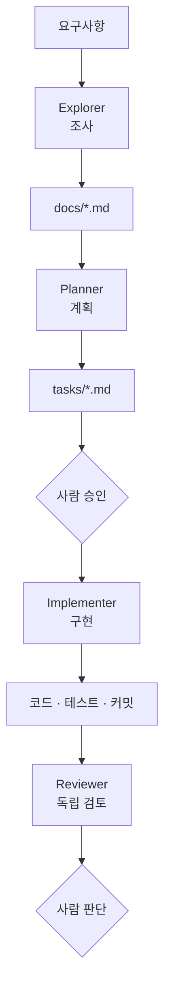

# 50장. Agent Orchestration — 구현과 Review를 분리한다

Agent 넷이 준비됐다.

이제 어떻게 엮는가.

가장 중요한 원칙 하나부터 짚는다.

---

## 자기가 쓴 코드를 자기가 검토할 수 없다

18장에서 세션을 나누는 이유로 말했다.

구현 세션에는 이런 것이 쌓여 있다.

```text
"이 방식으로 가기로 했다"
"이 예외는 여기서 처리하기로 했다"
"이건 다음 단계에서 하기로 했다"
```

같은 Context에서 검토를 시키면  
그 합의를 다시 확인한다.

```text
> 방금 구현한 코드를 검토해줘

계획대로 잘 구현되었습니다.
테스트도 모두 통과합니다. 특별한 문제는 없습니다.
```

⚠️ 이 답변은 검토가 아니다.

Reviewer가 독립 Context를 가져야 하는 이유가 여기 있다.

> 구현 과정을 모르는 상태에서  
> 결과만 보는 사람이 필요하다.

48장의 Context 격리가  
여기서 품질 장치로 쓰인다.

---

## 기본 흐름



각 단계가 **파일로** 이어진다.

19장에서 세운 원칙이다.  
Agent들은 서로를 모르고 문서만 안다.

---

## 사람이 개입하는 두 곳

흐름도에서 사람은 두 번 나온다.

| 지점 | 하는 일 | 근거 |
|---|---|---|
| 계획 승인 | 방향 결정, 대안 선택 | 21장 |
| Review 판단 | 지적을 수용할지 결정 | 25장 |

⚠️ 그 사이는 지켜보지 않는다.

24장에서 말한 대로,  
루프 중간을 지켜보면 위임의 이점이 사라진다.

---

## 실제로 돌리는 법

한 세션에서 순서대로 부를 수도 있고,  
세션을 나눌 수도 있다.

**한 세션에서**

```text
1. explorer 로 결제 재시도 관련 코드를 조사해줘.
   결과는 docs/payment-retry-survey.md 에 저장하고 요약만 보고해줘.

2. (조사 확인 후)
   planner 로 그 문서를 읽고 계획을 세워줘.

3. (계획 승인 후)
   implementer 로 계획의 1단계를 구현해줘.
```

**세션을 나눠서**

```text
세션 1  explorer + planner  → 문서
        /clear
세션 2  implementer          → 커밋
        /clear
세션 3  reviewer             → 지적 사항
```

🔥 검토만큼은 세션을 나누는 편이 확실하다.

같은 세션에서 `reviewer` 를 부르면  
Subagent의 Context는 깨끗하지만  
지시하는 Main Agent의 Context는 오염되어 있다.

전달하는 요약에 이미 편향이 섞인다.

---

## Reviewer에게 무엇을 주는가

Diff와 계획서만 준다.

```text
# 새 세션
reviewer 로 검토해줘.

대상: git diff main...HEAD
계획서: @tasks/payment-retry.md

계획과 실제 구현이 일치하는지,
계획에 없던 변경이 있는지 확인해줘.
```

⚠️ 구현 과정의 대화를 주지 않는다.

주는 순간 독립성이 사라진다.

---

## Review Agent가 잘 잡는 것

| 잘 잡는다 | 못 잡는다 |
|---|---|
| 테스트 약화 (23장 4패턴) | 요구사항 오해 |
| 계획 범위 이탈 | 도메인 규칙 위반 |
| 규칙 위반 (계층·경계) | 성능 실제 영향 |
| 누락 (권한·검증·에러) | 운영 환경 특수성 |
| 되돌릴 수 없는 변경 | 팀 관행 |

오른쪽 열은 사람이 봐야 한다.

특히 두 번째 — 도메인 규칙 위반은  
29장에서 본 것처럼 코드에 안 적혀 있다.

`CLAUDE.md` 나 도메인 문서에 적혀 있으면  
Reviewer도 잡을 수 있다.

> Reviewer의 성능은  
> 우리가 규칙을 얼마나 문서화했는지에 비례한다.

---

## 여러 Reviewer를 병렬로

관심사별로 나눈 Reviewer들을 동시에 돌린다.

```text
세 관점에서 동시에 검토해줘.

1. reviewer: 계획 대조와 테스트
2. db-reviewer: 마이그레이션과 쿼리
3. security-reviewer: 권한과 입력 검증

각각 결과를 따로 보고해줘.
```

읽기 전용이라 병렬이 안전하다.

⚠️ 결과가 겹치거나 충돌할 수 있다.

```text
db-reviewer:       인덱스를 추가하는 것이 좋겠습니다
boundary-reviewer: 이 조회는 다른 도메인 테이블 접근입니다
```

둘 다 맞는 말이고 방향이 반대다.

이럴 때 종합은 사람이 한다.

---

## 결과를 종합한다

지적이 스무 개 나오면 정리가 필요하다.

```text
세 Reviewer의 지적을 종합해줘.

- 중복 제거
- 심각도순 정렬 (치명 / 높음 / 낮음)
- 서로 충돌하는 지적은 별도로 표시
- 각 지적마다 근거 파일:줄

수정은 하지 마.
```

종합까지가 Agent의 일이고,  
무엇을 고칠지는 사람이 정한다.

---

## 지적을 반영할 때

또 하나의 함정이 있다.

```text
# ❌
Reviewer 지적사항을 전부 반영해줘
```

⚠️ 전부 반영하면 범위가 커진다.

Reviewer는 이상적인 상태를 기준으로 말한다.  
그중 일부는 이번 작업의 범위가 아니다.

```text
# ✅
지적 중 다음만 반영해줘.
- 3번 (권한 검사 누락)
- 7번 (트랜잭션 안 외부 호출)

나머지는 tasks/tech-debt.md 에 기록만 해줘.
```

20장의 Non-goals가 여기서도 작동한다.

---

## 이 흐름이 과한 경우

⚠️ 모든 작업에 넷을 다 쓰지 않는다.

| 작업 | 흐름 |
|---|---|
| 오타 수정 | 그냥 한다 |
| 버그 하나 | 구현 + 사람 검토 |
| 기능 추가 | 계획 + 구현 + 검토 |
| 대규모 리팩터링 | 넷 다 |

기준은 21장과 같다.  
되돌리기 비용이다.

오케스트레이션 자체가 비용이라는 것을 잊으면  
간단한 작업이 30분짜리 절차가 된다.

---

## 이 장의 핵심

* 구현 세션에는 합의가 쌓여 있어 그 Context에서는 검토가 재확인이 된다
* Reviewer는 구현 과정을 모르는 상태에서 결과만 봐야 한다
* Context 격리가 여기서 품질 장치로 쓰인다
* 각 단계는 대화가 아니라 파일로 이어진다
* 사람은 계획 승인과 Review 판단 두 곳에서 개입한다
* 검토만큼은 세션을 나누는 편이 확실하다 — Main의 Context도 편향된다
* Reviewer에게는 Diff와 계획서만 준다
* Reviewer의 성능은 규칙을 얼마나 문서화했는지에 비례한다
* 여러 Reviewer의 지적이 충돌할 수 있고, 종합은 사람이 한다
* 지적을 전부 반영하면 범위가 커진다 — 이번 범위와 부채를 나눈다
* 오케스트레이션 자체가 비용이다 — 작업 크기에 맞춘다
