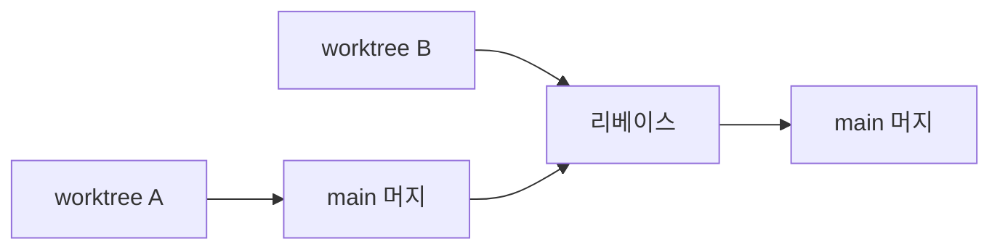
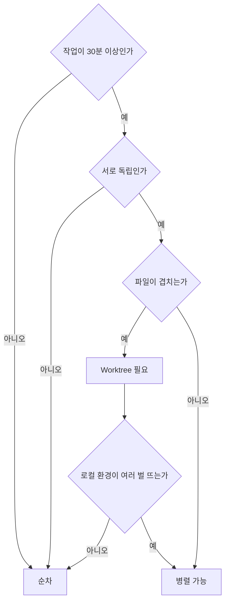

# 50장. 병렬 Agent와 Git Worktree — 그리고 Multi-Agent가 나쁠 때

49장까지는 순차였다.

조사하고, 계획하고, 구현하고, 검토한다.

이 장은 동시에 하는 이야기이고,  
**하지 말아야 할 때**의 이야기다.

후자가 더 길다.

---

## 조사는 병렬, 수정은 순차

47장에서 조사를 병렬로 던졌다.

읽기만 하므로 서로 방해하지 않는다.

수정은 다르다.

```text
Agent A: PaymentService.kt 수정 중
Agent B: PaymentService.kt 수정 중
```

⚠️ 나중에 쓴 쪽이 이긴다.

같은 작업 디렉터리를 공유하기 때문이다.

22장에서 말한 그 문제다.

> 논리적으로 독립이어도  
> 파일이 겹치면 충돌한다.

---

## Git Worktree

작업 디렉터리 자체를 분리한다.

```bash
git worktree add ../order-service-retry feat/payment-retry
git worktree add ../order-service-cache feat/cache-refactor
```

```text
~/work/
  order-service/          main
  order-service-retry/    feat/payment-retry
  order-service-cache/    feat/cache-refactor
```

각 디렉터리에서 Claude Code를 따로 띄운다.

```bash
cd ~/work/order-service-retry && claude
```

같은 레포의 다른 체크아웃이다.  
서로 완전히 격리된다.

정리는 이렇게 한다.

```bash
git worktree remove ../order-service-retry
```

---

## 병렬이 실제로 이득인 경우

⚠️ 생각보다 좁다.

| 이득 | 조건 |
|---|---|
| 독립 기능 두 개 | 파일이 안 겹친다 |
| 긴 작업 + 급한 수정 | 컨텍스트 전환 없이 처리 |
| 대안 두 개 비교 | 같은 문제를 두 방식으로 |
| 조사와 구현 동시 | 조사는 다른 브랜치에서 |

세 번째가 의외로 유용하다.

```bash
git worktree add ../try-a feat/retry-spring-retry
git worktree add ../try-b feat/retry-manual
```

두 방식으로 구현해보고 비교한 뒤 하나를 버린다.

사람 혼자서는 하기 어려운 실험이다.

---

## 백엔드에서의 함정

⚠️ Worktree를 나눠도 공유되는 것이 있다.

| 공유됨 | 결과 |
|---|---|
| 로컬 DB | 마이그레이션이 서로 충돌 |
| Redis | 키가 섞인다 |
| 포트 | 동시에 서버를 못 띄운다 |
| Docker 컨테이너 | 같은 컨테이너를 공유 |

```bash
# 각 worktree마다 다른 포트·DB
SERVER_PORT=8081 DB_NAME=order_retry ./gradlew bootRun
SERVER_PORT=8082 DB_NAME=order_cache ./gradlew bootRun
```

🔥 이 설정이 없으면 병렬 작업이  
서로의 데이터를 깨뜨린다.

Worktree를 쓰기 전에  
로컬 환경이 여러 벌 뜰 수 있는지 확인한다.

---

## 통합은 순차로

병렬로 만들었어도 합치는 것은 하나씩이다.



⚠️ 두 브랜치를 동시에 머지하지 않는다.

먼저 하나를 합치고,  
두 번째를 그 위에 리베이스한 뒤 테스트를 돌린다.

각각은 통과했는데 합치면 깨지는 경우가 있다.

---

## Multi-Agent가 나쁜 경우

이 장의 절반이다.

### 1️⃣ 작업이 작을 때

```text
버그 하나를 고치는 데
Explorer → Planner → Implementer → Reviewer
```

⚠️ 위임 비용이 작업보다 크다.

각 Agent가 Context를 새로 만들고,  
결과를 요약하고, 전달받는다.

10분이면 될 일이 40분이 된다.

### 2️⃣ 의존이 강할 때

```text
Agent A: 인터페이스를 정의한다
Agent B: 그 인터페이스를 구현한다
```

B는 A가 끝나야 시작할 수 있다.  
병렬이 아니라 순차를 억지로 나눈 것이다.

22장의 판단 기준으로 돌아간다.

### 3️⃣ 공유 맥락이 많을 때

```text
Agent A: 결제 도메인 리팩터링
Agent B: 결제 도메인 테스트 보강
```

둘 다 같은 코드를 이해해야 한다.

각자 조사하면 같은 일을 두 번 하고,  
Context 비용도 두 배다.

한 세션에서 순서대로 하는 편이 싸다.

### 4️⃣ 조율 비용이 클 때

```text
Agent 5개를 띄웠는데
결과를 종합하고, 충돌을 해소하고,
누가 무엇을 했는지 추적하는 데 시간이 다 간다
```

⚠️ 사람의 인지 부하가 병목이 된다.

Agent가 다섯 개면  
검토해야 할 Diff도 다섯 개다.

25장의 원칙이 여기서 무너진다.

> Agent가 빨라질수록  
> 검토 단위는 작아져야 한다.

병렬은 검토 단위를 늘린다.

---

## 비용도 배수로 든다

11장의 계산이다.

Agent 세 개를 동시에 돌리면  
토큰도 세 배다.

그리고 각각이 같은 코드를 읽으면  
캐시 이점도 못 받는다.

| 방식 | 시간 | 토큰 |
|---|---|---|
| 순차 1개 | 60분 | 1x |
| 병렬 3개 | 25분 | 3x |

35분을 3배 비용으로 사는 것이다.

살 만한 경우가 있고 아닌 경우가 있다.

---

## 판단 기준



네 관문을 다 통과해야 병렬이 이득이다.

🔥 실무에서는 대부분 첫 번째나 두 번째에서 걸린다.

그래서 이 장의 결론은 이렇다.

> 병렬은 기본값이 아니다.  
> 순차가 기본이고, 병렬은 근거가 있을 때 쓴다.

---

## 9부를 마치며

일곱 장에서 만든 것들이다.

```text
44·45장  절차를 Skill로
46장     강제할 것을 Hook으로
47·48장  역할을 Agent로
49장     흐름을 오케스트레이션으로
50장     병렬은 근거가 있을 때만
```

전부 하네스의 부품이다.

5장의 아홉 개 부품 중  
Skills와 Hooks가 여기서 채워졌다.

남은 것은 Tools의 확장과 Permission·Sandbox다.  
10부에서 다룬다.

---

## 이 장의 핵심

* 조사는 병렬로 안전하지만 수정은 다르다
* 같은 작업 디렉터리를 공유하면 나중에 쓴 쪽이 이긴다
* Worktree는 작업 디렉터리 자체를 분리한다
* Worktree를 나눠도 로컬 DB·Redis·포트는 공유된다
* 병렬 작업 전에 로컬 환경이 여러 벌 뜨는지 확인한다
* 통합은 순차로 한다 — 각각 통과했는데 합치면 깨질 수 있다
* Multi-Agent가 나쁜 경우는 넷이다 — 작은 작업, 강한 의존, 공유 맥락, 조율 비용
* Agent가 다섯이면 검토할 Diff도 다섯이다 — 사람이 병목이 된다
* 병렬은 시간을 토큰으로 사는 것이다
* 순차가 기본이고 병렬은 근거가 있을 때 쓴다
