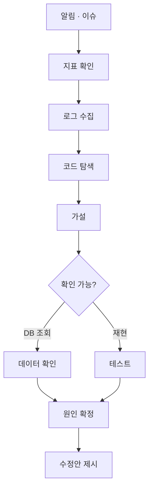

# 54장. 장애 대응 Agent — Issue에서 수정안까지

52장과 53장에서 연결한 것들이 있다.

이슈, PR, DB, 모니터링, 로그.

이것들을 엮으면 무엇이 되는가.

33장의 장애 분석이  
한 세션 안에서 끝까지 돌아간다.

---

## 지금까지의 장애 대응

```text
14:12  알림 슬랙에 에러율 급증
14:13  대시보드 열어서 확인
14:15  로그 시스템에서 시간 범위 맞춰 검색
14:18  에러 스택트레이스 복사
14:20  Claude Code 열고 붙여넣기
14:22  "이 코드 어디서 나온 건지 찾아줘"
14:25  DB 상태 확인하러 다시 터미널
14:28  결과 복사해서 다시 붙여넣기
```

⚠️ 절반이 복사와 붙여넣기다.

그리고 그 사이에 맥락이 끊긴다.

---

## 연결된 뒤

```text
PAY-3102 알림이 왔어. 조사해줘.

- 이슈 내용과 첨부된 알림 확인
- 해당 시간대 에러율·응답시간 지표
- 관련 로그 (traceId 로 좁혀서)
- 코드에서 원인 후보
- 가설 3개와 각각의 확인 방법

수정은 하지 마. 분석만.
```

한 번의 지시로 다섯 시스템을 오간다.

이것이 이 장의 전부다.

---

## 흐름



`J` 에서 멈춘다.

수정안까지가 Agent의 범위다.

---

## 읽기 전용 Agent로 정의한다

49장의 방식대로 만든다.

```markdown
---
name: incident-responder
description: 운영 장애를 조사한다. 알림·이슈를 받아 지표·로그·
  코드를 확인하고 원인 가설과 수정안을 제시한다. 아무것도 변경하지 않는다.
tools: Read, Grep, Glob, Bash, mcp__jira__get_issue,
  mcp__grafana__query, mcp__loki__query, mcp__postgres__query
model: opus
---

너는 장애 조사 담당이다.

## 절대 하지 않는 것

- 코드를 수정하지 않는다
- DB를 변경하지 않는다 (SELECT 만)
- 배포·재시작·설정 변경을 하지 않는다
- 티켓 상태를 바꾸지 않는다

## 절차

1. 이슈와 알림 내용을 확인한다
2. 영향 범위를 지표로 확인한다 (언제부터, 몇 %, 지금도 진행 중인가)
3. 로그를 좁혀서 수집한다 (전체를 가져오지 않는다)
4. 코드에서 원인 후보를 찾는다
5. 가설을 3개 이상, 유력한 순으로 제시한다
   - 근거 (파일:줄, 로그, 지표)
   - 맞다면 무엇이 더 관찰되어야 하는가
   - 확인 방법
6. 확인 가능한 것은 확인한다 (조회만)
7. 수정안을 제시한다. 적용하지는 않는다

## 보고 형식

## 현재 상태
(지금도 발생 중인가 / 영향 범위)

## 타임라인
## 확인한 사실 (근거 포함)
## 확인하지 못한 것
## 가설 (유력한 순)
## 권장 조치
  - 즉시 (완화)
  - 근본 (수정)
```

⚠️ `tools` 목록에 `Edit`·`Write` 가 없다.

48장의 원칙이다.  
문장으로 막는 것보다 도구를 안 주는 편이 확실하다.

---

## 즉시 조치와 근본 수정을 나눈다

보고 형식의 마지막 항목이 중요하다.

장애 상황에서 필요한 것은 두 가지다.

| 구분 | 목적 | 예 |
|---|---|---|
| 즉시 조치 | 지금 멈추기 | 피처 플래그 off, 롤백, 트래픽 차단 |
| 근본 수정 | 다시 안 나게 | 코드 수정 + 재현 테스트 |

🔥 Agent가 이 둘을 섞으면 위험하다.

"코드를 이렇게 고치면 됩니다" 만 오면  
지금 당장 무엇을 해야 하는지가 빠진다.

장애 대응에서는 완화가 먼저다.

---

## 사람이 하는 것

Agent가 하지 않는 일이 분명해야 한다.

| Agent | 사람 |
|---|---|
| 조사, 가설, 수정안 | 즉시 조치 실행 |
| 재현 테스트 작성 | 롤백 결정 |
| 영향 범위 정리 | 고객 공지 판단 |
| 타임라인 정리 | 에스컬레이션 |

⚠️ 두 번째 열은 전부 **되돌릴 수 없거나  
사회적 파장이 있는 결정**이다.

7장의 기준이 그대로다.

---

## 온콜에서 실제로 쓰는 법

새벽 세 시에 알림이 울렸다고 하자.

```text
1. 사람이 상황을 본다 (심각도 판단)
2. 심각하면 즉시 완화부터 (사람)
3. 그 다음 Agent에게 조사를 시킨다
4. 사람은 그 사이 고객 공지·에스컬레이션
5. Agent 결과를 받아 판단
6. 수정은 아침에, 재현 테스트와 함께
```

🔥 3번과 4번이 병렬이라는 것이 이득이다.

혼자 온콜을 서면 조사와 공지를 동시에 못 한다.  
조사를 위임하면 사람은 판단에 집중한다.

---

## 사후 기록까지

46장의 장애 분석 Skill 7번 항목이다.

```text
조사 결과를 tasks/incident-2026-08-14.md 에 정리해줘.

- 타임라인 (알림 → 완화 → 원인 확정)
- 원인
- 조치 (즉시 / 근본)
- 재발 방지 (코드 · 모니터링 · 프로세스)
- 확인하지 못한 것
```

⚠️ 마지막 항목을 빼지 않는다.

19장의 원칙이다.  
급하게 처리한 장애일수록 미확인 항목이 많다.

그것을 적어두지 않으면  
"원인 규명 완료" 로 기록되고 다시 터진다.

---

## 이 Agent를 만들지 말아야 할 때

⚠️ 다음 조건이면 아직 이르다.

| 조건 | 문제 |
|---|---|
| 로그에 추적 ID가 없다 | 로그를 좁힐 방법이 없다 |
| 지표가 없거나 신뢰할 수 없다 | 영향 범위를 모른다 |
| 운영 DB에만 붙일 수 있다 | 조회가 위험하다 |
| 읽기 전용 계정이 없다 | 사고 위험 |

셋 이상 해당하면  
그 문제를 먼저 푸는 것이 순서다.

24장에서 말한 관측 가능성 투자가  
여기서 회수된다.

---

## 이 장의 핵심

* 연결된 도구들을 엮으면 장애 조사가 한 세션에서 끝난다
* 지금까지 절반이 복사와 붙여넣기였고 그 사이 맥락이 끊겼다
* Agent의 범위는 수정안 제시까지다
* `tools` 에서 쓰기 도구를 빼서 구조적으로 변경할 수 없게 한다
* 즉시 조치와 근본 수정을 나눠 보고하게 한다
* 장애 대응에서는 완화가 먼저다
* 되돌릴 수 없거나 사회적 파장이 있는 결정은 사람이 한다
* 조사를 위임하면 온콜 담당자가 판단과 공지에 집중할 수 있다
* 급한 장애일수록 확인하지 못한 것을 기록해야 다시 안 터진다
* 추적 ID와 지표가 없으면 이 Agent를 만들기 전에 그것부터 만든다
