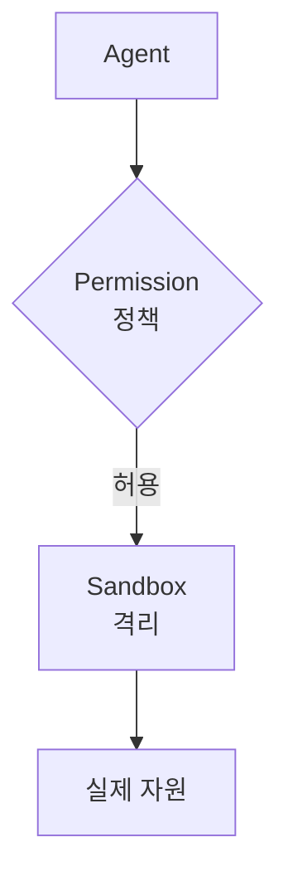

# 55장. Permission과 Sandbox — Allow · Ask · Deny, 그리고 격리

7장에서 권한의 기본을 봤다.

그때는 첫 주였고, 지금은 다르다.

MCP로 외부 시스템이 붙었고,  
Agent가 여러 개 돌고,  
팀 전체가 쓰기 시작했다.

권한을 다시 설계할 시점이다.

---

## 두 가지 층

이 장의 주제는 사실 둘이다.



| | 성격 | 막는 방식 |
|---|---|---|
| Permission | 정책 | 설정을 읽고 판단 |
| Sandbox | 격리 | 물리적으로 불가능 |

⚠️ 정책은 실수로 풀릴 수 있다.

설정 파일을 잘못 고치거나,  
새 팀원이 모르고 자동 승인 모드를 켜거나.

격리는 그렇지 않다.  
컨테이너 안에 운영 DB 주소가 없으면 접속할 수 없다.

> 중요한 것은 정책이 아니라 격리로 막는다.

---

## 권한 규칙 설계

`.claude/settings.json` 을 세 층으로 나눠 생각한다.

```json
{
  "permissions": {
    "allow": [
      "Bash(./gradlew test:*)",
      "Bash(./gradlew build)",
      "Bash(./gradlew ktlint:*)",
      "Bash(git status)",
      "Bash(git diff:*)",
      "Bash(git log:*)",
      "Read(./src/**)",
      "Edit(./src/**)",
      "mcp__jira__get_issue",
      "mcp__grafana__query"
    ],
    "ask": [
      "Bash(git commit:*)",
      "Bash(docker compose:*)",
      "Edit(./build.gradle.kts)",
      "Edit(./src/main/resources/application*.yml)"
    ],
    "deny": [
      "Read(./.env)",
      "Read(./.env.*)",
      "Read(**/*secret*)",
      "Read(**/*credential*)",
      "Bash(git push:*)",
      "Bash(git reset --hard:*)",
      "Bash(git clean:*)",
      "Bash(psql:*)",
      "Bash(mysql:*)",
      "Bash(kubectl:*)",
      "Bash(aws:*)",
      "Bash(curl:*)",
      "mcp__github__merge_pull_request"
    ]
  }
}
```

세 층의 성격이 다르다.

| 층 | 기준 |
|---|---|
| allow | 하루에 수십 번 하고, 되돌릴 수 있다 |
| ask | 가끔 하고, 영향이 있다 |
| deny | 되돌릴 수 없거나 나가면 안 되는 것 |

🔥 `ask` 층이 실무에서 가장 유용하다.

전부 allow면 위험하고  
전부 ask면 작업이 안 된다.

---

## `curl` 을 막는 이유

위 목록에서 눈에 띄는 항목이다.

```json
"Bash(curl:*)"
```

⚠️ `curl` 하나로 대부분의 금지가 뚫린다.

* 운영 API 호출
* 외부로 데이터 전송
* 스크립트 다운로드 후 실행

52장에서 말한 프롬프트 인젝션과 결합하면  
특히 위험하다.

외부 이슈 본문의 지시로  
코드가 외부로 나갈 수 있다.

필요하면 특정 호스트만 허용한다.

```json
"allow": ["Bash(curl http://localhost:*)"]
```

---

## 환경별로 나눈다

한 벌의 설정으로 모든 상황을 감당하지 않는다.

```text
.claude/
  settings.json            ← 팀 공통 (커밋)
  settings.local.json      ← 개인 (커밋 안 함)
```

개인 설정에는 각자의 실험적 허용을 둔다.  
팀 설정은 안전선을 담는다.

⚠️ 개인 설정으로 팀 `deny` 를 뚫지 않는다.

이것은 도구가 아니라 팀 합의의 문제다.  
61장에서 다룬다.

---

## Sandbox — 컨테이너 안에서 돌린다

정책 위에 격리를 얹는다.

```dockerfile
FROM eclipse-temurin:21-jdk

RUN apt-get update && apt-get install -y git curl \
    && curl -fsSL https://deb.nodesource.com/setup_20.x | bash - \
    && apt-get install -y nodejs \
    && npm install -g @anthropic-ai/claude-code

RUN useradd -m dev
USER dev
WORKDIR /workspace
```

이 컨테이너 안에는 이런 것이 **없다**.

```text
~/.aws/credentials
~/.ssh/
운영 DB 접속 정보
사내망 접근
다른 프로젝트 소스
```

🔥 없으면 유출될 수 없다.

`deny` 규칙 열 줄보다 확실하다.

---

## 무엇을 마운트하는가

컨테이너 설계의 핵심이다.

```yaml
services:
  dev:
    build: .
    volumes:
      - .:/workspace              # 이 프로젝트만
      - ~/.claude:/home/dev/.claude:ro
    environment:
      - DB_HOST=postgres          # 로컬 컨테이너
    networks:
      - dev-only
```

| 마운트한다 | 하지 않는다 |
|---|---|
| 이 프로젝트 디렉터리 | 홈 디렉터리 |
| 인증 정보 (읽기 전용) | SSH 키 |
| 로컬 DB 컨테이너 | 사내망 |

⚠️ `~` 를 통째로 마운트하면 격리의 의미가 없다.

6장에서 홈 디렉터리에서 실행하지 말라고 한 것과 같은 이유다.

---

## 네트워크를 좁힌다

가장 강한 격리다.

```yaml
networks:
  dev-only:
    internal: true      # 외부 인터넷 차단
```

⚠️ 다만 이러면 패키지 다운로드도 막힌다.

현실적인 절충은 이렇다.

```text
허용   npm, maven, gradle 저장소
허용   github.com
허용   Claude API
차단   그 외 전부
```

프록시나 방화벽 규칙으로 구현한다.

---

## 자동 승인 모드는 여기서만

7장에서 미뤄둔 이야기다.

모든 확인을 건너뛰는 모드가 있다.

⚠️ 로컬 개발 머신에서는 쓰지 않는다.

쓸 수 있는 조건은 셋이다.

```text
1. 격리된 컨테이너 안이다
2. 자격증명이 없다
3. 되돌릴 수 있다 (브랜치, 커밋)
```

셋 다 만족하면  
긴 리팩터링을 자동으로 돌릴 수 있다.

41장의 대규모 이동 같은 작업이 후보다.

🔥 그리고 이 경우에도 결과는 사람이 검토한다.

자동 승인은 **중간 확인을 생략**하는 것이지  
최종 검토를 생략하는 것이 아니다.

---

## 정책과 격리를 함께

두 층을 어떻게 조합하는지 정리하면 이렇다.

| 위험 | 정책 | 격리 |
|---|---|---|
| 실수로 테스트 삭제 | `deny` | — |
| 시크릿 읽기 | `deny` | 파일 자체가 없음 |
| 운영 DB 접속 | `deny` | 네트워크 도달 불가 |
| 외부로 코드 전송 | `deny curl` | 네트워크 차단 |
| force push | `deny` | 원격 자격증명 없음 |

오른쪽 열이 채워질수록  
왼쪽 열의 실수 여지가 줄어든다.

---

## 이 장의 핵심

* Permission은 정책이고 Sandbox는 격리다
* 정책은 실수로 풀릴 수 있고 격리는 그렇지 않다
* 중요한 것은 정책이 아니라 격리로 막는다
* `ask` 층이 실무에서 가장 유용하다 — 전부 allow도 전부 ask도 안 된다
* `curl` 하나로 대부분의 금지가 뚫린다
* 팀 설정은 안전선, 개인 설정은 실험용으로 나눈다
* 컨테이너에 자격증명이 없으면 유출될 수 없다
* 홈 디렉터리를 통째로 마운트하면 격리의 의미가 없다
* 자동 승인은 격리·무자격증명·되돌리기 세 조건이 모두 맞을 때만 쓴다
* 자동 승인은 중간 확인을 생략하는 것이지 최종 검토를 생략하는 것이 아니다
