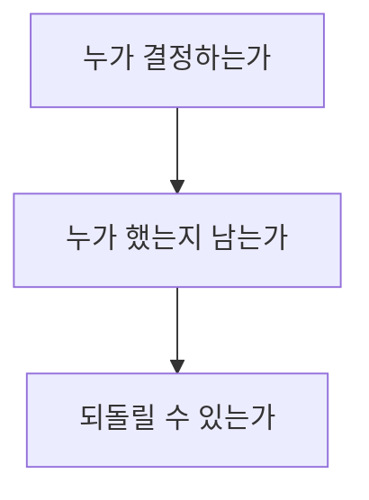
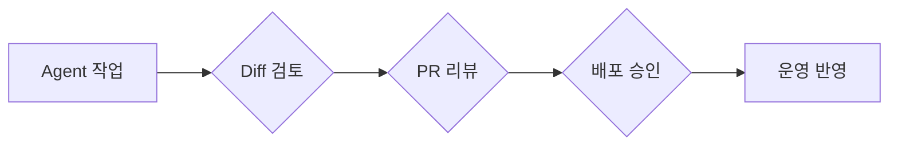

# 56장. Production에서의 원칙 — Human Approval · Audit · Rollback

10부의 마지막 장이다.

지금까지 권한과 격리를 다뤘다.

이 장은 그 위의 층이다.

기술이 아니라 **원칙**의 문제다.

---

## 세 가지 질문

운영과 관련된 모든 판단은  
이 셋으로 정리된다.



| 질문 | 없으면 |
|---|---|
| 사람이 승인했는가 | 아무도 책임지지 않는다 |
| 기록이 남는가 | 사후에 재구성할 수 없다 |
| 되돌릴 수 있는가 | 사고가 사고로 끝나지 않는다 |

셋 다 갖추면 Agent를 운영 근처에 둘 수 있다.  
하나라도 없으면 안 된다.

---

## 맡기지 않는 것

목록을 명확히 해두면 논쟁이 줄어든다.

| 작업 | 이유 |
|---|---|
| 운영 배포 | 되돌리기 비용이 크다 |
| 운영 DB 변경 | 되돌릴 수 없다 |
| 마이그레이션 실행 | 되돌릴 수 없다 |
| 인프라 변경 | 영향 범위를 예측하기 어렵다 |
| 피처 플래그 조작 | 즉시 사용자에게 반영된다 |
| 트래픽 라우팅 변경 | 장애를 만들 수 있다 |
| 고객 알림 발송 | 되돌릴 수 없다 |
| 결제·정산 실행 | 실제 돈이 움직인다 |
| 시크릿 로테이션 | 서비스가 멈출 수 있다 |
| 접근 권한 부여 | 보안 결정 |

🔥 기준은 하나로 요약된다.

> 실행하는 순간 되돌릴 수 없거나  
> 사용자에게 즉시 도달하는 일.

---

## 그럼 무엇을 맡기는가

같은 영역에서도 맡길 수 있는 일이 있다.

```text
❌ 배포한다              ✅ 배포 스크립트를 작성한다
❌ 마이그레이션을 실행한다  ✅ 마이그레이션을 작성하고 검토한다
❌ 플래그를 끈다          ✅ 어떤 플래그를 꺼야 하는지 찾는다
❌ 롤백한다              ✅ 롤백 절차와 영향을 정리한다
❌ 운영 데이터를 고친다    ✅ 보정 쿼리를 작성하고 검증한다
```

왼쪽과 오른쪽의 차이는 **실행 버튼**이다.

준비까지가 Agent,  
누르는 것이 사람.

53장의 장애 대응 Agent가 이 구조였다.

---

## 승인 지점을 설계한다

"사람이 승인한다" 를 실제로 작동하게 하려면  
지점이 명확해야 한다.



세 관문이 있다.

| 관문 | 확인하는 것 | 누가 |
|---|---|---|
| Diff 검토 | 의도한 변경인가 | 작업자 |
| PR 리뷰 | 팀 기준에 맞는가 | 동료 |
| 배포 승인 | 지금 나가도 되는가 | 배포 권한자 |

⚠️ 세 관문이 같은 사람이면 관문이 하나다.

Agent가 만든 코드를  
작업자가 검토하고 스스로 승인해 배포하면  
검토는 형식이 된다.

49장에서 구현과 Review를 나눈 이유가  
조직 차원에서도 적용된다.

---

## 무엇이 기록되어야 하는가

사고가 났을 때 재구성할 수 있어야 한다.

```text
누가 (사람)
무엇을 (변경 내용)
왜 (근거·티켓)
어떻게 만들어졌는가 (Agent 사용 여부)
누가 승인했는가
```

네 번째가 새로 생긴 항목이다.

⚠️ 이것을 어떻게 남길지 팀이 정해야 한다.

```text
방법 1  커밋 메시지 트레일러
        Assisted-by: Claude Code

방법 2  PR 템플릿 체크박스
        [ ] AI 도구를 사용해 작성했습니다

방법 3  기록하지 않는다 (사람이 검토했으면 사람의 코드)
```

세 번째도 유효한 입장이다.

🔥 중요한 것은 정하는 것이다.

정하지 않으면 사고 후에 논쟁이 된다.

---

## 되돌릴 수 있는 상태로 만든다

25장의 Git 원칙이 운영까지 확장된다.

| 층 | 되돌리는 방법 |
|---|---|
| 코드 | `git revert` |
| 배포 | 이전 버전 재배포 |
| 스키마 | 롤백 마이그레이션 |
| 데이터 | 백업 복원 또는 보정 |
| 설정 | 이전 값 복구 |

⚠️ 세 번째와 네 번째가 실제로 어렵다.

27장에서 "되돌리는 방법이 없는 마이그레이션은  
배포 후 손을 묶는다" 고 했다.

Agent가 마이그레이션을 작성하면  
되돌리는 방법도 함께 요구한다.

```text
이 마이그레이션의 롤백 방법도 함께 작성해줘.
되돌릴 수 없다면 그 사실과 이유를 명시해줘.
```

---

## 사고 시나리오를 미리 그려본다

팀에서 한 번은 해볼 만한 연습이다.

```text
Q. Agent가 만든 코드가 운영 장애를 냈다.
   무엇을 확인하고 무엇을 고치는가?
```

답이 이렇게 나오면 준비된 것이다.

```text
1. 즉시 롤백 (사람)
2. 어느 PR인지 확인 → 커밋 이력
3. 왜 통과했는지 확인
   - 테스트가 없었나        → 테스트 추가
   - Review에서 놓쳤나      → 체크리스트 보강
   - 규칙이 없었나          → CLAUDE.md / 아키텍처 테스트
   - 권한이 열려 있었나      → 권한 조정
4. 하네스를 고친다
```

🔥 4번이 이 책의 논지다.

"Agent를 쓰지 말자" 가 아니라  
"이 사고가 다시 안 나는 하네스로 고친다" 다.

59장에서 이것을 개선 루프로 다룬다.

---

## 조직 규정과의 관계

기술적으로 가능한 것과  
조직적으로 허용되는 것은 다르다.

확인해야 할 것들이다.

| 항목 | 확인 |
|---|---|
| 코드 반출 | 외부 API로 코드가 나가도 되는가 |
| 개인정보 | 어떤 데이터를 다룰 수 있는가 |
| 감사 대상 | 금융·의료 등 규제 산업인가 |
| 계약 | 고객사와의 계약에 제약이 있는가 |
| 라이선스 | 생성된 코드의 취급 |

⚠️ 개발자가 혼자 판단할 문제가 아니다.

특히 첫 번째와 세 번째.

먼저 확인하고 시작하는 편이  
나중에 전부 되돌리는 것보다 낫다.

---

## 10부를 마치며

여섯 장에서 다룬 것은 결국 하나다.

**Agent가 닿을 수 있는 범위를 정하는 일.**

```text
51·52장  무엇을 보여줄 것인가
53장     그것으로 무엇을 하게 할 것인가
54장     무엇을 막을 것인가
55장     가장 위험한 둘을 어떻게 다룰 것인가
56장     누가 결정하고 누가 책임지는가
```

5장의 아홉 부품 중  
Permission과 Sandbox가 채워졌다.

이제 부품이 다 모였다.  
11부에서 조립한다.

---

## 이 장의 핵심

* 사람 승인 · 기록 · 되돌리기 셋이 갖춰져야 운영 근처에 둘 수 있다
* 기준은 하나다 — 되돌릴 수 없거나 사용자에게 즉시 도달하는 일
* 같은 영역에서도 준비는 Agent, 실행 버튼은 사람이다
* 세 관문이 같은 사람이면 관문은 하나다
* Agent 사용 여부를 기록할지는 팀이 정한다 — 정하지 않으면 사고 후 논쟁이 된다
* 마이그레이션을 작성시킬 때 롤백 방법도 함께 요구한다
* 사고가 나면 "왜 통과했는지" 를 묻고 하네스를 고친다
* Agent를 쓰지 말자가 아니라 다시 안 나는 구조로 고친다
* 코드 반출과 규제 준수는 개발자 혼자 판단할 문제가 아니다
