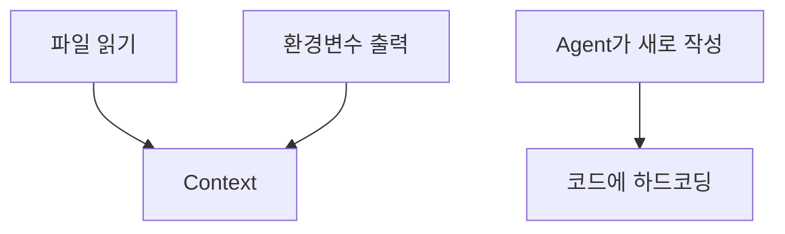

# 58장. Database와 Secret — 환경별 권한 정책

백엔드 개발자에게 가장 위험한 두 가지다.

DB와 시크릿.

이 장은 그 둘만 다룬다.

---

## 환경은 넷이다


Agent의 권한은 오른쪽으로 갈수록 좁아진다.

| 환경 | 읽기 | 쓰기 | 스키마 변경 |
|---|---|---|---|
| 로컬 | 🔥 자유 | 자유 | 자유 |
| 개발 | 허용 | 확인 후 | 확인 후 |
| 스테이징 | ⚠️ 조건부 | 금지 | 금지 |
| 운영 | ⚠️ 읽기 전용 계정만 | 금지 | 금지 |

로컬이 자유롭다는 것이 중요하다.

7장에서 말한 대로,  
전부 막으면 Agent가 검증할 수 없게 된다.

> 로컬에서는 넓게,  
> 운영으로 갈수록 좁게.

---

## 로컬 환경을 제대로 만드는 것이 먼저다

⚠️ 이 순서를 자주 뒤집는다.

운영 접근을 열어주는 이유는 대개  
로컬에서 확인이 안 되기 때문이다.

```text
"로컬에 데이터가 없어서 운영을 봐야 해요"
"로컬에서 재현이 안 돼요"
```

답은 운영을 여는 것이 아니라  
로컬을 고치는 것이다.

```bash
docker compose up -d          # DB, Redis, 메시지 브로커
./scripts/seed-local-data.sh  # 시나리오별 시드
```

🔥 시드 스크립트 하나가  
운영 접근 필요성의 절반을 없앤다.

그리고 이것은 Agent가 만들어줄 수 있다.

```text
로컬 개발용 시드 데이터 스크립트를 만들어줘.

- 주문 상태별로 각 5건씩
- 부분 취소 이력이 있는 케이스 포함
- 전액 포인트 결제 케이스 포함
- 개인정보는 전부 가짜 값으로
```

29장에서 뽑은 경계 케이스가  
그대로 시드 시나리오가 된다.

---

## 스테이징에도 개인정보가 있다

가장 흔한 오해다.

```text
"스테이징이니까 괜찮아요"
```

⚠️ 많은 조직에서 스테이징은  
운영 데이터를 복사해서 만든다.

이름, 연락처, 주소, 결제 이력이 그대로 있다.

```text
스테이징 DB 접근 = 개인정보 접근
```

Agent가 조회하면 그 결과가  
Context에 들어가고 대화 기록에 남는다.

가명화가 되어 있는지 확인하고,  
안 되어 있으면 운영과 같은 취급을 한다.

---

## 운영은 읽기 전용 계정으로만

55장에서 DB 연결의 조건을 말했다.

여기서 구체화한다.

```sql
-- Agent 전용 읽기 계정
CREATE USER claude_readonly WITH PASSWORD '...';

-- 특정 스키마만
GRANT USAGE ON SCHEMA public TO claude_readonly;
GRANT SELECT ON orders, payments TO claude_readonly;

-- 개인정보 테이블은 제외
REVOKE ALL ON users FROM claude_readonly;

-- 리소스 제한
ALTER ROLE claude_readonly SET statement_timeout = '5s';
```

네 가지가 다 필요하다.

| 설정 | 막는 것 |
|---|---|
| SELECT only | 데이터 변경 |
| 테이블 제한 | 개인정보 조회 |
| 타임아웃 | 무거운 쿼리로 인한 부하 |
| 레플리카 연결 | 운영 트래픽 영향 |

🔥 네 번째를 빠뜨리면  
Agent의 조사 쿼리가 운영에 영향을 준다.

리드 레플리카가 있으면 그쪽에 붙인다.

---

## 개인정보 컬럼을 다루는 법

테이블 단위 차단이 어려우면 뷰를 만든다.

```sql
CREATE VIEW orders_masked AS
SELECT
    id, status, amount, created_at,
    left(user_name, 1) || '**'        AS user_name,
    left(phone, 3) || '-****-****'    AS phone
FROM orders;

GRANT SELECT ON orders_masked TO claude_readonly;
```

Agent는 마스킹된 뷰만 본다.

⚠️ 그리고 이 원칙을 문서로도 남긴다.

```markdown
# CLAUDE.md
- 운영·스테이징 데이터를 조회할 때 개인정보 컬럼을 SELECT 하지 않는다
- 조회 결과를 문서나 커밋 메시지에 그대로 붙여넣지 않는다
- 예시가 필요하면 가짜 값을 만든다
```

두 번째 줄이 중요하다.

19장에서 조사 결과를 파일로 남기라고 했는데,  
그 파일에 실제 고객 데이터가 들어가면 안 된다.

---

## 시크릿이 Agent를 만나는 세 경로



각각 막는 방법이 다르다.

### 1️⃣ 파일 읽기

```json
"deny": [
  "Read(./.env)",
  "Read(./.env.*)",
  "Read(**/*secret*)",
  "Read(**/*credential*)",
  "Read(./src/main/resources/application-prod.yml)"
]
```

### 2️⃣ 환경변수 출력

```json
"deny": ["Bash(env)", "Bash(printenv:*)", "Bash(set)"]
```

⚠️ 이걸 빠뜨리는 경우가 많다.

`.env` 를 막아도 `env` 명령 한 줄이면 다 보인다.

가장 확실한 것은 57장의 격리다.  
컨테이너에 애초에 넣지 않는다.

### 3️⃣ Agent가 새로 만든다

32장에서 본 문제다.

```kotlin
// Agent가 테스트를 만들면서
val apiKey = "sk-live-abc123..."   // 실제 키
```

Diff 검토로 잡는다.

```bash
git diff | grep -iE "(api[_-]?key|secret|password|token).*=.*['\"]"
```

49장의 Hook으로 자동화한다.

```json
{
  "matcher": "Edit|Write",
  "hooks": [{"type": "command", "command": "./scripts/check-secrets.sh"}]
}
```

---

## 이미 읽혔다면

⚠️ 사고가 났을 때의 절차다.

```text
1. 세션을 즉시 종료한다 (/clear 로는 부족)
2. 해당 시크릿을 로테이션한다
3. 대화 기록에 남았다면 그것도 처리한다
4. 무엇이 노출됐는지 기록한다
```

2번이 핵심이다.

"Context에서 지웠으니 괜찮다" 가 아니다.  
노출된 시크릿은 노출된 것이다.

로테이션이 유일한 대응이다.

---

## 정리하면

| 대상 | 로컬 | 개발 | 스테이징 | 운영 |
|---|---|---|---|---|
| DB 읽기 | 자유 | 허용 | 마스킹 뷰만 | 읽기 계정 + 레플리카 |
| DB 쓰기 | 자유 | 확인 후 | 금지 | 금지 |
| 마이그레이션 실행 | 허용 | 사람이 | 사람이 | 사람이 |
| 시크릿 | 더미 값 | 더미 값 | 접근 금지 | 접근 금지 |
| 격리 | 권장 | 권장 | 필수 | 필수 |

이 표를 팀 문서로 만들어두면  
매번 논의하지 않아도 된다.

---

## 이 장의 핵심

* 권한은 로컬에서 넓고 운영으로 갈수록 좁다
* 운영 접근이 필요한 이유는 대개 로컬이 부실해서다 — 로컬을 먼저 고친다
* 시드 스크립트 하나가 운영 접근 필요성의 절반을 없앤다
* 경계 케이스 목록이 그대로 시드 시나리오가 된다
* 스테이징에는 대개 운영 데이터가 복사되어 있다 — 개인정보 접근이다
* 운영 읽기 계정은 SELECT·테이블 제한·타임아웃·레플리카 넷이 다 필요하다
* 마스킹 뷰를 만들면 개인정보 컬럼을 구조적으로 차단할 수 있다
* 조회 결과를 문서나 커밋 메시지에 붙여넣지 않는다
* `.env` 를 막아도 `env` 명령 한 줄이면 다 보인다
* 노출된 시크릿의 유일한 대응은 로테이션이다
