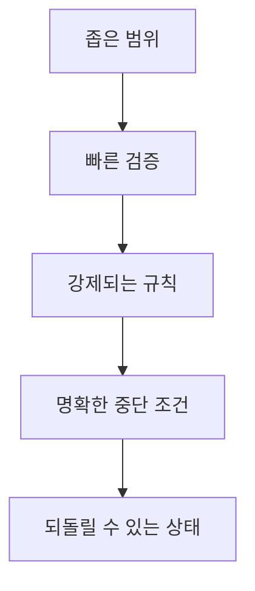

# 58장. 좋은 하네스와 나쁜 하네스 — 무엇이 Agent를 무력화하는가

4장에서 하네스라는 말을 처음 꺼냈다.

그때는 개념이었다.

지금은 다르다.  
2부부터 10부까지 실제로 겪었다.

* 테스트가 없어서 검증할 수 없었고
* Context가 오염돼서 방향을 고집했고
* 규칙이 문서에만 있어서 무너졌고
* 권한이 넓어서 아찔한 순간이 있었다

이제 대비를 보면 다르게 읽힌다.

---

## 네 가지 대비

### 1️⃣ 범위

| 나쁜 하네스 | 좋은 하네스 |
|---|---|
| 아무 파일이나 고칠 수 있다 | 작업 범위가 명확하다 |
| "알아서 잘 해줘" | Goal · Scope · Non-goals |
| Diff가 800줄 | Diff가 60줄 |

⚠️ 범위가 없으면 검토가 불가능해진다.

22장에서 말한 그대로다.  
읽지 않은 Diff를 승인하는 순간 위임이 아니라 방치다.

### 2️⃣ 검증

| 나쁜 하네스 | 좋은 하네스 |
|---|---|
| 테스트가 없다 | 12초 안에 도는 테스트가 있다 |
| "수정했습니다" | "테스트 7건 통과" |
| 사람이 매번 확인 | Agent가 스스로 판정 |

🔥 이것이 가장 큰 차이를 만든다.

23장에서 말한 대로,  
테스트가 없으면 완료 보고는 의견이다.

### 3️⃣ 접근

| 나쁜 하네스 | 좋은 하네스 |
|---|---|
| 운영에 닿을 수 있다 | 로컬에만 닿는다 |
| `.env` 를 읽을 수 있다 | 파일 자체가 없다 |
| 정책으로만 막는다 | 격리로 막는다 |

55장의 결론이다.  
정책은 풀릴 수 있고 격리는 그렇지 않다.

### 4️⃣ 중단

| 나쁜 하네스 | 좋은 하네스 |
|---|---|
| 실패하면 계속 시도한다 | 3회 후 멈추고 보고한다 |
| 검증을 약화시켜 통과시킨다 | 그 경로가 막혀 있다 |
| 끝없이 도는 루프 | 수렴하거나 멈춘다 |

24장에서 말한 대로,  
Agent에게는 포기라는 기본값이 없다.

---

## 나쁜 하네스의 증상

우리 프로젝트를 진단하는 방법이다.  
증상으로 판단하는 편이 정확하다.

| 증상 | 무엇이 없는가 |
|---|---|
| "잘 동작하는 것 같아요" 라는 보고를 받는다 | 검증 수단 |
| 같은 지적을 매주 반복한다 | Instruction 또는 강제 장치 |
| Diff를 다 읽지 못한다 | 작업 범위 |
| 며칠 전 세션 내용을 다시 설명한다 | 외부화 |
| 코드가 프로젝트 스타일과 다르다 | 컨벤션 문서 또는 참고 지목 |
| 규칙을 적어놨는데 안 지켜진다 | 에스컬레이션 (Hook·테스트) |
| Agent 결과를 결국 다시 쓴다 | 작업 정의 |
| 아찔한 순간이 있었다 | 권한·격리 |

🔥 각 증상마다 처방이 정해져 있다.

이 표가 60장의 진단 절차의 기초가 된다.

---

## 좋은 하네스의 특징

거꾸로 정리하면 이렇다.



다섯 가지가 다 있으면  
Agent에게 맡기는 일의 성격이 달라진다.

```text
없을 때  "결과를 다 확인해야 한다"
있을 때  "테스트 통과했고 Diff 60줄이니 보면 된다"
```

---

## 과잉 하네스라는 반대 실패

⚠️ 이 장에서 가장 놓치기 쉬운 부분이다.

하네스를 조이는 것이 항상 좋은 것은 아니다.

| 과잉의 증상 | 결과 |
|---|---|
| 모든 명령이 확인을 요구한다 | 사람이 계속 엔터를 누른다 |
| 규칙이 200줄이다 | 지시가 희석된다 (15장) |
| 테스트가 4분 걸린다 | 검증을 건너뛴다 (23장) |
| Skill이 열다섯 개다 | 무엇을 쓸지 모른다 |
| Agent가 여덟 개다 | 조율 비용이 작업보다 크다 (51장) |
| 모든 작업에 4단계 오케스트레이션 | 10분 일이 40분 |

🔥 하네스의 목적은 통제가 아니다.

> 위임이 가능해지는 것이 목적이다.

통제만 남으면 위임이 사라진다.  
그러면 Agent를 쓰는 이유도 사라진다.

---

## 균형점을 찾는 질문

지금 하네스가 적절한지 판단하는 방법이다.

```text
1. 작업 하나를 맡기고 결과를 검토하는 데 얼마나 걸리는가
2. 그 시간이 직접 하는 것보다 짧은가
3. Agent가 사고를 낼 수 있는 경로가 남아 있는가
```

이상적인 답은 이렇다.

```text
1. 작업 시간의 20~30%
2. 짧다
3. 되돌릴 수 없는 사고는 불가능하다
```

⚠️ 1번이 50%를 넘으면 하네스가 부족한 것이고,  
작업이 시작되지 않으면 하네스가 과한 것이다.

---

## 하네스는 프로젝트마다 다르다

마지막으로 짚을 것이 있다.

이 책의 모든 설정을 그대로 복사하면 안 된다.

| 프로젝트 | 하네스가 달라지는 이유 |
|---|---|
| 사이드 프로젝트 | 격리·감사 불필요 |
| 스타트업 초기 | 속도가 우선 |
| 금융·의료 | 규정이 하네스를 규정 |
| 레거시 모놀리스 | 검증 수단 구축이 최우선 |
| 신규 그린필드 | 규칙을 처음부터 강제 가능 |

🔥 우리 프로젝트에 맞는 하네스를  
직접 그려봐야 한다.

다음 장에서 그린다.

---

## 이 장의 핵심

* 네 가지 대비는 범위·검증·접근·중단이다
* 범위가 없으면 검토가 불가능해지고 위임이 방치가 된다
* 테스트가 없으면 완료 보고는 의견이다
* 정책은 풀릴 수 있고 격리는 그렇지 않다
* Agent에게는 포기라는 기본값이 없다
* 하네스는 증상으로 진단한다 — 증상마다 처방이 정해져 있다
* 과잉 하네스도 실패다 — 확인 요구가 많으면 사람이 엔터만 누른다
* 규칙이 많으면 희석되고, 테스트가 느리면 건너뛴다
* 하네스의 목적은 통제가 아니라 위임이 가능해지는 것이다
* 검토 시간이 작업의 절반을 넘으면 부족, 작업이 시작되지 않으면 과하다
