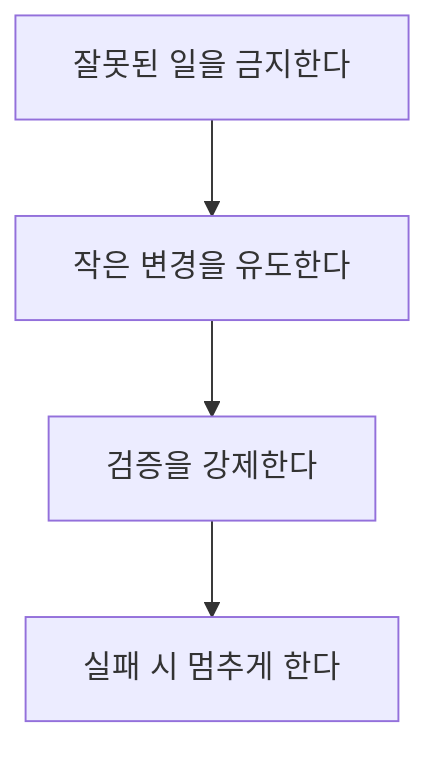
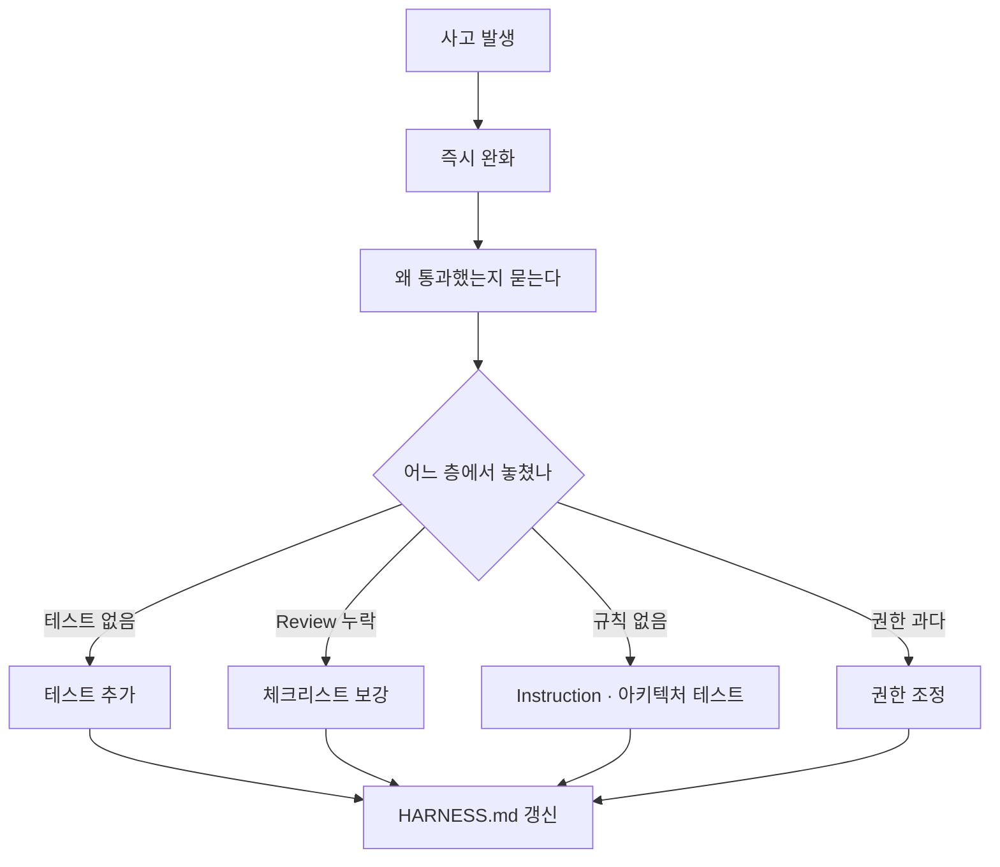

# 59장. Agent가 실패하기 어렵게 만들기 — 반복해서 틀리면 하네스를 고친다

58장에서 설계도를 그렸다.

이 장은 그 설계도를 고치는 방법이다.

시작은 4장의 문장이다.

> Agent가 같은 실수를 반복할 때  
> "이 모델은 별로다" 로 끝내면 개선이 멈춘다.

---

## 실패를 막는 네 방향



각각의 수단이 다르다.

| 방향 | 수단 | 근거 장 |
|---|---|---|
| 금지 | Permission, Sandbox | 54장 |
| 작게 | Task 분해, 커밋 단위 | 22·25장 |
| 검증 강제 | 테스트, Hook | 23·46장 |
| 중단 | 지시의 중단 조건 | 24장 |

⚠️ 네 번째가 가장 자주 빠진다.

앞의 셋은 갖춰놓고  
중단 조건은 안 넣는 경우가 흔하다.

---

## 반복 실수의 원인을 분류한다

4장의 질문 목록이 여기서 진단 도구가 된다.

```text
읽을 것이 부족했는가        → Context
규칙이 어디에도 없었는가    → Instruction
검증할 수단이 없었는가      → Tests
할 수 있는 행동이 없었는가  → Tools
막아야 할 것을 열어뒀는가   → Permission
작업이 너무 컸는가          → Task 설계
기억해야 할 것이 사라졌는가  → Memory
```

일곱 개 중 하나로 분류되면  
처방이 자동으로 나온다.

---

## 사례 세 개

실제로 이 절차가 어떻게 도는지 본다.

### 사례 1 — 매번 새 예외를 만든다

```text
증상   Agent가 API를 만들 때마다 새 예외 클래스를 생성
빈도   3주간 5회
```

**진단**

```text
Instruction 문제?  → CLAUDE.md 에 규칙이 있다. 있는데 안 지켜진다
Context 문제?      → 기존 예외 목록을 못 봤을 수 있다
```

**처방**

두 층으로 간다.

```markdown
# CLAUDE.md — 더 구체적으로
- 예외는 `common/exception` 에서 찾아 재사용한다
  목록: BusinessException, NotFoundException, ForbiddenException,
        InvalidStateException, ExternalApiException
```

```kotlin
// 아키텍처 테스트 — 강제
@Test
fun `예외 클래스는 common exception 패키지에만 정의한다`() { ... }
```

🔥 16장의 에스컬레이션이다.

문장을 강하게 쓰는 대신 수단을 올렸다.

### 사례 2 — 테스트 기댓값을 바꾼다

```text
증상   실패하는 테스트의 기댓값을 실제값으로 수정
빈도   2주간 2회 (한 번은 머지됨) ⚠️
```

**진단**

```text
Instruction?  → 금지 문장이 있다
Tests?        → 검증 자체는 있다
Permission?   → 테스트 파일 수정이 열려 있다
Task 설계?    → "테스트 통과" 를 목표로 준 적이 있다
```

원인이 넷째다.

**처방**

```text
1. 작업 지시 문구 교정
   "테스트를 통과하게" → "이 동작을 고치고, 테스트는 수정하지 말고"

2. Diff 검토 절차에 추가
   git diff --stat src/test/ 를 먼저 본다

3. Hook 추가
   테스트 파일 변경 시 경고 출력
```

⚠️ 2번이 가장 값싸고 효과가 크다.

25장에서 만든 순서에 이미 들어 있다.

### 사례 3 — 관계없는 파일을 함께 고친다

```text
증상   요청 범위 밖의 파일이 Diff에 섞임
빈도   상시
```

**진단**

```text
Task 설계 문제 → Non-goals 를 안 적었다
```

**처방**

```markdown
# CLAUDE.md
- 요청 범위 밖의 코드를 정리하지 않는다
  개선점을 발견하면 수정하지 말고 보고한다
```

그리고 작업 지시 템플릿에 `이번 범위 아님` 을 고정한다.

20장의 Non-goals가 습관이 되는 지점이다.

---

## 개선 로그를 남긴다

이 과정을 기록하면 두 가지를 얻는다.

```markdown
# HARNESS.md 의 개선 로그

## 2026-08-14 — 새 예외 생성 반복 (5회)
- 진단: Instruction 있으나 강제 없음
- 처방: 예외 목록 명시 + 아키텍처 테스트
- 결과: 이후 3주간 0회

## 2026-07-22 — 테스트 기댓값 변경 (2회)
- 진단: Task 설계 — "테스트 통과" 를 목표로 줬음
- 처방: 지시 문구 교정 + Diff 검토 순서 변경
- 결과: 이후 발생 없음. 1건은 머지됐어서 revert
```

🔥 이 로그가 팀에 두 가지를 준다.

* 무엇이 효과 있었는지 알 수 있다
* 새 팀원에게 "왜 이런 규칙이 있는지" 설명이 된다

15장에서 규칙에 이유를 붙이라고 한 것의  
프로젝트 단위 버전이다.

---

## 지표로 보기

감으로 판단하지 않으려면 숫자가 필요하다.

측정 가능한 것들이다.

| 지표 | 어떻게 | 의미 |
|---|---|---|
| 되돌린 횟수 | `git revert` 커밋 수 | 하네스 품질 |
| Review 지적 수 | PR 코멘트 수 추이 | 규칙 정착도 |
| 아키텍처 테스트 예외 수 | baseline 목록 크기 | 부채 감소 |
| 검증 없이 커밋한 비율 | CI 실패율 | 루프 작동 여부 |
| 세션당 평균 턴 수 | 대화 길이 | 작업 정의 품질 |

⚠️ 지표를 목표로 삼지 않는다.

세 번째를 목표로 하면  
예외를 지우는 대신 규칙을 약화시킬 수 있다.

23장에서 본 것과 같은 함정이다.

---

## 사고가 났을 때의 절차

56장에서 예고한 부분이다.



핵심 질문은 하나다.

> 왜 통과했는가.

⚠️ "누가 잘못했는가" 를 묻지 않는다.

Agent도 사람도 실수하고,  
하네스는 실수가 통과하지 못하게 만드는 장치다.

---

## 고칠 수 없는 것

솔직히 말할 부분이 있다.

하네스로 못 막는 것들이 있다.

| 못 막는 것 | 왜 |
|---|---|
| 요구사항 오해 | 애초에 잘못 이해한 것 |
| 도메인 판단 오류 | 규칙이 문서에 없으면 못 잡는다 |
| 설계 방향 실수 | 21장의 계획 검토가 유일한 방어 |
| 조직 사정 무지 | 코드에 없다 |

🔥 그래서 사람의 자리가 남는다.

이 네 가지가 21장의 계획 승인과  
25장의 Diff 검토가 없어지지 않는 이유다.

---

## 이 장의 핵심

* 실패를 막는 방향은 넷이다 — 금지, 작게, 검증 강제, 중단
* 중단 조건이 가장 자주 빠진다
* 반복 실수는 일곱 가지 원인 중 하나로 분류된다
* 분류되면 처방이 자동으로 나온다
* 문장을 강하게 쓰는 대신 수단을 올린다
* 개선 로그가 무엇이 효과 있었는지와 규칙의 이유를 남긴다
* 지표를 목표로 삼으면 규칙을 약화시키는 방향으로 최적화된다
* 사고 후 질문은 "누가 잘못했는가" 가 아니라 "왜 통과했는가" 다
* 요구사항 오해와 도메인 판단은 하네스로 막을 수 없다
* 그래서 계획 승인과 Diff 검토는 없어지지 않는다
