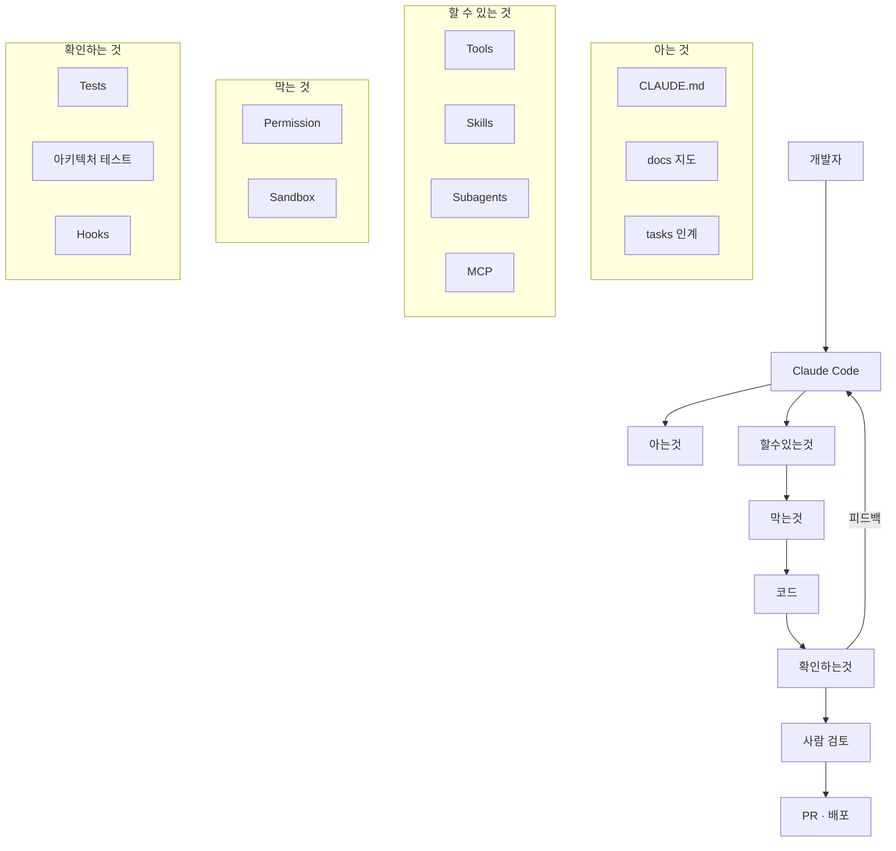

# 59장. 우리 프로젝트의 Harness 설계도 그리기

58장에서 진단 기준을 봤다.

이제 우리 프로젝트를 그린다.

5장에서 부품 목록을 봤고,  
그 뒤 50여 장에서 부품을 하나씩 만들었다.

이 장의 산출물은 한 장의 문서다.

---

## 전체 그림



이 그림 자체는 어느 프로젝트나 비슷하다.

차이는 각 칸이 **얼마나 채워져 있는가**다.

---

## HARNESS.md 를 만든다

프로젝트 루트에 문서 하나를 둔다.

```markdown
# Agent Harness

이 프로젝트에서 Claude Code가 일하는 조건을 정리한 문서.
분기마다 갱신한다.

## 현재 상태

| 부품 | 상태 | 위치 |
|---|---|---|
| Instruction | 🟢 | `CLAUDE.md`, `*/CLAUDE.md` (3개 도메인) |
| Context 규칙 | 🟢 | `CLAUDE.md` 의 지도 참조 절 |
| Memory | 🟡 | `docs/` 4종, `tasks/` (커밋 안 함) |
| Tools | 🟢 | 기본 + Jira·Grafana MCP |
| Skills | 🟡 | 5개 (`add-api`, `incident`, ...) |
| Subagents | 🟡 | explorer, reviewer 2개 |
| Permission | 🟢 | `.claude/settings.json` |
| Sandbox | 🔴 | 없음 — 로컬에서 직접 실행 |
| Tests | 🟡 | 단위 12초 / 전체 4분, 커버리지 41% |
| 아키텍처 테스트 | 🟡 | point 도메인만 |
| Hooks | 🟢 | 포맷터, 아키텍처 테스트 |

🟢 충분  🟡 부분적  🔴 없음

## 검증 명령

- 빠른: `./gradlew test --tests '*UnitTest'` (12초)
- 구조: `./gradlew test --tests '*ArchitectureTest'` (4초)
- 전체: `./gradlew test` (4분)
- 린트: `./gradlew ktlintCheck`

## 절대 하지 않는 것

- 운영·스테이징 DB 접속
- 마이그레이션 실행
- `git push`, force push
- 외부 PG·알림 API 실제 호출

## 알려진 약점

1. Sandbox 없음 → 로컬에 자격증명이 있는 상태로 실행
2. legacy 패키지에 테스트 없음 → 수정 금지로 대응 중
3. 전체 테스트 4분 → Agent가 마지막에 한 번만 실행
```

⚠️ 마지막 절이 이 문서의 핵심이다.

약점을 적어두지 않으면  
있는 것만 보고 안심한다.

---

## 갭을 찾는다

현재 상태 표에서 🔴 와 🟡 를 본다.

그리고 58장의 증상 목록과 대조한다.

```text
증상: 전체 테스트를 Agent가 안 돌린다
원인: 4분 걸린다
처방: 빠른 테스트 셋 분리 (이미 있음) + 검증 순서 명시

증상: 로컬에 운영 자격증명이 있다
원인: Sandbox 없음
처방: devcontainer 도입

증상: order·payment 도메인 경계가 안 지켜진다
원인: 아키텍처 테스트가 point 만 커버
처방: 규칙 확대 + baseline 예외 목록
```

🔥 처방까지 적으면 그것이 곧 할 일 목록이다.

---

## 우선순위는 39장 방식으로

갭이 열 개 나오면 순서를 정해야 한다.

39장에서 쓴 축을 다시 쓴다.

| 갭 | 가치 | 비용 | 위험 |
|---|---|---|---|
| Sandbox 도입 | 중 | 중 | 🔥 높음 (자격증명 노출) |
| 아키텍처 테스트 확대 | 높음 | 낮음 | 중 |
| legacy 특성화 테스트 | 중 | 높음 | 높음 |
| Skill 3개 추가 | 낮음 | 낮음 | 낮음 |

여기서 두 번째가 먼저다.

가치가 높고 비용이 낮다.  
42장에서 baseline 방식을 쓰면 반나절이면 된다.

---

## 90일 계획으로 만든다

```markdown
## 개선 계획

### 1차 (2주) — 검증 강화
- [ ] 아키텍처 테스트를 order·payment 로 확대 (baseline 방식)
- [ ] Hook에 아키텍처 테스트 추가
- [ ] 검증 순서를 `CLAUDE.md` 에 명시

### 2차 (4주) — 격리
- [ ] devcontainer 구성
- [ ] 로컬 DB·Redis 를 컨테이너로
- [ ] 시드 스크립트 작성
- [ ] 자격증명을 컨테이너 밖에 두기

### 3차 (6주) — 레거시 대응
- [ ] legacy 주요 경로 특성화 테스트 12건
- [ ] 그 뒤 legacy 수정 금지 해제

### 하지 않음
- 전사 MCP 서버 연결 — 필요성 확인 안 됨
- 병렬 Agent — 현재 작업 규모에 불필요
- Agent 5개 이상으로 확장 — 조율 비용
```

`하지 않음` 절을 반드시 넣는다.

39장에서와 같은 이유다.  
6개월 뒤에 다시 논의하지 않기 위해서다.

---

## 설계도를 Agent가 쓰게 한다

만들었으면 연결한다.

```markdown
# CLAUDE.md
## 하네스

이 프로젝트의 작업 조건은 `HARNESS.md` 에 정리되어 있다.

- 검증 명령은 그 문서의 "검증 명령" 절을 따른다
- 금지 사항은 그 문서의 "절대 하지 않는 것" 절을 따른다
- 약점으로 표시된 영역은 특별히 주의한다
```

🔥 마지막 줄이 유용하다.

"legacy 에 테스트가 없다" 를 Agent가 알면  
그 영역에서 더 보수적으로 움직인다.

---

## 초안을 Agent에게 맡긴다

처음 만들 때는 이렇게 시작하면 빠르다.

```text
이 프로젝트의 Agent 작업 환경을 조사해서 HARNESS.md 초안을 만들어줘.

확인할 것:
- CLAUDE.md 가 있는가, 무엇을 담고 있는가
- .claude/ 아래에 무엇이 있는가 (settings, skills, agents, hooks)
- 테스트 명령과 소요 시간 (실제로 실행해서 측정)
- 아키텍처·의존성 테스트가 있는가
- 격리 환경(devcontainer, docker) 이 있는가
- MCP 서버 설정이 있는가

각 항목을 "충분 / 부분적 / 없음" 으로 평가하고,
없는 것 중 무엇이 가장 시급해 보이는지 근거와 함께 알려줘.
```

⚠️ 우선순위 결정은 사람이 한다.

39장에서와 같다.  
조직 사정과 위험 판단은 코드에 없다.

---

## 분기마다 갱신한다

이 문서도 낡는다.

35장의 지도와 같은 문제다.

```markdown
> 작성: 2026-08-14
> 다음 갱신: 2026-11 (분기 회고 때)
```

갱신 계기를 정해두는 편이 현실적이다.

| 계기 | 갱신할 부분 |
|---|---|
| 분기 회고 | 전체 |
| 사고 발생 후 | 약점 절, 개선 계획 |
| 새 팀원 합류 | 이해되지 않는 부분 지적 |
| 도구 변경 | 검증 명령, Tools |

---

## 이 장의 핵심

* 그림은 어느 프로젝트나 비슷하고, 차이는 각 칸이 얼마나 채워졌는지다
* `HARNESS.md` 한 장으로 현재 상태를 표로 만든다
* 약점을 적어두지 않으면 있는 것만 보고 안심한다
* 58장의 증상 목록과 대조해 갭을 찾고 처방까지 적는다
* 처방 목록이 곧 할 일 목록이 된다
* 우선순위는 39장의 가치·비용·위험 축을 다시 쓴다
* `하지 않음` 절을 넣어 6개월 뒤 재논의를 막는다
* `CLAUDE.md` 에서 이 문서를 가리켜 Agent가 쓰게 한다
* 약점으로 표시된 영역에서 Agent가 더 보수적으로 움직인다
* 초안은 Agent에게 맡기고 우선순위는 사람이 정한다
