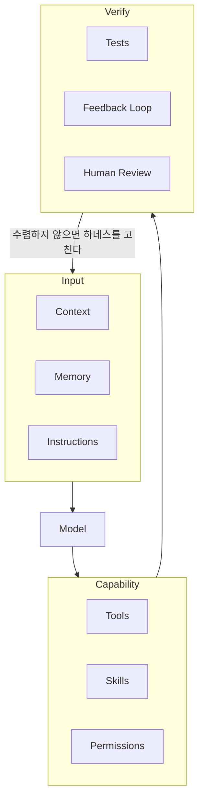

# 백엔드 개발자를 위한 Claude Code 에이전틱 코딩

이미 돌아가고 있는 백엔드 코드베이스를 Claude Code와 함께  
이해하고, 이어서 개발하고, 나중에 떼어낼 수 있는 구조로 만드는 방법을 다룹니다.

> **Prompt Engineering이 아니라 Agent Harness Engineering.**

---

## 이 책의 전제

대부분의 백엔드 개발자는 빈 디렉터리에서 시작하지 않는다.

몇 년 된 모놀리스가 있고,  
문서는 없거나 낡았고,  
테스트는 일부만 있고,  
건드리면 어디가 깨지는지 아무도 확신하지 못한다.

이 책은 그 상태에서 출발한다.

* 예시 스택은 **Kotlin + Spring Boot** 모놀리스
* 목적지는 마이크로서비스 분리가 아니라 **분리할 수 있는 상태**
* 그 과정을 사람이 아니라 **Agent가 수행하고 사람이 검증하는 방식**으로 만든다

읽는 순서는 순차를 권한다.  
다만 Claude Code를 이미 쓰고 있다면 2부를 훑고 7부로 건너가도 된다.

---

## 목차

### 1부. 에이전틱 코딩과 하네스
> Agent가 무엇이고, 왜 모델이 아니라 환경이 결과를 만드는가. 이 책의 지도.

- 1장. AI 코딩은 어떻게 달라지고 있는가 — 자동완성에서 Coding Agent까지
- 2장. Agent를 이루는 것들 — Context · Tools · Memory · Environment · Feedback Loop
- 3장. Coding Agent는 어떻게 개발하는가 — 탐색 · 계획 · 구현 · 검증의 순환
- 4장. 좋은 모델만으로 좋은 Agent가 되지 않는 이유 — 하네스라는 개념
- 5장. Harness의 구성요소 — 아홉 개의 부품

### 2부. Claude Code 첫걸음
> 설치부터 첫 위임까지. 그리고 문서 없는 우리 레포에 처음 붙이는 날.

- 6장. 설치와 첫 실행 — 터미널에서 시작한다
- 7장. Claude Code가 쓰는 도구와 권한 — Read · Grep · Edit · Bash
- 8장. 문서 없는 레포에 Claude Code를 붙이는 날 — 읽기부터 시작한다
- 9장. 첫 에이전틱 코딩 — 버그 하나를 끝까지
- 10장. 질문이 아니라 작업을 주는 법 — 목표 · 제약 · 완료 조건
- 11장. 모델 선택과 비용 감각 — 어디에 Opus를 쓸 것인가

### 3부. Context와 프로젝트 지식
> Agent의 성능은 무엇을 읽히느냐로 결정된다. 그리고 무엇을 남겨두느냐로.

- 12장. Context가 Agent의 성능을 결정한다 — Window의 한계와 Context Rot
- 13장. 필요한 Context만 주기 — 검색 → 선택 → 정밀 분석
- 14장. CLAUDE.md란 무엇인가 — Agent가 항상 알아야 하는 것
- 15장. 좋은 CLAUDE.md 만들기 — 짧게, 자주 틀리는 것만
- 16장. 계층화와 개선 루프 — Root · 모듈 · 도메인, 그리고 규칙의 수명

### 4부. Memory와 Session 운영
> 중요한 정보가 대화 안에만 존재하면 안 된다.

- 17장. Agent의 Memory란 무엇인가 — 기억시킬 것과 기억시키지 않을 것
- 18장. Session이 길어지면 무엇이 무너지는가 — 언제 새로 시작할까
- 19장. Session을 안전하게 넘기는 방법 — 작업 상태를 파일로 남긴다

### 5부. 작업을 설계하고 수렴시키기
> 좋은 결과는 좋은 프롬프트가 아니라 좋은 작업 정의와 피드백에서 나온다.

- 20장. 요구사항을 Agent Task로 — Goal · Scope · Constraints · Acceptance Criteria
- 21장. Plan First — 바로 구현시키지 않는다
- 22장. 큰 작업 분해하기 — 병렬 가능한 것과 순차적인 것
- 23장. 테스트를 Agent의 눈으로 쓰기 — 스스로 검증하게 만들기
- 24장. Feedback Loop 설계 — Observe · Think · Act · Verify
- 25장. Git을 Agent의 안전장치로 — 작은 커밋과 되돌리기

### 6부. 백엔드 실무에 Claude Code 활용하기
> Kotlin · Spring Boot 코드베이스에서 매일 반복하는 작업들.

- 26장. API 개발 — 기존 Convention을 따르게 만들기
- 27장. Database 작업 — Schema · Query · Migration · Index
- 28장. 트랜잭션과 동시성 — 경계 · Lock · Race Condition
- 29장. 도메인 규칙을 깨뜨리지 않게 — Invariant와 Edge Case
- 30장. 외부 연동과 복원력 — Timeout · Retry · 멱등성 · Circuit Breaker
- 31장. 캐시와 비동기 처리 — Redis · Queue · Worker · DLQ
- 32장. 인증과 보안 — Token · Secret · Injection · 개인정보
- 33장. 장애와 성능 분석 — 로그에서 Root Cause까지, Slow Query와 N+1

### 7부. 레거시 모놀리스를 파악시키기
> 문서가 없는 코드베이스를 Agent와 함께 읽는다.

- 34장. 문서 없는 레거시를 Agent와 함께 읽기 — Entry Point에서 Side Effect까지
- 35장. 코드베이스 지도 만들기 — Module · Dependency · Domain · Data Flow
- 36장. Characterization Test — 리팩터링 전에 현재 동작을 고정한다

### 8부. 경계를 긋는 에이전틱 리팩터링
> 지금 나누지 않는다. 다만 나중에 떼어낼 수 있게 만든다. 이 책의 목적지.

- 37장. 코드에서 경계를 찾기 — 도메인 · 책임 · 데이터 소유권
- 38장. 무엇부터 정리할 것인가 — 경계 후보의 우선순위
- 39장. 모놀리스 내부 구조 개선 — Controller · Application · Domain · Infrastructure
- 40장. 대규모 패키지 이동을 Agent에게 맡기는 방법 — 작게, 검증하며
- 41장. 경계를 규칙으로 강제하기 — 의존성 테스트와 Hook
- 42장. 데이터 경계 준비 — 공유 테이블과 조인부터 끊기
- 43장. 나중에 떼어내기 쉬운 구조 — 코드 · 데이터 · 트랜잭션 · API · 이벤트

### 9부. 반복 가능한 Workflow — Skill · Hook · Subagent
> 한 번 잘된 작업 방식을 매번 다시 설명하지 않는다.

- 44장. Skill이란 무엇인가 — 반복되는 절차를 자산으로
- 45장. 백엔드 Skill 만들기 — API 구현 · 장애 분석 · Migration Review
- 46장. Hooks — 무조건 실행되어야 하는 것, 그리고 셋의 구분
- 47장. Subagent란 무엇인가 — 독립 Context와 역할 분리
- 48장. 전문 Agent 만들기 — Explorer · Planner · Implementer · Reviewer
- 49장. Agent Orchestration — 구현과 Review를 분리한다
- 50장. 병렬 Agent와 Git Worktree — 그리고 Multi-Agent가 나쁠 때

### 10부. MCP와 안전한 운영
> Agent에게 실제 시스템을 보여주되, 할 수 있는 일의 범위를 정한다.

- 51장. MCP란 무엇인가 — Agent에게 실제 시스템을 보여주기
- 52장. 개발 도구 연결 — GitHub · Jira · Database · Monitoring
- 53장. 장애 대응 Agent — Issue에서 수정안까지
- 54장. Permission과 Sandbox — Allow · Ask · Deny, 그리고 격리
- 55장. Database와 Secret — 환경별 권한 정책
- 56장. Production에서의 원칙 — Human Approval · Audit · Rollback

### 11부. 우리 팀의 Agent Harness
> 개인의 요령을 팀의 환경으로 바꾼다. 5장의 구성요소를 실제로 조립한다.

- 57장. 좋은 하네스와 나쁜 하네스 — 무엇이 Agent를 무력화하는가
- 58장. 우리 프로젝트의 Harness 설계도 그리기
- 59장. Agent가 실패하기 어렵게 만들기 — 반복해서 틀리면 하네스를 고친다
- 60장. 팀에 도입하기 — `.claude/` 공유와 CI 자동 Review

### 12부. 실전 종합
> 앞의 모든 것을 하나의 작업에 붙여본다.

- 61장. 실전 1 — 요구사항 하나로 기능 개발하기
- 62장. 실전 2 — 장애 티켓 하나로 문제 해결하기
- 63장. 실전 3 — 레거시 모듈 하나를 경계 밖으로 밀어내기

---

## 이 책이 결국 말하는 것

같은 Claude Code를 쓰는데 결과가 다른 이유는 프롬프트가 아니다.

초급 단계에서는 이것을 배운다.

> Claude에게 코드를 작성시키는 방법

중급 단계에서는 이것을 배운다.

> Claude에게 개발 작업을 맡기는 방법

고급 단계에서 배우는 것은 다르다.

> Claude가 개발을 잘할 수 있는 환경을 설계하는 방법

좋은 에이전틱 코딩 환경은 하나의 요소로 만들어지지 않는다.

이 루프를 설계하는 일이 백엔드 개발자의 새로운 업무다.
